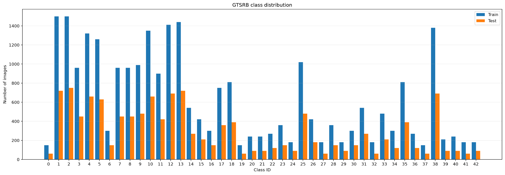
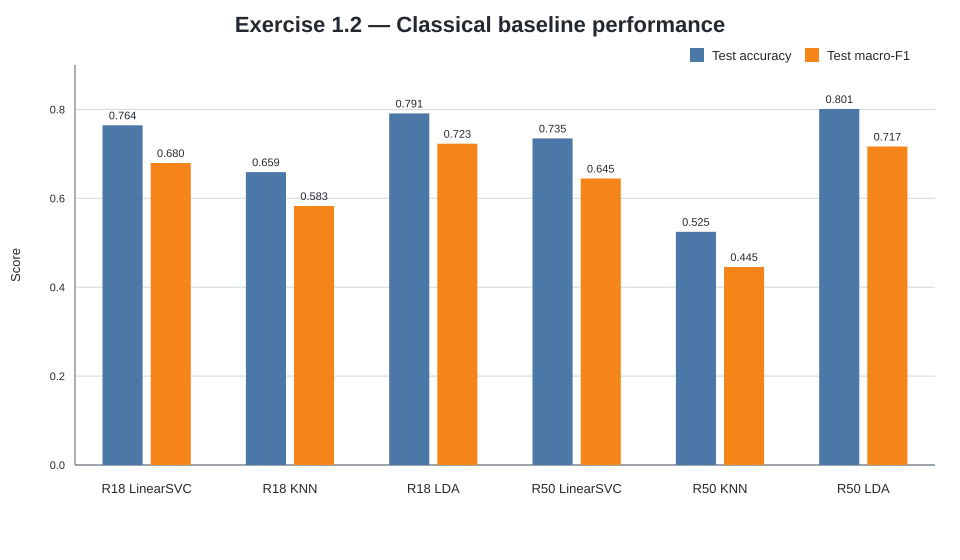
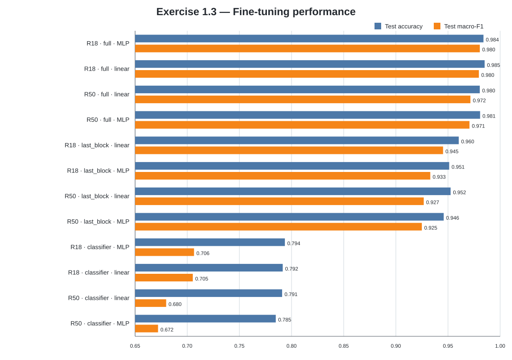
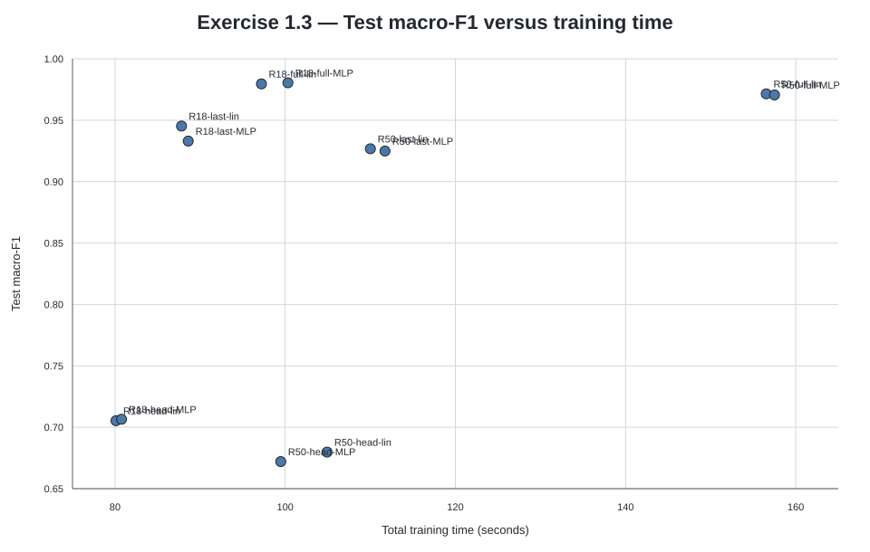

# Exercise 1 — Transfer Learning per la classificazione GTSRB

L'Exercise 1 studia come riutilizzare e adattare reti convoluzionali pre-addestrate su ImageNet per la classificazione dei segnali stradali del **German Traffic Sign Recognition Benchmark (GTSRB)**.

Il percorso è articolato in tre fasi:

1. **Exercise 1.1 — EDA:** analisi del dataset e delle proprietà rilevanti per gli esperimenti;
2. **Exercise 1.2 — Feature extraction:** ResNet congelate come estrattori di rappresentazioni + classificatori classici;
3. **Exercise 1.3 — Fine-tuning:** adattamento progressivo del backbone e confronto tra testa lineare e MLP.

La campagna principale comprende **6 baseline classiche** e **12 configurazioni di fine-tuning da 5 epoche**. Una run preliminare da una sola epoca è stata usata esclusivamente come verifica della pipeline e non entra nel confronto sperimentale.

---

## Dataset ed EDA

Il dataset viene caricato tramite `torchvision.datasets.GTSRB`.

| Split | Immagini |
|---|---:|
| Training ufficiale | 26.640 |
| Test ufficiale | 12.630 |
| Classi | 43 |

Per il fine-tuning, il training ufficiale viene suddiviso in modo stratificato con seed `42`:

| Split interno | Immagini |
|---|---:|
| Training | 21.312 |
| Validation | 5.328 |
| Test ufficiale | 12.630 |

Il test ufficiale rimane separato dalla selezione del checkpoint.

L'EDA evidenzia tre aspetti principali:

- **sbilanciamento tra classi:** da 150 a 1.500 immagini nel training, rapporto massimo `10:1`;
- **immagini piccole e a risoluzione variabile:** mediana circa `43 × 43 px`;
- variazioni di illuminazione, contrasto, scala, sfocatura, centratura e sfondo.

Per questo vengono riportate sia **accuracy** sia **macro-F1**, così da non nascondere eventuali difficoltà sulle classi meno frequenti.

<p align="center">
  
</p>

Il preprocessing utilizza direttamente `weights.transforms()` associato ai pesi Torchvision selezionati. Non viene introdotta augmentation personalizzata; in particolare vengono evitati flip orizzontali e crop aggressivi, potenzialmente incompatibili con la semantica dei segnali.

---

## Exercise 1.2 — Feature extraction e classificatori classici

### Metodo

Le ResNet pre-addestrate vengono usate come **feature extractor congelati**:

```text
Immagine
   ↓
ResNet pre-addestrata
   ↓
rimozione della FC ImageNet
   ↓
feature vector
   ↓
StandardScaler
   ↓
LinearSVC / KNN / LDA
   ↓
classe GTSRB
```

La testa ImageNet viene sostituita con `nn.Identity()`. L'estrazione avviene con il modello in `eval()` e dentro `torch.inference_mode()`, quindi nessun parametro della CNN viene aggiornato.

| Backbone | Pesi | Dimensione feature | Batch |
|---|---|---:|---:|
| ResNet-18 | `IMAGENET1K_V1` | 512 | 32 |
| ResNet-50 | `IMAGENET1K_V2` | 2.048 | 16 |

Le feature vengono salvate e riutilizzate per evitare di ripetere il forward della CNN per ogni classificatore.

I classificatori confrontati sono:

- `LinearSVC(C=1.0, max_iter=10000, random_state=42)`;
- `KNeighborsClassifier(n_neighbors=5, n_jobs=-1)`;
- `LinearDiscriminantAnalysis()`.

Prima del fit viene applicato `StandardScaler`, adattato **solo sulle feature di training** per evitare leakage dal test.

### Risultati

<p align="center">
  
</p>

| Backbone | Classificatore | Accuracy | Macro-F1 |
|---|---|---:|---:|
| ResNet-18 | LDA | 0.7912 | **0.7228** |
| ResNet-50 | LDA | **0.8010** | 0.7167 |
| ResNet-18 | LinearSVC | 0.7643 | 0.6795 |
| ResNet-50 | LinearSVC | 0.7348 | 0.6446 |
| ResNet-18 | KNN | 0.6591 | 0.5827 |
| ResNet-50 | KNN | 0.5246 | 0.4454 |

**LDA è il classificatore migliore per entrambi i backbone.** ResNet-50 + LDA raggiunge l'accuracy più alta, mentre ResNet-18 + LDA ottiene la macro-F1 migliore.

La maggiore dimensionalità delle feature ResNet-50 non produce un vantaggio sistematico: KNN peggiora sensibilmente e LinearSVC richiede molto più tempo senza migliorare la qualità. La run ResNet-50 + LinearSVC raggiunge inoltre il limite di `10.000` iterazioni senza convergere completamente.

I tempi disponibili negli artifact dell'Exercise 1.2 riguardano fit e predizione del classificatore; **il tempo di estrazione delle feature non è incluso**.

---

## Exercise 1.3 — Fine-tuning

### Strategie

La testa ImageNet viene sostituita con un classificatore a 43 classi. Sono confrontate due architetture:

- **linear:** `Linear(in_features, 43)`;
- **MLP:** `Linear(in_features, 256) → ReLU → Dropout(0.3) → Linear(256, 43)`.

Tre strategie stabiliscono quali parametri vengono aggiornati:

| Strategia | Moduli trainabili |
|---|---|
| `classifier` | sola testa |
| `last_block` | `layer4` + testa |
| `full` | intera rete |

Nei casi di fine-tuning selettivo, i moduli BatchNorm congelati vengono mantenuti in modalità `eval()` per non modificare involontariamente le running statistics.

### Configurazione di training

| Componente | Valore |
|---|---|
| Loss | `CrossEntropyLoss` |
| Ottimizzatore | `AdamW` |
| LR backbone | `1e-4` |
| LR testa | `1e-3` |
| Weight decay | `1e-4` |
| Epoche | 5 |
| Seed | 42 |
| Checkpoint | minima validation loss |
| Batch ResNet-18 | 32 |
| Batch ResNet-50 | 16 |

La testa utilizza un learning rate maggiore perché parte da parametri inizializzati per il nuovo task, mentre i pesi pre-addestrati vengono aggiornati più cautamente.

### Risultati

<p align="center">
  
</p>

| Backbone | Strategia | Testa | Accuracy | Macro-F1 | Tempo [s] |
|---|---|---|---:|---:|---:|
| ResNet-18 | `classifier` | linear | 0.7915 | 0.7053 | 80.1 |
| ResNet-18 | `classifier` | MLP | 0.7936 | 0.7065 | 80.8 |
| ResNet-18 | `last_block` | linear | 0.9603 | 0.9453 | 87.8 |
| ResNet-18 | `last_block` | MLP | 0.9511 | 0.9330 | 88.6 |
| ResNet-18 | `full` | linear | **0.9851** | 0.9796 | 97.2 |
| ResNet-18 | `full` | MLP | 0.9840 | **0.9805** | 100.3 |
| ResNet-50 | `classifier` | linear | 0.7910 | 0.6798 | 104.9 |
| ResNet-50 | `classifier` | MLP | 0.7849 | 0.6720 | 99.5 |
| ResNet-50 | `last_block` | linear | 0.9525 | 0.9267 | 110.0 |
| ResNet-50 | `last_block` | MLP | 0.9458 | 0.9249 | 111.7 |
| ResNet-50 | `full` | linear | 0.9804 | 0.9715 | 156.5 |
| ResNet-50 | `full` | MLP | 0.9808 | 0.9706 | 157.5 |

Il risultato principale è il salto tra `classifier` e `last_block`: adattare almeno gli stadi profondi del backbone è molto più efficace che aumentare soltanto la capacità della testa. Il `full` fine-tuning migliora ulteriormente.

Nel protocollo eseguito:

- **ResNet-18** supera ResNet-50 in tutte le coppie direttamente confrontabili sulla macro-F1 e richiede meno tempo;
- l'**MLP non è sistematicamente migliore** della testa lineare;
- la migliore macro-F1 è ottenuta da **ResNet-18 full + MLP** (`0.9805`);
- la massima accuracy e la minima test loss sono ottenute da **ResNet-18 full + linear** (`accuracy 0.9851`, `loss 0.0529`).

Per il miglior equilibrio tra qualità, semplicità e costo, **ResNet-18 full + linear** viene considerato il modello di riferimento della classificazione.

<p align="center">
  
</p>

Il grafico qualità-costo evidenzia che le configurazioni `full` di ResNet-18 raggiungono la regione di performance più elevata con un costo nettamente inferiore alle corrispondenti ResNet-50.

---

## Riproduzione

L'ambiente del laboratorio è definito in [`../environment.yml`](../environment.yml).

Dalla root del repository:

```bash
conda env create -f DLA_LAB1/environment.yml
conda activate DLA2026_clean
cd DLA_LAB1
```

### EDA

```bash
python Exercise1/main.py eda
```

### Tutte le baseline classiche

```bash
python Exercise1/main.py baseline \
  --models all \
  --classifiers all \
  --wandb
```

### Singola run di fine-tuning

```bash
python Exercise1/main.py finetune \
  --model resnet18 \
  --strategy full \
  --classifier linear \
  --epochs 5 \
  --wandb
```

Valori supportati:

- `--model`: `resnet18`, `resnet50`;
- `--strategy`: `classifier`, `last_block`, `full`;
- `--classifier`: `linear`, `mlp`;
- `--batch-size`: override opzionale;
- `--wandb`: logging opzionale.

### Campagna completa

```bash
bash Exercise1/run_all_exercise1.sh
```

Lo script esegue:

```text
2 backbone × 3 classificatori classici
+
2 backbone × 3 strategie × 2 teste
=
6 baseline + 12 fine-tuning
```

È possibile passare il numero di epoche delle run di fine-tuning come primo argomento, ad esempio:

```bash
bash Exercise1/run_all_exercise1.sh 5
```

---

## Output e tracking

Gli output completi vengono generati localmente e non sono versionati.

```text
Exercise1/outputs/
├── exercise_1_1/
├── exercise_1_2/
│   ├── features/
│   └── results/
├── exercise_1_3/
│   └── results/
└── logs/
```

Le run di Exercise 1.2 e 1.3 possono essere tracciate con **Weights & Biases** tramite `--wandb`; vengono conservate configurazioni, metriche aggregate, report per classe e, quando previsto, curve e artifact del modello.

Feature `.npz`, checkpoint, dataset, output completi e directory W&B locali rimangono esclusi dal repository.

---

## Limiti del confronto

- È disponibile una sola run per configurazione: differenze di pochi millesimi non devono essere interpretate come statisticamente significative.
- ResNet-18 e ResNet-50 usano versioni diverse dei pesi ImageNet e batch size differenti; il confronto non è quindi un'ablation architetturale perfettamente isolata.
- Il tempo di feature extraction non è disponibile nella tabella aggregata dell'Exercise 1.2.
- La run ResNet-50 + LinearSVC non converge entro `max_iter=10000`.
- Le dodici configurazioni sono state confrontate anche sul test ufficiale; il test non rappresenta quindi una singola stima finale completamente indipendente dal confronto sperimentale.

---

## Riferimenti e assistenza AI

Riferimenti principali:

- GTSRB / `torchvision.datasets.GTSRB`;
- ResNet-18 e ResNet-50 pre-addestrate di Torchvision;
- PyTorch e Torchvision;
- Scikit-learn;
- Weights & Biases.

Riferimento del dataset:

> J. Stallkamp, M. Schlipsing, J. Salmen, C. Igel,  
> *Man vs. Computer: Benchmarking Machine Learning Algorithms for Traffic Sign Recognition*,  
> Neural Networks, 2012.

ChatGPT è stato utilizzato come supporto per chiarimenti teorici, organizzazione del lavoro, revisione del codice, debugging, analisi degli artifact e documentazione. Le proposte generate sono state verificate e adattate; codice e metriche riportate derivano dalle esecuzioni e dagli artifact reali del progetto.
