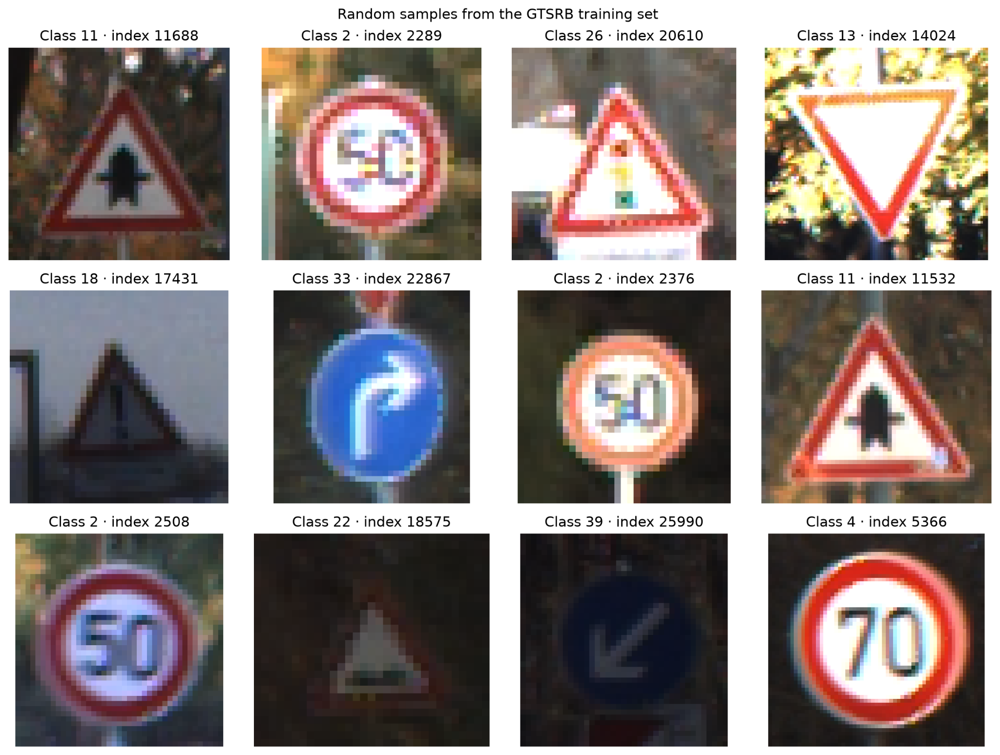
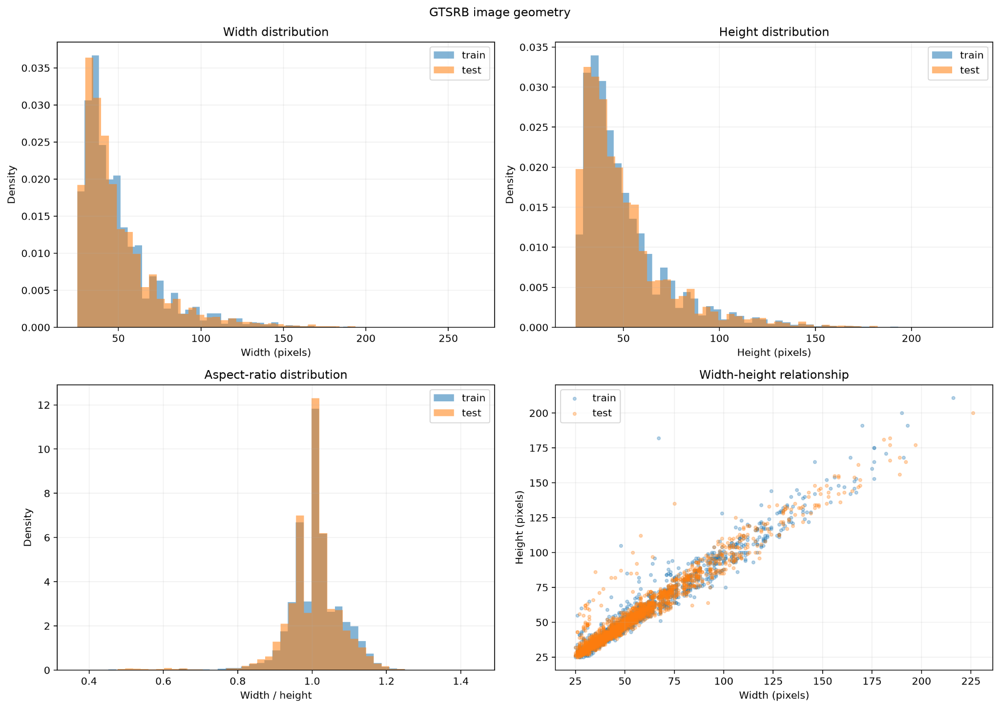

# Exercise 1 — Transfer Learning for Traffic Sign Classification

This exercise studies how ImageNet-pretrained convolutional neural networks can be reused and adapted to classify traffic signs from the **German Traffic Sign Recognition Benchmark (GTSRB)**.

The work is divided into three progressive stages:

1. **Exercise 1.1 — Exploratory Data Analysis:** inspect the dataset and identify properties that may affect the experiments.
2. **Exercise 1.2 — Frozen feature extraction:** use pretrained ResNet backbones as fixed feature extractors and train classical Scikit-learn classifiers.
3. **Exercise 1.3 — Fine-tuning:** adapt pretrained ResNet models to GTSRB by training different portions of the network and comparing linear and MLP classifier heads.

All reported values come from the experiment artifacts produced by the code. The main comparison includes **6 classical baselines** and **12 five-epoch fine-tuning runs**.

---

## Dataset

The experiments use `torchvision.datasets.GTSRB`.

| Split | Images |
|---|---:|
| Official training split | 26,640 |
| Official test split | 12,630 |
| Classes | 43 |

For fine-tuning, the official training split is divided into:

| Internal split | Images |
|---|---:|
| Training | 21,312 |
| Validation | 5,328 |
| Official test | 12,630 |

The internal split uses an 80/20 ratio, stratification by class, and seed `42`. The official test set is kept separate from training and checkpoint selection.

---

## Repository structure

```text
Exercise1/
├── main.py
├── data.py
├── eda.py
├── feature_extraction.py
├── classical_baseline.py
├── fine_tuning.py
│
├── assets/
│   ├── eda_samples.png
│   ├── eda_class_distribution.png
│   ├── eda_image_dimensions.png
│   ├── baseline_performance_comparison.svg
│   ├── finetuning_performance_comparison.svg
│   └── finetuning_quality_vs_time.svg
│
└── outputs/
    ├── exercise_1_1/
    │   ├── figures/
    │   └── results/
    ├── exercise_1_2/
    │   ├── features/
    │   └── results/
    └── exercise_1_3/
        └── results/
```

The `outputs/`, `wandb/`, dataset, feature arrays, and checkpoints are generated locally and are excluded from version control. Only selected documentation figures are stored under `assets/`.

### Main modules

| File | Responsibility |
|---|---|
| `main.py` | Unified command-line entry point for Exercises 1.1, 1.2, and 1.3 |
| `data.py` | GTSRB loading and label extraction |
| `eda.py` | Exploratory analysis, figures, and CSV summaries |
| `feature_extraction.py` | Pretrained backbone preparation and feature extraction |
| `classical_baseline.py` | Scaling, classical classifiers, evaluation, local logging, and W&B logging |
| `fine_tuning.py` | Dataset split, model adaptation, training, validation, checkpointing, and testing |

---

## Environment

Python 3.12 is used for the project. The root `environment.yml` records the main portable dependencies:

- NumPy
- Pandas
- Matplotlib
- Scikit-learn
- Pillow
- Weights & Biases

PyTorch and Torchvision must be installed with a build compatible with the CUDA version of the execution machine.

From the repository root:

```bash
conda env create -f environment.yml
conda activate DLA2026_server
```

Then install the appropriate PyTorch and Torchvision packages for the target machine.

The experiments were developed locally on Windows with an NVIDIA RTX 3050 Ti Laptop GPU and executed at larger scale on the IRIS server using NVIDIA RTX 5090 GPUs.

---

## Running the exercises

Run the commands from the `DLA_LAB1` directory.

### Exercise 1.1 — EDA

```bash
python Exercise1/main.py eda
```

### Exercise 1.2 — One classical baseline

```bash
python Exercise1/main.py baseline \
  --models resnet18 \
  --classifiers linear_svc
```

### Exercise 1.2 — Complete 2 × 3 experiment matrix

```bash
python Exercise1/main.py baseline \
  --models all \
  --classifiers all \
  --wandb
```

### Exercise 1.3 — Fine-tuning example

```bash
python Exercise1/main.py finetune \
  --model resnet18 \
  --strategy last_block \
  --classifier linear \
  --epochs 5 \
  --wandb
```

Supported fine-tuning arguments:

| Argument | Values |
|---|---|
| `--model` | `resnet18`, `resnet50` |
| `--strategy` | `classifier`, `last_block`, `full` |
| `--classifier` | `linear`, `mlp` |
| `--epochs` | positive integer |
| `--wandb` | optional W&B logging |

---

# Exercise 1.1 — Exploratory Data Analysis

## Objective

The EDA characterizes the dataset before defining the classification pipeline. It includes:

- reproducible visual inspection of training images;
- class counts and percentages;
- train-test class-distribution comparison;
- original width and height;
- aspect ratio and image area;
- descriptive statistics and percentiles;
- automatic export of figures and CSV files.

The code generates:

```text
outputs/exercise_1_1/
├── figures/
│   ├── gtsrb_train_samples.png
│   ├── class_distribution.png
│   └── image_dimensions.png
└── results/
    ├── class_distribution.csv
    ├── image_metadata.csv
    └── image_metadata_summary.csv
```

<p align="center">
  
</p>

<p align="center">
  <em>Random samples from the official GTSRB training split.</em>
</p>

<p align="center">
  
</p>

<p align="center">
  <em>Class counts in the official training and test splits.</em>
</p>

<p align="center">
  
</p>

<p align="center">
  <em>Original image geometry in the train and test splits.</em>
</p>

## Main observations

### Moderate class imbalance

The least represented training class contains **150 images**, while the most represented class contains **1,500 images**, producing a maximum imbalance ratio of **10:1**.

The train and test class proportions are nevertheless strongly aligned, with a correlation of approximately **0.9985**.

Because accuracy can hide poor performance on less frequent classes, all classification experiments also report **macro-F1**, which gives equal weight to every class.

### Small and variable input images

The median image resolution is approximately **43 × 43 pixels**. Mean dimensions are close to 51 pixels, while the 95th percentiles are approximately 101 pixels in width and 98–99 pixels in height.

Most images are nearly square, but quality, illumination, scale, contrast, centering, and background vary substantially.

The pretrained ResNet input transforms enlarge these images to the resolution expected by the ImageNet weights. This resizing ensures architectural compatibility but does not create additional visual detail.

### Preprocessing consequences

The baseline experiments use the transforms associated with the selected pretrained weights through `weights.transforms()`.

No custom augmentation is applied in Exercise 1. Horizontal flips are avoided because they can change the semantics of a traffic sign, and aggressive crops may remove discriminative regions.

---

# Exercise 1.2 — Frozen Features and Classical Classifiers

## Method

A pretrained ResNet is converted into a fixed feature extractor by replacing its ImageNet classifier:

```python
feature_dimension = model.fc.in_features
model.fc = nn.Identity()
```

Feature extraction is performed with:

```python
model.eval()

with torch.inference_mode():
    ...
```

No CNN parameter is updated. The resulting feature vectors are saved to disk and reused by the classical classifiers.

## Backbones

| Backbone | Pretrained weights | Feature size | Extraction batch size |
|---|---|---:|---:|
| ResNet-18 | `IMAGENET1K_V1` | 512 | 32 |
| ResNet-50 | `IMAGENET1K_V2` | 2,048 | 16 |

## Classifiers

Three Scikit-learn classifiers are evaluated:

- `LinearSVC(C=1.0, max_iter=10000, random_state=42)`
- `KNeighborsClassifier(n_neighbors=5, n_jobs=-1)`
- `LinearDiscriminantAnalysis()`

Before fitting a classifier, feature standardization is learned only from the training set:

```python
scaler.fit(train_features)
train_features = scaler.transform(train_features)
test_features = scaler.transform(test_features)
```

This prevents test-set information from entering the preprocessing stage.

## Results

<p align="center">
  
</p>

| Backbone | Classifier | Test accuracy | Test macro-F1 | Classifier fit | Prediction |
|---|---|---:|---:|---:|---:|
| ResNet-18 | LDA | 0.7912 | **0.7228** | 5.16 s | 0.015 s |
| ResNet-50 | LDA | **0.8010** | 0.7167 | 2.85 s | 0.013 s |
| ResNet-18 | LinearSVC | 0.7643 | 0.6795 | 126.77 s | 0.011 s |
| ResNet-50 | LinearSVC | 0.7348 | 0.6446 | 12,582.21 s | 0.030 s |
| ResNet-18 | KNN | 0.6591 | 0.5827 | 0.003 s | 0.555 s |
| ResNet-50 | KNN | 0.5246 | 0.4454 | 0.009 s | 1.991 s |

The times above cover classifier fitting and prediction only; feature-extraction time was not recorded in the aggregated baseline table.

### Interpretation

**ResNet-18 + LDA** is the best classical baseline according to macro-F1. **ResNet-50 + LDA** reaches the highest accuracy, but its macro-F1 is slightly lower.

The larger 2,048-dimensional ResNet-50 representation does not provide a general advantage. KNN degrades substantially, and LinearSVC is both slower and less accurate. The ResNet-50 LinearSVC run also emits a convergence warning after reaching 10,000 iterations, so that result must be interpreted cautiously.

In every classical baseline, accuracy is higher than macro-F1. This confirms that aggregate accuracy alone does not fully represent performance across the 43 imbalanced classes.

---

# Exercise 1.3 — Fine-Tuning

## Model adaptation

The ImageNet classifier is replaced by a GTSRB classifier with 43 outputs.

Two classifier heads are supported.

### Linear head

```python
nn.Linear(input_features, 43)
```

### MLP head

```python
nn.Sequential(
    nn.Linear(input_features, 256),
    nn.ReLU(),
    nn.Dropout(p=0.3),
    nn.Linear(256, 43),
)
```

## Fine-tuning strategies

| Strategy | Trainable modules |
|---|---|
| `classifier` | classifier head only |
| `last_block` | `layer4` and classifier head |
| `full` | the complete network |

Frozen Batch Normalization modules are kept in evaluation mode during selective fine-tuning so that their running statistics are not modified unintentionally.

## Training configuration

| Component | Value |
|---|---|
| Loss | `CrossEntropyLoss` |
| Optimizer | `AdamW` |
| Backbone learning rate | `1e-4` |
| Classifier learning rate | `1e-3` |
| Weight decay | `1e-4` |
| Epochs in the main comparison | 5 |
| Seed | 42 |
| Checkpoint criterion | Minimum validation loss |
| ResNet-18 batch size | 32 |
| ResNet-50 batch size | 16 |

The classifier uses a higher learning rate because it starts from randomly initialized parameters, while pretrained layers are updated more conservatively.

## Results

<p align="center">
  
</p>

| Backbone | Strategy | Head | Test accuracy | Test macro-F1 | Training time |
|---|---|---|---:|---:|---:|
| ResNet-18 | full | MLP | 0.9840 | **0.9805** | 100.3 s |
| ResNet-18 | full | linear | **0.9851** | 0.9796 | 97.2 s |
| ResNet-50 | full | linear | 0.9804 | 0.9715 | 156.5 s |
| ResNet-50 | full | MLP | 0.9808 | 0.9706 | 157.5 s |
| ResNet-18 | last_block | linear | 0.9603 | 0.9453 | 87.8 s |
| ResNet-18 | last_block | MLP | 0.9511 | 0.9330 | 88.6 s |
| ResNet-50 | last_block | linear | 0.9525 | 0.9267 | 110.0 s |
| ResNet-50 | last_block | MLP | 0.9458 | 0.9249 | 111.7 s |
| ResNet-18 | classifier | MLP | 0.7936 | 0.7065 | 80.8 s |
| ResNet-18 | classifier | linear | 0.7915 | 0.7053 | 80.1 s |
| ResNet-50 | classifier | linear | 0.7910 | 0.6798 | 104.9 s |
| ResNet-50 | classifier | MLP | 0.7849 | 0.6720 | 99.5 s |

<p align="center">
  
</p>

### Main findings

1. **Adapting the representation is decisive.**  
   Moving from classifier-only training to `last_block` increases macro-F1 by approximately 23–25 percentage points.

2. **Full fine-tuning gives a further improvement.**  
   The transition from `last_block` to `full` adds approximately 3.4–4.7 macro-F1 percentage points.

3. **ResNet-18 is consistently stronger in these experiments.**  
   It obtains a higher macro-F1 than ResNet-50 in every directly comparable configuration while requiring less training time.

4. **The MLP head is not systematically better.**  
   Differences between the linear and MLP heads are small and inconsistent. More random seeds would be needed to determine whether these differences are meaningful.

5. **The validation-test gap decreases as more of the backbone is adapted.**  
   The gap is largest for classifier-only training, smaller for `last_block`, and approximately 1.4–1.8 percentage points for full fine-tuning.

## Selected model

The highest macro-F1 is obtained by **ResNet-18, full fine-tuning, MLP head**:

```text
test macro-F1 = 0.9805
test accuracy = 0.9840
```

The selected final model is instead **ResNet-18, full fine-tuning, linear head**:

```text
test accuracy = 0.9851
test macro-F1 = 0.9796
test loss = 0.0529
```

The linear model reaches the highest accuracy and lowest test loss, remains within 0.001 macro-F1 of the best run, uses fewer parameters, and trains slightly faster. It therefore provides the strongest overall balance of predictive performance and architectural simplicity.

When training cost is the main constraint, **ResNet-18, `last_block`, linear head** is a useful alternative with test accuracy `0.9603` and macro-F1 `0.9453`.

---

## Output artifacts

### Exercise 1.2

```text
outputs/exercise_1_2/
├── features/
│   ├── train_features_resnet18.npz
│   ├── test_features_resnet18.npz
│   ├── train_features_resnet50.npz
│   └── test_features_resnet50.npz
└── results/
    ├── experiments.csv
    └── runs/<run_id>/
        ├── config.json
        ├── metrics.json
        ├── classification_report.csv
        └── predictions.npz
```

### Exercise 1.3

```text
outputs/exercise_1_3/results/
├── experiments.csv
└── runs/<run_id>/
    ├── config.json
    ├── history.csv
    ├── best_model.pt
    ├── metrics.json
    ├── classification_report.csv
    └── predictions.npz
```

Each run stores its resolved configuration, metrics, predictions, and per-class report. Fine-tuning runs also store the epoch history and best checkpoint.

---

## Weights & Biases

W&B logging is optional through `--wandb`.

### Exercise 1.2

- project: `dla-lab1`
- group: `exercise-1-2`
- job type: `classical-baseline`

### Exercise 1.3

- project: `dla-lab1`
- group: `exercise-1-3`
- job type: `fine-tuning`

The tracked information includes configurations, aggregate metrics, per-class reports, confusion matrices, batch/epoch training metrics, and model artifacts where applicable.

---

## Reproducibility

The implementation includes:

- seed `42`;
- fixed official GTSRB train/test splits;
- stratified 80/20 train-validation split for fine-tuning;
- transforms tied to the selected pretrained weights;
- deterministic sample selection in the EDA;
- persisted configurations and metrics;
- cached feature arrays;
- unique run identifiers;
- best-checkpoint selection using validation loss;
- optional external experiment tracking with W&B.

The current comparison uses one seed. Small differences, especially between linear and MLP heads, should therefore not be interpreted as statistically significant.

---

## Known limitations

- Only one random seed is available for the reported experiment matrix.
- Feature-extraction time is not included in the Exercise 1.2 timing comparison.
- ResNet-18 and ResNet-50 use different pretrained weight versions and different batch sizes, so their comparison is not a perfectly isolated architectural ablation.
- The ResNet-50 LinearSVC run does not converge within 10,000 iterations.
- The checkpoint is selected using validation loss, while the main ranking emphasizes test macro-F1.
- Repeated comparison of many configurations on the official test set reduces its purity as a final unbiased estimate.
- Numerical confusion matrices were not included in the compact analysis bundle, so specific confusion pairs are not documented here.

---

## References

- German Traffic Sign Recognition Benchmark (GTSRB)
- `torchvision.datasets.GTSRB`
- Torchvision ResNet-18 and ResNet-50 pretrained weights
- PyTorch and Torchvision documentation
- Scikit-learn documentation
- Weights & Biases documentation

Dataset reference:

> J. Stallkamp, M. Schlipsing, J. Salmen, and C. Igel,  
> *Man vs. Computer: Benchmarking Machine Learning Algorithms for Traffic Sign Recognition*,  
> Neural Networks, 2012.

---

## AI Assistance Disclosure

ChatGPT was used as a support tool for:

- discussing the assignment requirements;
- explaining transfer-learning and fine-tuning concepts;
- reviewing code organization and experimental choices;
- assisting with debugging and command-line usage;
- structuring and revising the project documentation.

The generated suggestions were reviewed, adapted, executed, and validated by the author. Experimental metrics in this README come from the produced result files and were not generated or estimated by the language model.
