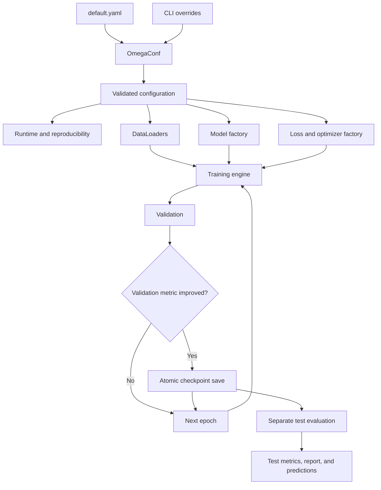
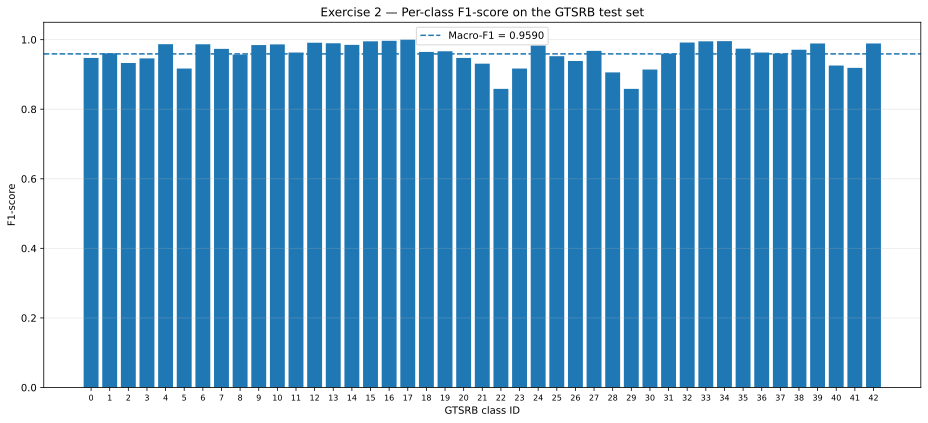

# Exercise 2 — Modular and Reproducible Training Pipeline

This exercise refactors the GTSRB fine-tuning workflow developed in
Exercise 1.3 into a modular, configurable, and reproducible experimental
pipeline.

The scientific task remains the classification of cropped traffic-sign
images into 43 GTSRB classes. The main contribution of Exercise 2 is
therefore engineering-oriented: configuration, data loading, model
construction, optimization, training, validation, checkpointing, and
test evaluation are separated into reusable components.

---

## Objectives

The pipeline is designed to:

- repeat experiments without modifying source-code constants;
- change model and training settings from a configuration file or the command line;
- isolate training and evaluation logic;
- assign a unique directory to each run;
- select checkpoints using a configurable validation metric;
- reproduce the principal sources of randomness;
- evaluate the official test split only through a separate entry point.

---

## Relationship with Exercise 1.3

| Aspect | Exercise 1.3 | Exercise 2 |
|---|---|---|
| Configuration | constants and `argparse` | YAML, OmegaConf, and CLI overrides |
| Code organization | one main fine-tuning module | modules with separate responsibilities |
| Train/validation metrics | loss and accuracy | loss, accuracy, and macro-F1 |
| Checkpoint criterion | validation loss | configurable validation metric |
| Smoke test | not available | supported |
| Test evaluation | part of the experiment workflow | separate script |
| Run naming | timestamp and configuration | generated or custom run name |
| Configuration validation | limited | explicit structured validation |
| Checkpoint writing | direct | atomic temporary-file replacement |
| W&B | operational in Exercise 1 | schema present, not connected in Exercise 2 |

Exercise 2 does not introduce a new neural architecture. It consolidates
the scientific choices already implemented in Exercise 1.3.

---

## Pipeline architecture



The configuration is resolved first. The pipeline then builds all runtime
components from that resolved configuration. During training, validation
controls model selection. The official test set is evaluated only after
training by loading the selected checkpoint.

---

## Project structure

```text
Exercise2/
├── checkpointing.py
├── configuration.py
├── data.py
├── engine.py
├── evaluate_test.py
├── experiment_paths.py
├── main.py
├── models.py
├── optimization.py
├── runtime.py
├── training.py
├── README.md
│
├── assets/
│   └── per_class_f1.svg
│
├── configs/
│   └── default.yaml
│
└── outputs/
    └── runs/
        └── <run_id>/
            ├── best_model.pt
            ├── test_metrics.json
            ├── classification_report.json
            └── predictions.npz
```

### Module responsibilities

| Module | Responsibility |
|---|---|
| `configuration.py` | Load, merge, convert, and validate the configuration |
| `runtime.py` | Seed management, deterministic options, and device selection |
| `data.py` | GTSRB loading, stratified split, DataLoaders, and data metadata |
| `models.py` | Preprocessing, backbone registry, classifier heads, and freezing policy |
| `optimization.py` | Loss factory, parameter groups, and optimizer factory |
| `engine.py` | Reusable one-epoch training and evaluation loops |
| `training.py` | Multi-epoch orchestration, validation, and model selection |
| `checkpointing.py` | Atomic checkpoint saving and checkpoint loading |
| `experiment_paths.py` | Unique run identifiers and output directories |
| `main.py` | Full training and smoke-test entry point |
| `evaluate_test.py` | Independent official test-set evaluation |

---

## Configuration system

The default configuration is stored in:

```text
Exercise2/configs/default.yaml
```

```yaml
paths:
  data_dir: ../data
  output_dir: outputs

data:
  dataset_name: GTSRB
  validation_size: 0.20
  batch_size: 32
  num_workers: 0
  pin_memory: true

model:
  name: resnet18
  classifier_type: linear
  fine_tuning_strategy: last_block
  num_classes: 43
  mlp_hidden_features: 256
  mlp_dropout: 0.30

training:
  epochs: 5
  loss_function: cross_entropy
  optimizer: adamw
  backbone_learning_rate: 0.0001
  classifier_learning_rate: 0.001
  weight_decay: 0.0001

checkpoint:
  monitor: validation_loss
  mode: min

logging:
  batch_interval: 50

tracking:
  use_wandb: false
  project: dla-lab1
  group: exercise-2

experiment:
  seed: 42
  device: auto
  deterministic: false
  run_name: null
  smoke_test_batches: 0
```

Configuration values follow this precedence:

```text
structured defaults
        <
default.yaml
        <
command-line overrides
```

Example:

```bash
python Exercise2/main.py \
  model.name=resnet50 \
  data.batch_size=16 \
  model.classifier_type=mlp \
  model.fine_tuning_strategy=classifier \
  training.epochs=10
```

The configuration layer validates individual values and semantic
relationships. In particular:

```text
validation_loss      -> mode=min
validation_accuracy  -> mode=max
validation_macro_f1  -> mode=max
```

This prevents a run from starting with an inconsistent checkpoint policy.

---

## Supported components

| Component | Supported values |
|---|---|
| Dataset | GTSRB |
| Backbones | ResNet-18, ResNet-50 |
| Classifier heads | linear, MLP |
| Fine-tuning strategies | classifier, last_block, full |
| Loss | Cross Entropy |
| Optimizer | AdamW |
| Checkpoint metrics | validation loss, validation accuracy, validation macro-F1 |
| Devices | automatic, CPU, or explicit CUDA device |

### Fine-tuning strategies

| Strategy | Trainable modules |
|---|---|
| `classifier` | classifier head only |
| `last_block` | `layer4` and classifier head |
| `full` | complete model |

Frozen Batch Normalization modules are kept in evaluation mode during
selective fine-tuning so that their running statistics are not modified.

### Classifier heads

The linear head is:

```python
nn.Linear(input_features, 43)
```

The MLP head is:

```python
nn.Sequential(
    nn.Linear(input_features, 256),
    nn.ReLU(),
    nn.Dropout(p=0.30),
    nn.Linear(256, 43),
)
```

---

## Data preparation

The official GTSRB training split contains 26,640 images and is divided
into a stratified internal training and validation split:

| Split | Images |
|---|---:|
| Internal training | 21,312 |
| Validation | 5,328 |
| Official test | 12,630 |
| Classes | 43 |

The default validation proportion is `0.20`, and the default seed is `42`.

Input preprocessing is tied to the pretrained Torchvision weights through
the corresponding weight transforms. No custom data augmentation is added
in this pipeline.

---

## Training and evaluation engine

The reusable engine exposes two central operations:

```python
train_one_epoch(...)
evaluate(...)
```

Both return aggregate information including:

- loss;
- accuracy;
- macro-F1;
- processed samples;
- processed batches;
- elapsed time.

The evaluation loop can also collect labels and predictions, which are
used by the independent test-evaluation script.

A standard training step performs:

```python
optimizer.zero_grad(set_to_none=True)
outputs = model(images)
loss = criterion(outputs, labels)
loss.backward()
optimizer.step()
```

Cross Entropy receives logits directly; an explicit Softmax is not applied
before the loss.

AdamW uses differentiated learning rates:

- pretrained backbone: `1e-4`;
- new classifier head: `1e-3`;
- weight decay: `1e-4`.

---

## Smoke test

Before launching a full run, a short smoke test can verify that the
complete pipeline is internally consistent:

```bash
python Exercise2/main.py \
  experiment.smoke_test_batches=2
```

The smoke test prepares the real configuration, datasets, model, loss, and
optimizer, then processes only a limited number of training and validation
batches.

It verifies:

- imports and configuration;
- input and output shapes;
- device compatibility;
- forward pass;
- loss computation;
- backward pass;
- optimizer update;
- validation evaluation.

It is not intended to estimate model performance.

---

## Full training

Run the default configuration:

```bash
python Exercise2/main.py
```

Run ResNet-50 with a smaller batch:

```bash
python Exercise2/main.py \
  model.name=resnet50 \
  data.batch_size=16 \
  model.fine_tuning_strategy=last_block \
  model.classifier_type=linear \
  training.epochs=5
```

Select the checkpoint using validation macro-F1:

```bash
python Exercise2/main.py \
  checkpoint.monitor=validation_macro_f1 \
  checkpoint.mode=max
```

Request deterministic execution:

```bash
python Exercise2/main.py \
  experiment.deterministic=true
```

Use a custom run name:

```bash
python Exercise2/main.py \
  experiment.run_name=resnet18-lastblock-mlp
```

---

## Checkpointing

The best checkpoint stores:

- epoch;
- monitored metric name;
- monitored value;
- model state dictionary;
- optimizer state dictionary;
- complete resolved configuration.

The state dictionaries are transferred to CPU before serialization.

Checkpoint writing is atomic:

```text
best_model.pt.tmp
        |
        v
best_model.pt
```

The temporary file is written first and replaces the final checkpoint only
after successful serialization. This reduces the risk of leaving a
partially written checkpoint after an interruption.

---

## Separate test evaluation

The official test set is evaluated through a dedicated entry point:

```bash
python Exercise2/evaluate_test.py \
  --checkpoint Exercise2/outputs/runs/<run_id>/best_model.pt
```

An explicit device can be selected:

```bash
python Exercise2/evaluate_test.py \
  --checkpoint Exercise2/outputs/runs/<run_id>/best_model.pt \
  --device cuda:0
```

The script:

1. reads the resolved configuration from the checkpoint;
2. reconstructs preprocessing, DataLoaders, and model;
3. loads the selected weights;
4. evaluates the complete official test split;
5. computes aggregate and per-class metrics;
6. writes the results into the run directory.

Generated test outputs:

```text
test_metrics.json
classification_report.json
predictions.npz
```

Keeping test evaluation separate discourages repeated inspection of the
test set while model and hyperparameter decisions are still being made.

---

## Reference run

The pipeline was validated with the following complete run:

| Component | Value |
|---|---|
| Run name | `resnet18-lastblock-mlp` |
| Backbone | ResNet-18 |
| Classifier head | MLP |
| Fine-tuning strategy | `last_block` |
| Trainable backbone block | `layer4` |
| MLP hidden units | 256 |
| Dropout | 0.30 |
| Epochs | 10 |
| Batch size | 32 |
| Loss | Cross Entropy |
| Optimizer | AdamW |
| Backbone learning rate | `1e-4` |
| Classifier learning rate | `1e-3` |
| Weight decay | `1e-4` |
| Checkpoint monitor | `validation_macro_f1` |
| Checkpoint mode | `max` |
| Seed | 42 |
| Deterministic mode | disabled |
| W&B tracking | disabled |

The selected checkpoint corresponds to epoch **10**.

### Test results

| Metric | Value |
|---|---:|
| Best validation macro-F1 | 0.9972 |
| Test loss | 0.1416 |
| Test accuracy | 0.9645 |
| Test macro-F1 | 0.9590 |
| Test samples | 12,630 |
| Test evaluation time | 9.87 s |

The validation-to-test macro-F1 gap is approximately
`0.0381`,
or about **3.8 percentage points**.
The official test split is therefore more challenging than the internal
validation split, although overall test performance remains high.

<p align="center">
  
</p>

### Most difficult classes

| Class | Precision | Recall | F1-score | Support |
|---:|---:|---:|---:|---:|
| 22 | 0.9891 | 0.7583 | 0.8585 | 120 |
| 29 | 0.7870 | 0.9444 | 0.8586 | 90 |
| 28 | 0.8324 | 0.9933 | 0.9058 | 150 |
| 30 | 0.9433 | 0.8867 | 0.9141 | 150 |
| 5 | 0.9415 | 0.8937 | 0.9169 | 630 |
| 23 | 1.0000 | 0.8467 | 0.9170 | 150 |
| 41 | 1.0000 | 0.8500 | 0.9189 | 60 |

The weakest classes exhibit different error patterns:

- class 22 has very high precision but lower recall, indicating missed true instances;
- classes 28 and 29 have high recall but lower precision, indicating more false positives;
- class 17 reaches perfect precision, recall, and F1 on the test set.

The aggregate report is:

| Average | Precision | Recall | F1-score |
|---|---:|---:|---:|
| Macro | 0.9621 | 0.9588 | 0.9590 |
| Weighted | 0.9662 | 0.9645 | 0.9645 |

The relatively small difference between macro and weighted F1 indicates
that performance remains broadly balanced across classes, despite the
specific weaknesses identified above.

---

## Run directories and outputs

Run directories use a generated identifier such as:

```text
20260729_171020_622224_resnet18-lastblock-mlp
```

A custom run name may also be supplied through the configuration.

Expected run output:

```text
outputs/runs/<run_id>/
├── best_model.pt
├── test_metrics.json
├── classification_report.json
└── predictions.npz
```

The checkpoint is produced by training. The remaining files are produced
by the separate test-evaluation command.

---

## Reproducibility

The runtime module sets:

```python
random.seed(seed)
numpy.random.seed(seed)
torch.manual_seed(seed)
torch.cuda.manual_seed_all(seed)
```

Worker and DataLoader generators are also seeded.

When:

```yaml
experiment:
  deterministic: true
```

the pipeline requests deterministic PyTorch algorithms and disables cuDNN
benchmarking where appropriate.

The default is `false`, which favors execution speed on CUDA. A fixed seed
still controls the principal random choices, but bit-for-bit
reproducibility is not guaranteed in non-deterministic mode.

---

## Current implementation status

### Operational

- OmegaConf configuration;
- YAML configuration file;
- command-line overrides;
- structured validation;
- train, validation, and test DataLoaders;
- ResNet-18 and ResNet-50;
- linear and MLP heads;
- `classifier`, `last_block`, and `full` strategies;
- Cross Entropy and AdamW;
- differentiated learning rates;
- loss, accuracy, and macro-F1;
- smoke test;
- configurable checkpoint selection;
- atomic checkpoint saving;
- independent test evaluation;
- JSON and NPZ test outputs.

### Present in the schema but not connected

The configuration contains:

```yaml
tracking:
  use_wandb: false
  project: dla-lab1
  group: exercise-2
```

The current Exercise 2 pipeline does not initialize W&B or send metrics to
it. W&B integration is therefore only represented in the configuration
schema.

### History persistence

The multi-epoch training code maintains the complete history in memory,
but the current entry point does not automatically export it to CSV or
JSON. The selected checkpoint is persisted, while training curves would
require an additional history-export step.

---

## Known limitations

- The reference result comes from a single seed.
- Non-deterministic mode was used for the reference run.
- The internal validation split is substantially easier than the official test split.
- Training history is not automatically written to disk.
- W&B options exist in the configuration but are not connected to the pipeline.
- ResNet-18 and ResNet-50 use different pretrained weights and normally different batch sizes.
- The pipeline currently supports only Cross Entropy and AdamW, despite being organized through factories.
- Repeated evaluation of many candidate configurations on the official test set should be avoided.

---

## References and external resources

- German Traffic Sign Recognition Benchmark (GTSRB)
- `torchvision.datasets.GTSRB`
- Torchvision pretrained ResNet weights and transforms
- PyTorch and Torchvision documentation
- OmegaConf documentation
- Scikit-learn classification metrics

Dataset reference:

> J. Stallkamp, M. Schlipsing, J. Salmen, and C. Igel,  
> *Man vs. Computer: Benchmarking Machine Learning Algorithms for Traffic Sign Recognition*,  
> Neural Networks, 2012.

---

## AI Assistance Disclosure

ChatGPT was used as a support tool for:

- discussing the assignment and pipeline requirements;
- explaining configuration, checkpointing, and reproducibility concepts;
- reviewing software organization and command-line workflows;
- assisting with debugging;
- structuring and revising the documentation.

The suggestions were reviewed, adapted, executed, and validated by the
author. The numerical results reported in this README come from the
generated checkpoint, test metrics, and classification report and were not
estimated by the language model.
