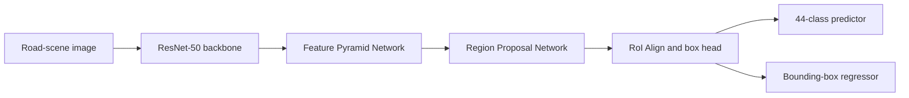
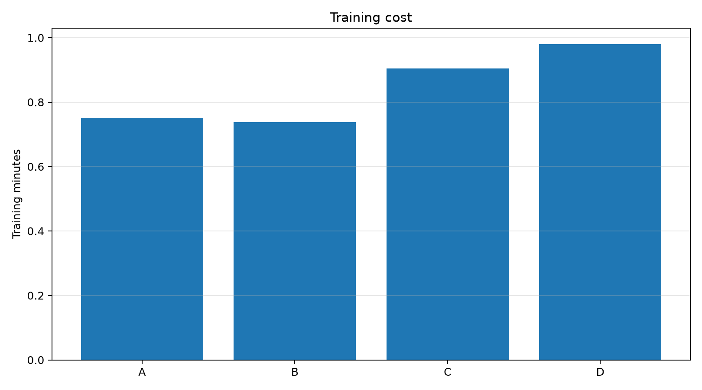
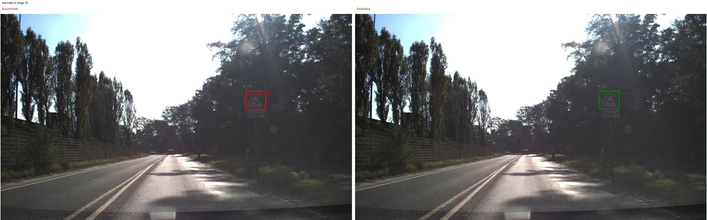

# Exercise 3.3 — Traffic Sign Object Detection

This exercise extends the GTSRB classification work developed in the
previous exercises to **object detection in complete road scenes**.

Instead of receiving an image already cropped around one traffic sign, the
model must:

1. identify whether one or more traffic signs are present;
2. localize each sign with a bounding box;
3. assign each detected sign to one of the 43 canonical GTSRB classes.

The detector is based on **Faster R-CNN with a ResNet-50-FPN backbone**.
The experimental study compares the original COCO initialization with a
ResNet-50 body previously fine-tuned as a GTSRB image classifier.

---

## Main result

The best validation configuration was:

> **Run A — COCO-initialized backbone, frozen**

| Split | mAP@[0.50:0.95] | AP50 | AP75 |
|---|---:|---:|---:|
| Validation | **0.220813** | **0.323058** | **0.272360** |
| Test | **0.228329** | **0.328921** | **0.289682** |

The final configuration was selected exclusively on the validation split.
The test split was evaluated once, after model selection.

<p align="center">
  
</p>

The GTSRB initialization was transferred and verified correctly, but it did
not outperform the COCO baseline under the tested protocol. Progressive
unfreezing improved the GTSRB variants, although none recovered the full
performance gap.

This is a result about the specific dataset, detector, transfer procedure,
and five-epoch protocol used here. It does **not** establish that
domain-specific pretraining is generally ineffective.

---

## Dataset

The detection dataset is loaded from Hugging Face:

```text
repository: keremberke/german-traffic-sign-detection
configuration: full
revision: a549a284a1fefdc761ad459ee85f50c5ad8138ef
datasets version: 3.6.0
```

The original annotations use bounding boxes in:

```text
[x_min, y_min, width, height]
```

The dataset adapter converts them to absolute `XYXY` coordinates, as
required by Torchvision detection models.

### Verified split sizes

One exact duplicate annotation is removed by the adapter.

| Split | Images | Objects | Empty images |
|---|---:|---:|---:|
| Train | 383 | 599 | 29 |
| Validation | 108 | 170 | 6 |
| Test | 54 | 82 | 4 |
| **Total** | **545** | **851** | **39** |

Empty images are retained because they provide useful background examples
and teach the detector that some scenes should produce no foreground
detections.

### Detector labels

- detector label `0`: background;
- detector labels `1–43`: canonical GTSRB classes;
- detector output classes: `44`;
- image format: `torch.float32` in `[0, 1]`;
- bounding boxes: absolute `XYXY`.

No external resize, ImageNet normalization, or custom data augmentation is
applied in the baseline. Faster R-CNN performs its own resizing and
normalization internally.

---

## Exploratory analysis

All images have resolution:

```text
1360 × 800 pixels
```

The main difficulty is the small apparent size of traffic signs inside the
complete scenes.

| Bounding-box statistic | Width | Height |
|---|---:|---:|
| Minimum | 16 px | 16 px |
| Median | 38 px | 37 px |
| Mean | 43.4 px | 42.8 px |
| 95th percentile | 90.4 px | 89.4 px |
| Maximum | 127 px | 128 px |

The median bounding box occupies approximately `0.126%` of the image area.

Using COCO scale thresholds:

| Scale | Objects | Percentage |
|---|---:|---:|
| Small | 315 | 37.0% |
| Medium | 503 | 59.0% |
| Large | 34 | 4.0% |

The dataset is also strongly imbalanced. In the training split, the most
frequent class contains 50 objects, while the least frequent represented
class contains one object.

Only 41 of the 43 foreground classes are represented in training:

```text
absent from train:
- animals
- restriction ends
```

The official splits are retained for the baseline to preserve a clear and
reproducible evaluation protocol. Consequently, per-class metrics for rare
or unseen classes must be interpreted cautiously.

### Annotation integrity

| Check | Result |
|---|---:|
| Valid boxes before deduplication | 852 |
| Invalid boxes | 0 |
| Degenerate boxes | 0 |
| Non-finite boxes | 0 |
| Out-of-image boxes | 0 |
| Invalid categories | 0 |
| Exact duplicate rows | 2 |
| Objects after keeping one copy | 851 |

The principal dataset limitations are therefore not geometric corruption,
but small objects, limited sample size, class imbalance, and missing
training classes.

---

## Detector architecture



Main components:

- **ResNet-50 body:** extracts hierarchical visual features;
- **FPN:** produces multi-scale feature maps, particularly important for
  small objects;
- **RPN:** proposes candidate object regions;
- **RoI box head:** classifies each proposal and refines its geometry;
- **box predictor:** outputs 44 class scores and class-specific box
  corrections.

The Faster R-CNN training loss is the sum of:

```text
classification loss
+ final box-regression loss
+ RPN objectness loss
+ RPN box-regression loss
```

Loss is used to optimize the detector and select the best epoch within each
run. Detection quality is compared using mAP and related metrics, not by
interpreting loss as an accuracy percentage.

---

## GTSRB backbone preparation and transfer

Before runs B–D, a ResNet-50 classifier was fully fine-tuned on the cropped
GTSRB classification dataset.

| Setting | Value |
|---|---|
| Training / validation images | 21,312 / 5,328 |
| Classifier classes | 43 |
| Classifier head | linear |
| Fine-tuning strategy | full |
| Batch size | 16 |
| Epochs | 5 |
| Loss | Cross Entropy |
| Optimizer | AdamW |
| Backbone learning rate | `1e-4` |
| Classifier learning rate | `1e-3` |
| Weight decay | `1e-4` |
| Selected epoch | 5 |
| Validation loss | 0.004080 |

Only the convolutional body is transferred:

```text
conv1
bn1
layer1
layer2
layer3
layer4
```

The classification-specific `avgpool` and `fc` modules are excluded.

Strict transfer validation found:

| Check | Result |
|---|---:|
| Target body tensors required | 265 |
| Target body tensors loaded | 265 |
| Shape mismatches | 0 |
| Exact post-load verification | passed |
| Backbone changed from COCO | confirmed |

The poor performance of the GTSRB detector variants therefore cannot be
attributed to a missing or partially loaded checkpoint.

---

## Experimental questions

The study separates two questions.

### 1. Does the GTSRB classification backbone improve detection?

```text
A — COCO frozen
versus
B — GTSRB frozen
```

A and B use the same trainable detector components and the same number of
trainable parameters. Their main intended difference is the initialization
of the ResNet-50 body.

### 2. Can progressive adaptation recover performance?

```text
B — GTSRB frozen
versus
C — GTSRB layer4 + FPN
versus
D — GTSRB layer3 + layer4 + FPN
```

---

## Experimental matrix

| Run | Initialization | Trainable backbone components | Trainable parameters | Best epoch |
|---|---|---|---:|---:|
| A | COCO | none; detector heads only | 14,715,115 | 5 |
| B | GTSRB | none; detector heads only | 14,715,115 | 3 |
| C | GTSRB | layer4 + FPN | 33,001,707 | 5 |
| D | GTSRB | layer3 + layer4 + FPN | 40,079,595 | 5 |

### Common protocol

All four runs use:

- Faster R-CNN ResNet-50-FPN;
- identical train and validation splits;
- seed `42`;
- batch size `1`;
- `5` training epochs;
- SGD optimizer;
- momentum `0.9`;
- weight decay `0.0005`;
- detector learning rate `0.005`;
- backbone learning rate `0.0001` when trainable;
- StepLR with step size `3` and gamma `0.1`;
- automatic mixed precision;
- best-checkpoint selection by minimum validation total loss;
- final configuration selection by validation mAP@[0.50:0.95];
- no test evaluation during the A–D comparison.

The test split is not used to choose the model.

---

## Validation results

| Run | Val. loss | mAP | AP50 | AP75 | Precision@0.5 | Recall@0.5 | F1@0.5 |
|---|---:|---:|---:|---:|---:|---:|---:|
| A | 0.211201 | **0.220813** | **0.323058** | **0.272360** | 0.8611 | 0.1824 | **0.3010** |
| B | 0.265388 | 0.025346 | 0.058273 | 0.017204 | 0.0000 | 0.0000 | 0.0000 |
| C | 0.289489 | 0.048158 | 0.116793 | 0.018993 | 0.0000 | 0.0000 | 0.0000 |
| D | 0.264972 | 0.060371 | 0.154755 | 0.046821 | 0.5556 | 0.0294 | 0.0559 |

### A versus B: initialization effect

```text
A mAP: 0.220813
B mAP: 0.025346
absolute difference: -0.195467
relative difference: -88.5%
```

The frozen GTSRB body is substantially weaker than the frozen COCO body for
this detection task.

### B → C → D: progressive unfreezing

Unfreezing `layer4` and the FPN improves mAP from `0.025346` to `0.048158`.
Unfreezing `layer3` as well raises it further to `0.060371`.

This shows that adaptation helps the GTSRB representation, but Run D
remains approximately 72.7% below Run A in mAP.

<p align="center">
  
</p>

The fixed-threshold values describe one operating point only:

```text
score threshold = 0.5
IoU threshold = 0.5
```

They complement, but do not replace, the COCO-style mAP comparison.

---

## Training behavior and cost

<p align="center">
  
</p>

Run A reduces training loss from `0.292408` to `0.173738` and validation
loss from `0.277499` to `0.211201`. Its best checkpoint occurs at epoch 5.

Run B reaches its best validation loss at epoch 3 and then degrades while
training loss continues to improve.

Runs C and D continue improving through epoch 5. Additional training could
potentially help them, but the fixed five-epoch protocol remains the basis
of the reported comparison.

<p align="center">
  
</p>

| Run | Trainable parameters | Peak allocated GPU memory | Training time |
|---|---:|---:|---:|
| A | 14,715,115 | 5,287 MiB | 45.1 s |
| B | 14,715,115 | 5,287 MiB | 44.2 s |
| C | 33,001,707 | 5,467 MiB | 54.3 s |
| D | 40,079,595 | 5,730 MiB | 58.8 s |

Run A is both the best-performing configuration and one of the least
expensive.

---

## Final test evaluation

Only the selected Run A checkpoint is evaluated on the official test split.

### COCO-style metrics

| Metric | Value |
|---|---:|
| mAP@[0.50:0.95] | **0.228329** |
| AP50 | 0.328921 |
| AP75 | 0.289682 |
| AP small | 0.253322 |
| AP medium | 0.274623 |
| AP large | 0.850000 |
| AR@100 | 0.529316 |

Validation mAP is `0.220813`; test mAP is `0.228329`. The final result does
not show an evident validation-to-test collapse.

The large-object result should be interpreted cautiously because large
objects are very rare.

### Fixed-threshold diagnostics

At score threshold `0.5` and IoU `0.5`:

| Metric | Value |
|---|---:|
| Precision | 0.523810 |
| Recall | 0.134146 |
| F1 | 0.213592 |
| True positives | 11 |
| False positives | 10 |
| False negatives | 71 |
| Mean matched IoU | 0.859288 |
| Empty-image FP rate | 0.000000 |

The detector is conservative at this score threshold. It produces a
moderate proportion of correct detections, but misses many real objects.

mAP is measured by varying score thresholds and IoU criteria, whereas these
fixed-threshold values describe a single operating point. The two views are
therefore complementary.

---

## Qualitative examples

### Successful detection

<p align="center">
  
</p>

A sufficiently visible triangular sign is localized with a plausible
bounding box and the correct class.

### False-negative case

<p align="center">
  
</p>

Small and distant traffic signs are frequently missed at score threshold
`0.5`. This qualitative behavior is consistent with the low fixed-threshold
recall and the high number of false negatives.

---

## Interpretation

The experimental pattern supports the following interpretation:

1. The GTSRB classifier is trained on cropped and centered traffic signs.
2. The detector must find small signs embedded in complete road scenes.
3. Full classification fine-tuning may specialize the backbone toward crop
   classification and reduce some generic localization-oriented features.
4. In Run B, the transferred GTSRB body is combined with a COCO-derived FPN
   that is also frozen.
5. Runs C and D allow increasing adaptation and progressively improve the
   result.
6. The detection training set contains only 383 images, limiting how much
   a large unfrozen backbone can be adapted in five epochs.

This is an interpretation consistent with the observations, not a direct
causal decomposition.

---

## Project structure

```text
Exercise3/
├── analysis/           dataset analysis and class mapping
├── backbone/           canonical GTSRB ResNet-50 preparation
├── checks/             adapter, loader, model, transfer and smoke checks
├── configs/            OmegaConf/YAML configurations
├── data_pipeline/      loading, adapter, transforms and DataLoaders
├── evaluation/         mAP and fixed-threshold evaluation
├── experiments/        A–D matrix and comparison orchestration
├── models/             Faster R-CNN and strict GTSRB transfer
├── training/           engine, trainer, checkpoints and W&B
├── visualization/      ground-truth and prediction visualization
├── main.py             unified public CLI
├── train_baseline.py
├── evaluate_detector.py
├── run_experiment_matrix.py
├── README.md
└── assets/             curated README figures only
```

Large outputs, model checkpoints, W&B caches, dataset caches, logs, and raw
predictions are intentionally excluded from Git.

---

## Unified CLI

Run commands from the `DLA_LAB1` root:

```bash
python -m Exercise3.main --help
```

Available commands:

```text
inspect
eda
class-mapping
check
prepare-backbone
train
evaluate
matrix
```

Examples:

```bash
python -m Exercise3.main inspect --split train

python -m Exercise3.main check \
  --device cpu \
  --weights none \
  --num-workers 0 \
  --skip-smoke \
  --skip-gtsrb

python -m Exercise3.main prepare-backbone --validate-only

python -m Exercise3.main matrix \
  --preflight-only \
  --device cuda:0 \
  --num-workers 4 \
  --no-wandb
```

---

## Reproduction

### 1. Prepare the canonical GTSRB backbone

```bash
CUDA_VISIBLE_DEVICES=0 python -m Exercise3.main prepare-backbone \
  --device cuda:0 \
  --num-workers 4 \
  --epochs 5
```

Expected checkpoint:

```text
Exercise3/checkpoints/gtsrb_resnet50_full_linear.pt
```

The checkpoint is intentionally excluded from Git.

### 2. Validate strict transfer

```bash
CUDA_VISIBLE_DEVICES=0 python -m Exercise3.checks.validate_gtsrb_transfer \
  --checkpoint Exercise3/checkpoints/gtsrb_resnet50_full_linear.pt \
  --required-strategy full \
  --no-progress
```

### 3. Run matrix preflight

```bash
CUDA_VISIBLE_DEVICES=0 python -m Exercise3.main matrix \
  --preflight-only \
  --device cuda:0 \
  --num-workers 4 \
  --no-wandb
```

### 4. Run the A–D experiment matrix

```bash
CUDA_VISIBLE_DEVICES=0 python -m Exercise3.main matrix \
  --device cuda:0 \
  --num-workers 4 \
  --wandb \
  --wandb-project dla-lab1 \
  --no-log-checkpoints
```

Do not add:

```text
--evaluate-test-all
```

The test split must remain closed during model selection.

### 5. Evaluate the selected checkpoint once

```bash
CUDA_VISIBLE_DEVICES=0 python -m Exercise3.main evaluate \
  --config Exercise3/configs/evaluation.yaml \
  --checkpoint <SELECTED_BEST_MODEL_PT> \
  --split test \
  --allow-test \
  --device cuda:0
```

---

## Evaluation protocol

The evaluation module reports:

- mAP@[0.50:0.95];
- AP50 and AP75;
- AP for small, medium and large objects;
- AR@100;
- per-class metrics;
- one-to-one matching at IoU `0.5`;
- precision, recall, and F1 at score threshold `0.5`;
- TP, FP, and FN;
- false positives on empty images;
- per-image diagnostics;
- qualitative predictions.

The fixed-threshold metrics are not referred to as “accuracy”, because
object detection must jointly evaluate classification, localization,
duplicate predictions, false positives, and missed objects.

---

## Weights & Biases

The completed study used:

```text
project: dla-lab1
entity: alepogge-university-of-florence
group: 20260731_160848_exercise-3-3-backbone-study
```

Completed runs:

| Run | Name | W&B ID |
|---|---|---|
| A | `coco-frozen` | `czjaa6cm` |
| B | `gtsrb-frozen` | `fzriktoy` |
| C | `gtsrb-layer4` | `7rauu5lc` |
| D | `gtsrb-layer3-layer4` | `3kfi2wex` |

Training metrics, validation results, comparison tables, qualitative
images, and final test metrics were logged to W&B.

---

## Reproducibility

The reference study used:

| Component | Version |
|---|---|
| Python | 3.12.13 |
| PyTorch | 2.13.0+cu132 |
| Torchvision | 0.28.0+cu132 |
| datasets | 3.6.0 |
| TorchMetrics | 1.9.0 |
| pycocotools | 2.0.11 |
| W&B | 0.28.1 |
| GPU | NVIDIA GeForce RTX 5090 |
| Seed | 42 |
| Git commit | `a14a3f51478ac467534750cf3f0621c93c64f618` |

Study identifier:

```text
20260731_160848_exercise-3-3-backbone-study
```

---

## Limitations

- one run per configuration;
- no multi-seed uncertainty estimate;
- only 383 training images;
- only 54 test images;
- strong class imbalance;
- classes absent from training or test;
- only five detector-training epochs;
- no custom data augmentation;
- only Faster R-CNN ResNet-50-FPN;
- fixed score threshold `0.5` not tuned on validation;
- per-class AP may depend on very few objects;
- optional COCO-layer4 control experiment not executed.

---

## Conclusion

The experiment answers a narrow but reproducible question:

> With this detection dataset, five-epoch training protocol, and transfer
> of a classification-fine-tuned ResNet-50 body into a COCO-derived Faster
> R-CNN/FPN, the frozen COCO initialization was clearly superior.

The GTSRB transfer was technically correct. Progressive unfreezing improved
its performance, but the GTSRB variants remained below the COCO baseline.

The result highlights that successful classification transfer does not
automatically imply successful object-detection transfer, especially when
the source classifier sees centered crops while the detector must localize
small objects in complex scenes.

---

## AI Assistance Disclosure

OpenAI ChatGPT was used to support:

- interpretation of the laboratory instructions;
- modular design and code review;
- debugging of paths, checkpoint discovery, and experiment orchestration;
- preparation of validation and reproducibility procedures;
- organization and revision of the documentation.

All generated code and commands were inspected before use. The experiments
were executed by the author, and all reported metrics were checked against
the generated JSON, CSV, logs, checkpoints, and W&B artifacts. The author
remains responsible for the final implementation and interpretation.

---

## References and external resources

- DLA Lab 1 assignment notebook.
- German Traffic Sign Recognition Benchmark and German Traffic Sign
  Detection Benchmark.
- `keremberke/german-traffic-sign-detection` on Hugging Face.
- PyTorch and Torchvision Faster R-CNN documentation.
- TorchMetrics `MeanAveragePrecision`.
- COCO evaluation API and `pycocotools`.
- OmegaConf.
- Weights & Biases.
