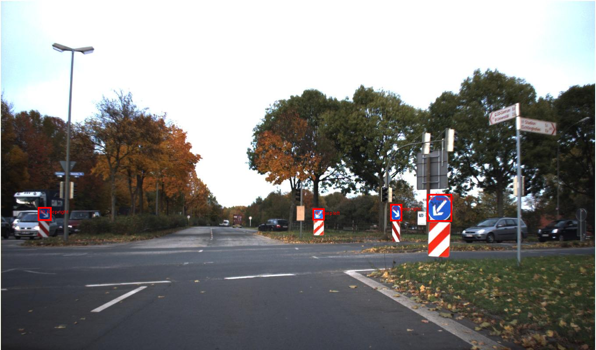
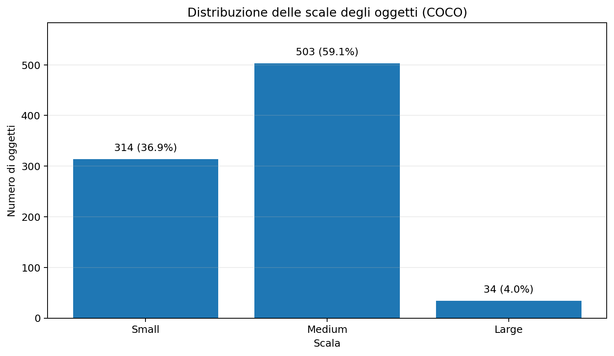
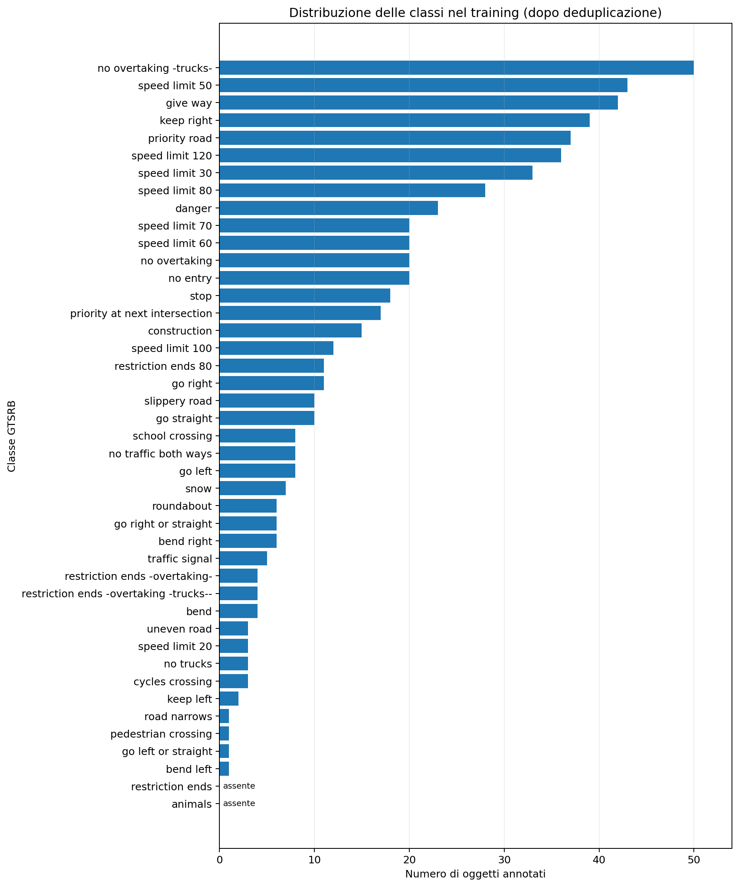
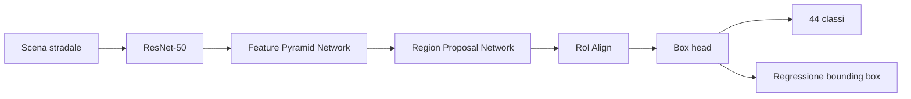
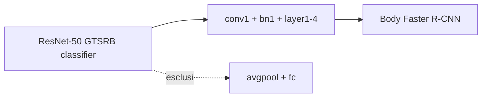
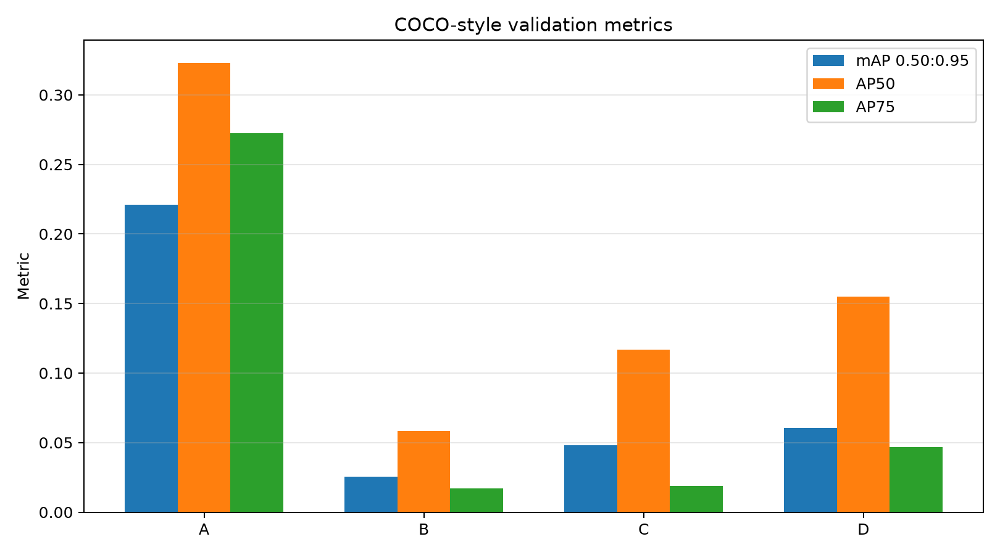
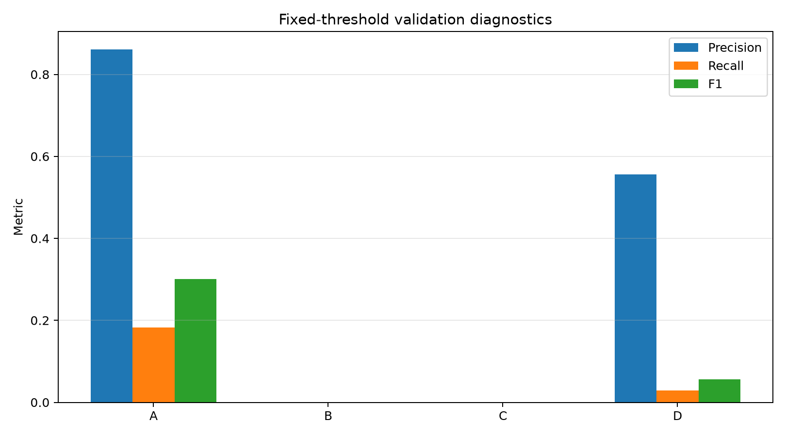
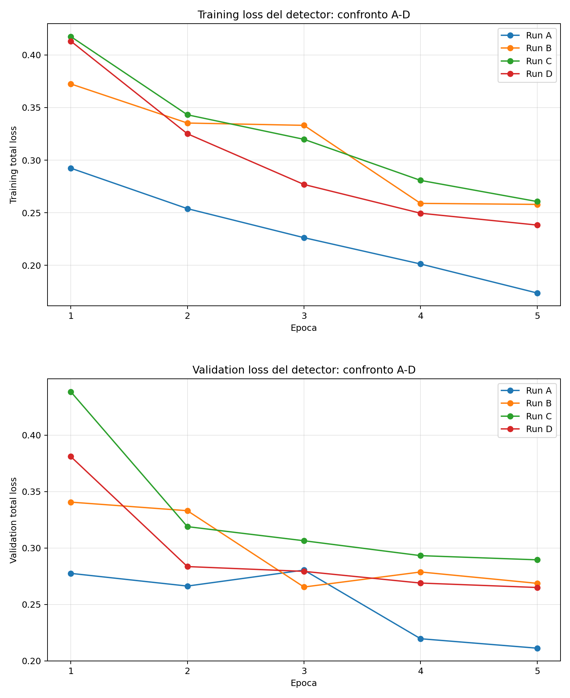
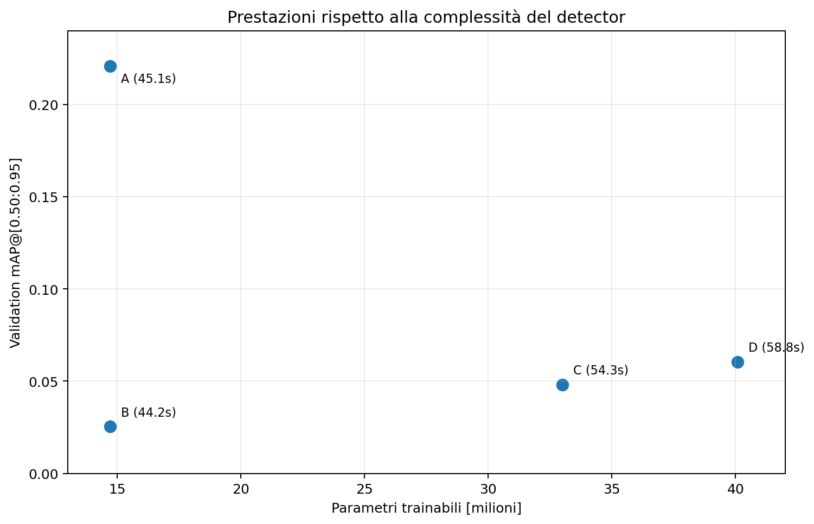
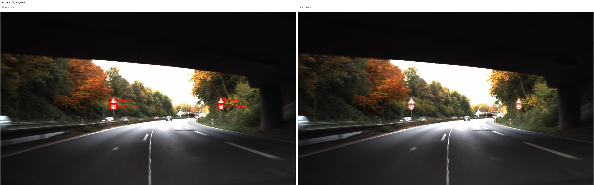

# Exercise 3.3 — Object Detection dei segnali stradali

L'Exercise 3.3 estende il lavoro di classificazione svolto su GTSRB alla **object detection in scene stradali complete**.

Negli esercizi precedenti il modello riceveva immagini già ritagliate attorno a un singolo cartello. Qui deve invece:

1. individuare se uno o più segnali sono presenti;
2. localizzare ogni oggetto con una bounding box;
3. assegnare a ciascuna detection una delle 43 classi GTSRB.

Il detector utilizzato è **Faster R-CNN con backbone ResNet-50-FPN**. Lo studio sperimentale confronta l'inizializzazione COCO del detector con il trasferimento di un body ResNet-50 precedentemente fine-tuned come classificatore GTSRB.

La domanda principale è quindi:

> un backbone specializzato sulla classificazione di crop GTSRB trasferisce meglio di un backbone COCO quando il task diventa object detection?

---

## Dal crop alla scena completa

Il cambio di task è sostanziale.

```text
Classificazione GTSRB
crop centrato sul cartello
        ↓
un'etichetta per immagine

Object detection
scena stradale completa
        ↓
0, 1 o più oggetti
        ↓
bounding box + classe + score
```

<p align="center">
  
</p>

Nelle scene complete i cartelli occupano una porzione molto piccola dell'immagine e devono essere localizzati prima di poter essere classificati. Questo rende il task più difficile e modifica anche il tipo di rappresentazioni utili al modello.

---

## Dataset

Il dataset di detection è:

```text
keremberke/german-traffic-sign-detection
configuration: full
```

Le immagini hanno risoluzione fissa:

```text
1360 × 800 pixel
```

Le annotazioni originarie rappresentano le bounding box come:

```text
[x_min, y_min, width, height]
```

L'adapter le converte nel formato assoluto `XYXY` richiesto da Torchvision:

```text
[x_min, y_min, x_max, y_max]
```

Le classi del detector sono organizzate come:

```text
0      -> background
1–43   -> classi GTSRB
```

Il predictor finale ha quindi **44 classi**.

### Split effettivamente usati

L'EDA originaria rileva 852 annotazioni valide. Due righe del training rappresentano però la stessa annotazione esatta; l'adapter ne mantiene una sola copia.

Il dataset realmente utilizzato dal detector contiene quindi:

| Split | Immagini | Oggetti | Immagini vuote |
|---|---:|---:|---:|
| Train | 383 | 599 | 29 |
| Validation | 108 | 170 | 6 |
| Test | 54 | 82 | 4 |
| **Totale** | **545** | **851** | **39** |

Le immagini senza oggetti vengono conservate: forniscono esempi di background e permettono di valutare eventuali falsi positivi in scene prive di segnali.

---

## Analisi esplorativa

### Dimensione delle bounding box

Le bounding box sono molto piccole rispetto alle immagini complete.

| Statistica | Larghezza | Altezza |
|---|---:|---:|
| Minimo | 16 px | 16 px |
| Mediana | 38 px | 37 px |
| Media | 43.4 px | 42.8 px |
| 95° percentile | 90.4 px | 89.4 px |
| Massimo | 127 px | 128 px |

La bounding box mediana occupa circa **0.126%** dell'area dell'immagine.

### Scale COCO

Sul dataset effettivo dopo deduplicazione:

| Scala | Oggetti | Percentuale |
|---|---:|---:|
| Small | 314 | 36.9% |
| Medium | 503 | 59.1% |
| Large | 34 | 4.0% |

Circa il **96% degli oggetti è small o medium**.

<p align="center">
  
</p>

La rarità degli oggetti large rende le relative metriche particolarmente sensibili al basso supporto.

### Distribuzione delle classi

Il training è fortemente sbilanciato: la classe più frequente contiene 50 oggetti, mentre alcune classi compaiono una sola volta.

Due classi non sono presenti nel training:

```text
animals
restriction ends
```

La classe `animals` compare nel test, mentre `restriction ends` compare nella validation.

<p align="center">
  
</p>

Gli split ufficiali vengono comunque mantenuti per preservare un protocollo riproducibile. Le metriche per classe devono quindi essere interpretate insieme al relativo supporto.

### Integrità delle annotazioni

I controlli sull'EDA hanno rilevato:

| Controllo | Risultato |
|---|---:|
| Annotazioni valide originarie | 852 |
| Box invalide | 0 |
| Box degeneri | 0 |
| Box non finite | 0 |
| Box fuori immagine | 0 |
| Categorie invalide | 0 |
| Copia duplicata rimossa | 1 |
| Oggetti usati dal detector | 851 |

Le principali difficoltà del dataset non sono quindi errori geometrici, ma **oggetti piccoli, forte sbilanciamento, classi rare o assenti e numero limitato di immagini**.

---

## Preprocessing e dataset adapter

Il detector riceve immagini come tensori `float32` nell'intervallo `[0, 1]`.

Non viene applicata una normalizzazione ImageNet esterna e non viene introdotto un resize manuale: Faster R-CNN gestisce internamente normalizzazione e ridimensionamento.

La baseline non utilizza augmentation personalizzata. Questa scelta mantiene il confronto A–D concentrato sull'inizializzazione e sulla strategia di fine-tuning del backbone.

Le anchor standard vengono mantenute nella prima configurazione. Le bounding box sono prevalentemente quadrate, quindi l'EDA non ha motivato una modifica immediata degli aspect ratio delle anchor.

---

## Architettura Faster R-CNN ResNet-50-FPN



Le componenti principali sono:

- **ResNet-50 body:** estrae feature gerarchiche dalla scena;
- **FPN:** combina feature a diverse scale e produce mappe multi-risoluzione;
- **RPN:** genera candidate region proposals;
- **RoI Align:** produce rappresentazioni di dimensione fissa per ogni proposta;
- **box head:** classifica le proposte e raffina le bounding box.

La FPN è particolarmente rilevante in questo dataset perché la maggior parte dei cartelli è small o medium.

### Loss

Durante il training Faster R-CNN restituisce quattro componenti principali:

```text
classification loss
+ final box-regression loss
+ RPN objectness loss
+ RPN box-regression loss
```

La total loss viene usata per ottimizzare il detector e per selezionare il best checkpoint **all'interno di ogni run**.

La qualità dei detector viene invece confrontata tramite mAP, AP e metriche di precision/recall: una loss più bassa non equivale direttamente a una detection migliore.

---

## Preparazione del backbone GTSRB

Prima delle run B–D viene addestrata una ResNet-50 di classificazione sul dataset GTSRB ritagliato.

| Componente | Valore |
|---|---|
| Backbone | ResNet-50 |
| Strategia | `full` |
| Testa | linear |
| Classi | 43 |
| Batch size | 16 |
| Epoche | 5 |
| Loss | Cross Entropy |
| Optimizer | AdamW |
| LR backbone | `1e-4` |
| LR testa | `1e-3` |
| Weight decay | `1e-4` |
| Best epoch | 5 |
| Validation loss | 0.004080 |
| Validation accuracy | circa 0.9985 |
| Validation macro-F1 | circa 0.9975 |

Il test di classificazione non viene utilizzato per scegliere questo checkpoint.

### Trasferimento nel detector

Viene trasferito soltanto il body convoluzionale:

```text
conv1
bn1
layer1
layer2
layer3
layer4
```

Non vengono trasferiti:

```text
avgpool
fc
```



Il trasferimento è stato verificato in modo stretto:

| Verifica | Risultato |
|---|---:|
| Tensori richiesti | 265 |
| Tensori caricati | 265 |
| Shape mismatch | 0 |
| Uguaglianza dopo il load | verificata |
| Differenza rispetto al body COCO | confermata |

Le basse prestazioni delle varianti GTSRB non possono quindi essere attribuite a un caricamento incompleto o errato del checkpoint.

---

## Domande sperimentali

Lo studio separa due confronti.

### 1. Effetto dell'inizializzazione

```text
A — COCO frozen
vs
B — GTSRB frozen
```

A e B hanno la stessa policy di congelamento e lo stesso numero di parametri trainabili. Il confronto isola quindi, per quanto possibile, l'effetto dell'origine dei pesi del body ResNet-50.

### 2. Progressive unfreezing

```text
B — GTSRB frozen
vs
C — GTSRB layer4 + FPN
vs
D — GTSRB layer3 + layer4 + FPN
```

Le run C e D verificano se una maggiore capacità di adattamento permette al backbone GTSRB di recuperare parte del gap.

---

## Matrice sperimentale

| Run | Inizializzazione | Componenti backbone/FPN trainabili | Parametri trainabili | Best epoch |
|---|---|---|---:|---:|
| A | COCO | nessuno | 14,715,115 | 5 |
| B | GTSRB | nessuno | 14,715,115 | 3 |
| C | GTSRB | `layer4` + FPN | 33,001,707 | 5 |
| D | GTSRB | `layer3` + `layer4` + FPN | 40,079,595 | 5 |

### Protocollo comune

Tutte le run utilizzano:

- Faster R-CNN ResNet-50-FPN;
- gli stessi split train/validation;
- seed `42`;
- batch size `1`;
- `5` epoche;
- SGD;
- momentum `0.9`;
- weight decay `0.0005`;
- detector learning rate `0.005`;
- backbone learning rate `0.0001` quando trainabile;
- StepLR con `step_size=3` e `gamma=0.1`;
- automatic mixed precision;
- best checkpoint della singola run selezionato sulla **minima validation total loss**.

Il confronto tra le quattro configurazioni usa invece come metrica primaria la **validation mAP@[0.50:0.95]**.

Il test rimane chiuso durante l'intera matrice A–D.

---

## Metriche di valutazione

### IoU

L'Intersection over Union misura la sovrapposizione tra bounding box predetta e ground truth.

Le diagnostiche a soglia fissa usano:

```text
score threshold = 0.5
IoU threshold   = 0.5
```

Da questo matching vengono calcolati:

- true positive;
- false positive;
- false negative;
- precision;
- recall;
- F1.

### COCO-style mAP

La metrica principale è:

```text
mAP@[0.50:0.95]
```

che media la Average Precision su più soglie IoU.

Vengono inoltre riportate:

- AP50;
- AP75;
- AP small;
- AP medium;
- AP large;
- AR@100.

Le metriche a soglia fissa e la mAP sono complementari: la prima descrive un singolo operating point, mentre la seconda considera ranking e più criteri IoU.

---

## Risultati di validation

| Run | Val. loss | mAP | AP50 | AP75 | Precision@0.5 | Recall@0.5 | F1@0.5 |
|---|---:|---:|---:|---:|---:|---:|---:|
| A | 0.211201 | **0.220813** | **0.323058** | **0.272360** | **0.8611** | **0.1824** | **0.3010** |
| B | 0.265388 | 0.025346 | 0.058273 | 0.017204 | 0.0000 | 0.0000 | 0.0000 |
| C | 0.289489 | 0.048158 | 0.116793 | 0.018993 | 0.0000 | 0.0000 | 0.0000 |
| D | 0.264972 | 0.060371 | 0.154755 | 0.046821 | 0.5556 | 0.0294 | 0.0559 |

<p align="center">
  
</p>

### A vs B — effetto dell'inizializzazione

```text
A mAP = 0.220813
B mAP = 0.025346
```

La differenza assoluta è `0.195467`; B risulta circa **88.5% inferiore** ad A.

Poiché A e B hanno lo stesso numero di parametri trainabili e la stessa policy di congelamento, questo è il confronto più diretto dell'intero studio.

### B → C → D — progressive unfreezing

Lo sblocco progressivo migliora le varianti GTSRB:

```text
B  0.025346
↓
C  0.048158
↓
D  0.060371
```

C migliora B di circa il **90%** in termini relativi. D migliora C di circa il **25.4%**.

L'adattamento recupera quindi parte delle prestazioni, ma D rimane circa **72.7% sotto A** in mAP.

### Diagnostica a soglia fissa

<p align="center">
  
</p>

A è l'unica configurazione con un equilibrio utile tra precision e recall a score `0.5`.

B non produce true positive sopra soglia; C non produce true positive e genera un falso positivo; D recupera alcune detection ma rimane molto conservativa.

Una mAP non nulla con recall@0.5 nullo non è una contraddizione: la mAP considera l'intero ranking degli score e più soglie IoU.

---

## Andamento del training

<p align="center">
  
</p>

La Run A riduce la training total loss da `0.292408` a `0.173738` e la validation loss da `0.277499` a `0.211201`. Il best checkpoint è l'epoca 5.

La Run B raggiunge la migliore validation loss all'epoca 3 e poi peggiora mentre la training loss continua a scendere.

Le run C e D continuano invece a migliorare fino all'epoca 5. Questo suggerisce che un budget maggiore potrebbe aiutarle, ma il confronto riportato rimane quello definito dal protocollo a cinque epoche.

---

## Prestazioni e costo computazionale

| Run | Parametri trainabili | Picco GPU allocato | Training |
|---|---:|---:|---:|
| A | 14,715,115 | 5,287 MiB | 45.1 s |
| B | 14,715,115 | 5,287 MiB | 44.2 s |
| C | 33,001,707 | 5,467 MiB | 54.3 s |
| D | 40,079,595 | 5,730 MiB | 58.8 s |

<p align="center">
  
</p>

A è simultaneamente la configurazione con **mAP più alta** e una delle meno costose.

Lo sblocco progressivo del backbone aumenta parametri trainabili, memoria e tempo, ma nel protocollo eseguito il guadagno delle varianti GTSRB non è sufficiente a recuperare il vantaggio della baseline COCO.

---

## Selezione del modello

La selezione finale viene effettuata **esclusivamente sulla validation mAP@[0.50:0.95]**.

La configurazione scelta è:

> **Run A — body COCO congelato**

```text
validation mAP@[0.50:0.95] = 0.220813
```

Solo dopo questa decisione viene aperto il test ufficiale.

---

## Valutazione finale sul test

La Run A viene valutata sulle 54 immagini e 82 oggetti dello split di test.

### Metriche COCO-style

| Metrica | Valore |
|---|---:|
| mAP@[0.50:0.95] | **0.228329** |
| AP50 | 0.328921 |
| AP75 | 0.289682 |
| AP small | 0.253322 |
| AP medium | 0.274623 |
| AP large | 0.850000 |
| AR@100 | 0.529316 |

La mAP di test è molto vicina alla validation:

```text
validation mAP = 0.220813
test mAP       = 0.228329
```

Non emerge quindi un evidente collasso validation → test.

`AP large = 0.85` va interpretata con cautela: gli oggetti large sono solo il 4% del dataset e il supporto nel test è molto ridotto.

### Diagnostica a score 0.5

| Metrica | Valore |
|---|---:|
| Precision | 0.523810 |
| Recall | 0.134146 |
| F1 | 0.213592 |
| True positive | 11 |
| False positive | 10 |
| False negative | 71 |
| Mean matched IoU | 0.859288 |
| Empty-image FP rate | 0.000000 |

Il detector è **conservativo** all'operating point scelto: quando produce una detection sopra soglia la localizzazione abbinata è spesso buona, ma molti cartelli non raggiungono uno score sufficiente.

---

## Analisi qualitativa

### Predizione plausibile sotto soglia

<p align="center">
  
</p>

In questo esempio la regione predetta coincide in modo plausibile con il cartello reale e la classe è coerente, ma lo score massimo è circa `0.43`.

Con una soglia fissa a `0.5`, la detection viene quindi scartata e conteggiata come false negative.

Questo caso mostra concretamente perché la mAP, che considera il ranking delle predizioni, può risultare sensibilmente migliore del recall misurato a una singola soglia.

### Cartelli piccoli e distanti

<p align="center">
  
</p>

La scena contiene quattro cartelli reali e nessuna detection sopra soglia.

Gli oggetti sono piccoli e distanti, in linea con la principale difficoltà evidenziata dall'EDA e con i **71 false negative** osservati sul test.

---

## Interpretazione del trasferimento negativo

Il pattern sperimentale è compatibile con un **mismatch tra rappresentazione e task**:

1. il classificatore GTSRB vede crop centrati in cui il cartello domina l'immagine;
2. il detector deve localizzare oggetti piccoli in scene con sfondo complesso;
3. il full fine-tuning GTSRB può specializzare gli stadi profondi verso la classificazione dei crop;
4. nella Run B il body GTSRB viene accoppiato a una FPN derivata dal detector COCO e anch'essa congelata;
5. C e D permettono una crescente ri-adattabilità e migliorano progressivamente;
6. il training di detection contiene soltanto 383 immagini;
7. cinque epoche possono essere insufficienti per riadattare decine di milioni di parametri.

Questi punti sono **interpretazioni coerenti con i risultati**, non cause isolate sperimentalmente.

La conclusione corretta rimane circoscritta:

> con questo dataset, questa procedura di trasferimento, Faster R-CNN ResNet-50-FPN e un budget di cinque epoche, l'inizializzazione COCO congelata è nettamente superiore alle configurazioni che trasferiscono il body fine-tuned su GTSRB.

---

## Struttura del progetto

```text
Exercise3/
├── analysis/                 # EDA e class mapping
├── backbone/                 # preparazione backbone GTSRB
├── configs/                  # configurazioni YAML
├── data_pipeline/            # dataset adapter, transform e DataLoader
├── evaluation/               # mAP e diagnostica a soglia fissa
├── experiments/              # matrice A-D e confronto
├── models/                   # Faster R-CNN e transfer del backbone
├── training/                 # training loop, checkpoint e logging
├── visualization/            # visualizzazione GT e predizioni
├── inspect_dataset.py
├── train_baseline.py
├── evaluate_detector.py
├── run_experiment_matrix.py
├── main.py
├── README.md
└── assets/
```

Dataset, checkpoint, output completi, log e cache W&B non vengono versionati.

---

## Riproduzione

L'ambiente condiviso del Laboratorio 1 è definito in [`../environment.yml`](../environment.yml).

Dalla root del repository:

```bash
conda env create -f DLA_LAB1/environment.yml
conda activate DLA2026_clean
cd DLA_LAB1
```

### Ispezione del dataset

```bash
python -m Exercise3.main inspect --split train
```

### EDA

```bash
python -m Exercise3.main eda
```

### Validazione del mapping delle classi

```bash
python -m Exercise3.main class-mapping
```

### Preparazione del backbone GTSRB

```bash
CUDA_VISIBLE_DEVICES=0 python -m Exercise3.main prepare-backbone \
  --device cuda:0 \
  --num-workers 4 \
  --epochs 5
```

Checkpoint atteso:

```text
Exercise3/checkpoints/gtsrb_resnet50_full_linear.pt
```

Il checkpoint è intenzionalmente escluso da Git.

Per validare un checkpoint già preparato senza riaddestrarlo:

```bash
python -m Exercise3.main prepare-backbone --validate-only
```

### Preflight della matrice

```bash
CUDA_VISIBLE_DEVICES=0 python -m Exercise3.main matrix \
  --preflight-only \
  --device cuda:0 \
  --num-workers 4 \
  --no-wandb
```

### Matrice A–D

```bash
CUDA_VISIBLE_DEVICES=0 python -m Exercise3.main matrix \
  --device cuda:0 \
  --num-workers 4 \
  --wandb \
  --wandb-project dla-lab1 \
  --no-log-checkpoints
```

Durante questa fase **non deve essere abilitata la valutazione del test per tutte le run**: il test deve rimanere chiuso fino alla selezione del modello.

### Test del checkpoint selezionato

```bash
CUDA_VISIBLE_DEVICES=0 python -m Exercise3.main evaluate \
  --config Exercise3/configs/evaluation.yaml \
  --checkpoint <SELECTED_BEST_MODEL_PT> \
  --split test \
  --allow-test \
  --device cuda:0
```

---

## Output e tracking

La pipeline salva localmente:

- configurazioni risolte;
- history di training e validation;
- checkpoint best/last quando previsti;
- metriche COCO-style;
- diagnostica fixed-threshold;
- risultati per immagine e per classe;
- predizioni;
- figure qualitative;
- manifest della matrice sperimentale.

La matrice finale è stata tracciata anche con **Weights & Biases**.

```text
project: dla-lab1
group: 20260731_160848_exercise-3-3-backbone-study
```

| Run | Nome | W&B ID |
|---|---|---|
| A | `coco-frozen` | `czjaa6cm` |
| B | `gtsrb-frozen` | `fzriktoy` |
| C | `gtsrb-layer4` | `7rauu5lc` |
| D | `gtsrb-layer3-layer4` | `3kfi2wex` |

---

## Riproducibilità

Il protocollo mantiene:

- seed `42`;
- split ufficiali invariati;
- configurazioni YAML;
- checkpoint per run;
- stessa procedura di valutazione per A–D;
- separazione tra validation e test;
- selezione della singola run sulla validation mAP;
- apertura del test solo dopo la selezione.

La campagna principale è stata eseguita con una sola seed e non fornisce intervalli di confidenza.

---

## Limiti

- una sola run per configurazione;
- nessuna stima multi-seed dell'incertezza;
- solo 383 immagini di training;
- solo 54 immagini di test;
- forte sbilanciamento delle classi;
- due classi assenti dal training;
- 12 delle 43 classi assenti dal test;
- solo cinque epoche di training del detector;
- nessuna augmentation personalizzata;
- una sola architettura di detection;
- soglia di score `0.5` non ottimizzata sulla validation;
- AP per classe talvolta basata su pochissimi oggetti;
- controllo opzionale COCO con `layer4 + FPN` trainabili non eseguito.

Questi limiti non annullano il confronto, ma ne restringono la generalizzabilità.

---

## Conclusioni

Lo studio produce tre risultati principali.

1. **Il trasferimento del body GTSRB è tecnicamente corretto ma non vantaggioso nel protocollo eseguito.**  
   A parità di congelamento, la Run A COCO raggiunge `mAP = 0.220813`, contro `0.025346` della Run B GTSRB.

2. **Lo sblocco progressivo aiuta il backbone GTSRB.**  
   B → C → D mostra un recupero costante, fino a `mAP = 0.060371`, ma non colma il gap rispetto ad A.

3. **La migliore configurazione è anche una delle meno costose.**  
   La Run A utilizza circa 14.7 milioni di parametri trainabili e raggiunge sul test `mAP = 0.228329`.

Il risultato evidenzia che un backbone molto efficace nella classificazione di crop centrati non trasferisce automaticamente in modo ottimale a un task di detection, soprattutto quando gli oggetti sono piccoli, il dataset è ridotto e il backbone deve integrarsi con componenti multi-scala già co-adattate su COCO.

---

## Riferimenti e assistenza AI

Riferimenti principali:

- German Traffic Sign Recognition Benchmark;
- `keremberke/german-traffic-sign-detection`;
- Faster R-CNN;
- Feature Pyramid Networks;
- PyTorch e Torchvision;
- TorchMetrics `MeanAveragePrecision`;
- protocollo COCO;
- OmegaConf;
- Weights & Biases.

ChatGPT è stato utilizzato come supporto per chiarimenti teorici, progettazione della pipeline, revisione del codice, debugging, organizzazione degli esperimenti, analisi degli artifact e documentazione.

Le proposte generate sono state controllate e adattate; codice, metriche e conclusioni riportate derivano dalle run e dagli artifact effettivamente prodotti.
