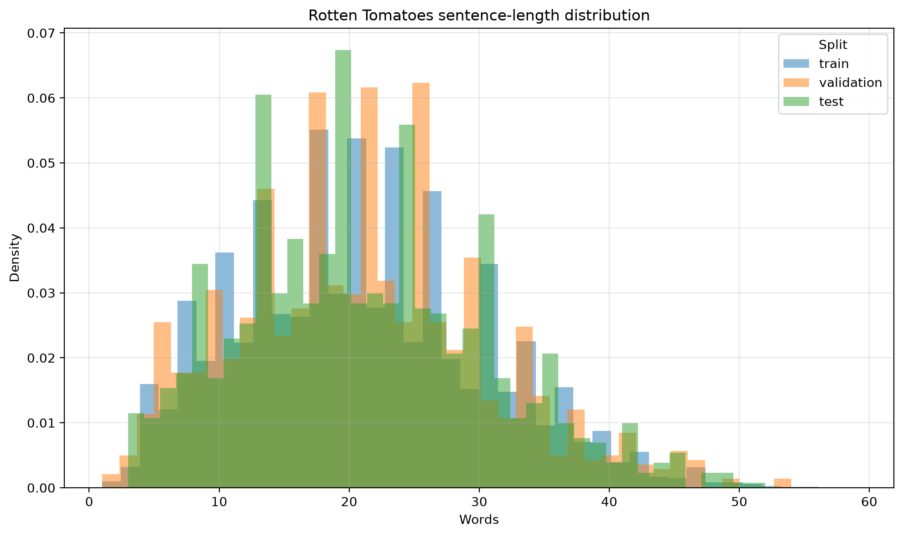
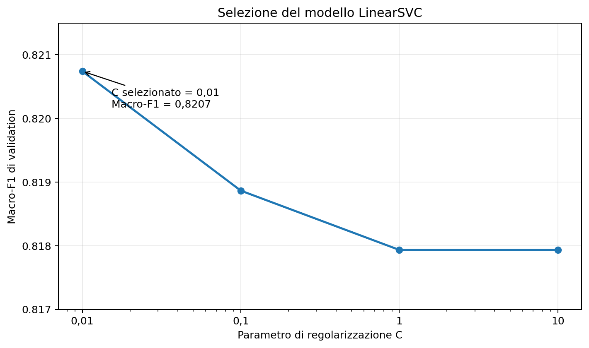
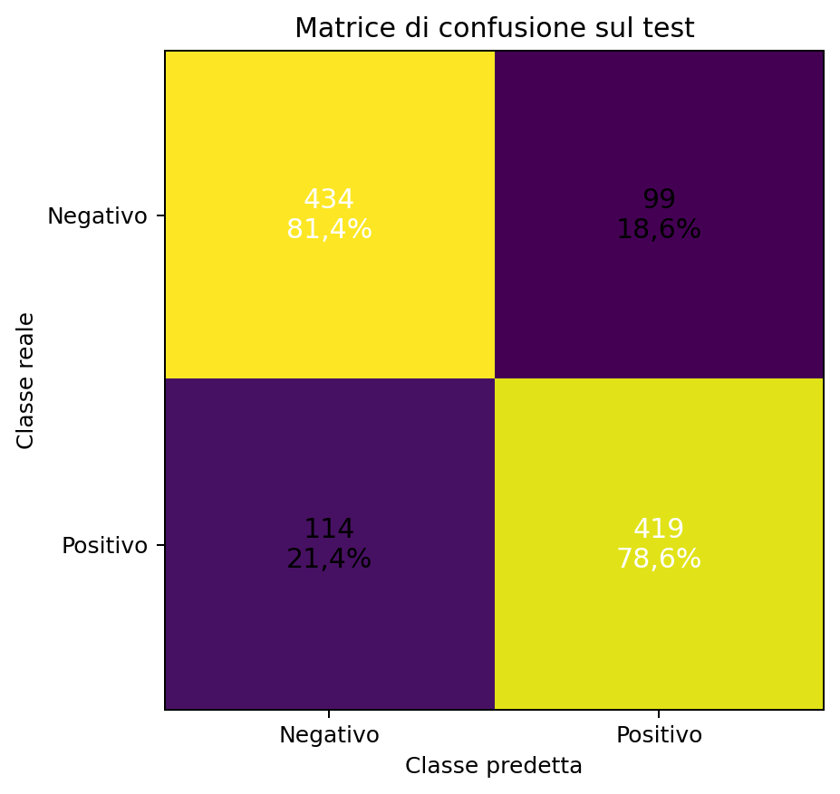

# Exercise 1 — DistilBERT come feature extractor per la Sentiment Analysis

L'Exercise 1 studia l'uso di un Transformer pre-addestrato per la classificazione binaria del sentiment sul dataset **Cornell Rotten Tomatoes**.

Il percorso è articolato in tre fasi:

1. **Exercise 1.1 — EDA:** analisi della struttura del dataset, del bilanciamento delle classi e della lunghezza dei testi;
2. **Exercise 1.2 — Ispezione di DistilBERT:** tokenizzazione, padding dinamico e analisi delle rappresentazioni prodotte dal modello pre-addestrato;
3. **Exercise 1.3 — Stable baseline:** DistilBERT congelato come estrattore di feature e classificazione con una pipeline `StandardScaler + LinearSVC`.

L'obiettivo principale è verificare quanta informazione utile per la sentiment analysis sia già contenuta nelle rappresentazioni di **DistilBERT** senza aggiornare i pesi del Transformer.

---

## Exercise 1.1 — Dataset ed EDA

Il dataset viene caricato tramite Hugging Face Datasets:

```text
cornell-movie-review-data/rotten_tomatoes
```

Ogni esempio contiene:

```text
text   -> frase tratta da una recensione cinematografica
label  -> 0 = negativo, 1 = positivo
```

Il dataset fornisce direttamente gli split ufficiali di training, validation e test.

| Split | Esempi | Negativi | Positivi |
|---|---:|---:|---:|
| Train | 8.530 | 4.265 | 4.265 |
| Validation | 1.066 | 533 | 533 |
| Test | 1.066 | 533 | 533 |
| **Totale** | **10.662** | **5.331** | **5.331** |

Le due classi sono quindi **perfettamente bilanciate** in tutti gli split. Non è necessario introdurre pesi di classe o strategie di riequilibrio; accuracy e macro-F1 risultano entrambe informative.

### Lunghezza dei testi

L'EDA misura la lunghezza delle frasi sia in parole sia in caratteri.

| Split | Parole medie | Dev. std. | Mediana | P95 | Massimo |
|---|---:|---:|---:|---:|---:|
| Train | 20,99 | 9,37 | 20 | 37 | 59 |
| Validation | 21,00 | 9,64 | 21 | 38 | 54 |
| Test | 21,22 | 9,51 | 20 | 38 | 52 |

Le distribuzioni sono molto simili tra train, validation e test: non emergono differenze macroscopiche nella lunghezza dei testi tra gli split.

<p align="center">
  
</p>

Gli output dell'EDA vengono salvati in CSV e PNG, così da separare i dati numerici dalle visualizzazioni.

---

## Exercise 1.2 — Ispezione di DistilBERT

Il checkpoint utilizzato è:

```text
distilbert/distilbert-base-uncased
```

Il modello viene caricato con le AutoClass di Hugging Face:

```text
AutoTokenizer
AutoModel
```

`AutoModel` restituisce il **base encoder** di DistilBERT: non è presente una testa di classificazione del sentiment e non vengono prodotte direttamente probabilità positive o negative.

### Flusso dei dati

```text
testo
  ↓
AutoTokenizer
  ↓
input_ids + attention_mask
  ↓
DistilBERT
  ↓
last_hidden_state
  ↓
rappresentazione contestuale di ogni token
```

Per un batch di `B` frasi, dopo il padding alla frase più lunga del batch:

```text
input_ids          -> (B, L)
attention_mask     -> (B, L)
last_hidden_state  -> (B, L, 768)
```

dove `L` è la lunghezza tokenizzata massima del batch e `768` è la dimensione nascosta di DistilBERT.

### Padding dinamico

L'ispezione su più esempi utilizza:

```python
tokenizer(
    texts,
    padding=True,
    return_tensors="pt",
    add_special_tokens=True,
)
```

Il padding viene quindi applicato **solo fino alla sequenza più lunga del batch**, invece di portare ogni frase alla lunghezza massima teorica del modello.

L'`attention_mask` distingue i token reali dal padding:

```text
1 -> token reale
0 -> padding
```

### Rappresentazione usata nella baseline

Per ogni frase viene estratto il vettore del primo token dell'ultimo hidden state:

```python
last_hidden_state[:, 0, :]
```

La rappresentazione risultante ha forma:

```text
(B, 768)
```

e fornisce un singolo vettore di 768 componenti per ciascun testo.

In questa fase DistilBERT viene usato esclusivamente in inferenza:

```python
model.eval()
torch.inference_mode()
```

Non vengono aggiornati i pesi del Transformer.

---

## Exercise 1.3 — Stable baseline con feature congelate

L'Exercise 1.3 usa DistilBERT come **feature extractor congelato** e addestra un classificatore classico sulle rappresentazioni ottenute.

```text
testo
  ↓
tokenizzazione
  ↓
DistilBERT congelato
  ↓
feature del primo token (768)
  ↓
StandardScaler
  ↓
LinearSVC
  ↓
sentiment negativo / positivo
```

### Estrazione delle feature

Durante l'estrazione il modello viene esplicitamente congelato:

```python
model.requires_grad_(False)
model.eval()
```

e il forward avviene dentro `torch.inference_mode()`.

La tokenizzazione usa padding dinamico, troncamento a un massimo di 512 token e batch size 32 nella run registrata.

| Split | Matrice delle feature |
|---|---:|
| Train | `(8530, 768)` |
| Validation | `(1066, 768)` |
| Test | `(1066, 768)` |

Le feature vengono salvate su disco e possono essere riutilizzate senza ripetere il forward di DistilBERT.

### Pipeline di classificazione

La baseline finale è:

```text
StandardScaler
      ↓
LinearSVC
```

`StandardScaler` viene adattato **solo sulle feature di training**, perché è contenuto nella stessa pipeline scikit-learn del classificatore.

La selezione dell'iperparametro `C` usa esclusivamente training e validation. Il test non viene caricato dalla procedura di model selection.

### Selezione di `C`

Sono stati confrontati:

```text
C ∈ {0.01, 0.1, 1, 10}
```

usando il **macro-F1 di validation** come metrica principale.

| C | Accuracy validation | Macro-F1 validation | Iterazioni |
|---:|---:|---:|---:|
| **0,01** | **0,820826** | **0,820742** | 9 |
| 0,1 | 0,818949 | 0,818865 | 10 |
| 1 | 0,818011 | 0,817934 | 10 |
| 10 | 0,818011 | 0,817934 | 10 |

Il valore selezionato è:

```text
C = 0.01
```

La differenza tra le configurazioni è contenuta, ma `C=0.01` ottiene il miglior macro-F1 e la migliore accuracy tra i valori testati.

<p align="center">
  
</p>

### Valutazione finale

Il modello selezionato sulla validation viene successivamente caricato e valutato sul test **senza effettuare un nuovo fit**.

| Split | Accuracy | Macro-F1 |
|---|---:|---:|
| Validation | **0,820826** | **0,820742** |
| Test | **0,800188** | **0,800148** |

Il divario tra validation e test è di circa **2,06 punti percentuali di accuracy**. La riduzione è moderata e non modifica il comportamento complessivamente bilanciato del classificatore.

La matrice di confusione sul test è:

```text
                 Predetto
               Neg.   Pos.
Reale Neg.      434     99
Reale Pos.      114    419
```

<p align="center">
  
</p>

Su 1.066 esempi di test vengono commessi **213 errori**. I falsi negativi sono leggermente più numerosi dei falsi positivi (`114` contro `99`), ma le prestazioni sulle due classi rimangono vicine:

| Classe | Precision | Recall | F1 |
|---|---:|---:|---:|
| Negativo | 0,7920 | 0,8143 | 0,8030 |
| Positivo | 0,8089 | 0,7861 | 0,7973 |

### Controlli esplorativi

Gli artifact registrano anche due verifiche alternative sulla validation:

| Classificatore | Accuracy | Macro-F1 |
|---|---:|---:|
| LDA | 0,813321 | 0,813248 |
| Logistic Regression | 0,814259 | 0,814180 |
| **LinearSVC selezionato** | **0,820826** | **0,820742** |

Entrambi i controlli rimangono sotto la configurazione LinearSVC selezionata.

La regressione logistica è ancora disponibile nella CLI corrente come esperimento di validation; LDA è invece conservato negli artifact storici ma non fa parte dell'entry point finale.

---

## Protocollo sperimentale

La separazione degli split è mantenuta esplicita:

```text
TRAIN
  ↓
fit di StandardScaler + LinearSVC

VALIDATION
  ↓
selezione di C

TEST
  ↓
una valutazione finale del modello già selezionato
```

Il codice di model selection carica soltanto le feature di train e validation e registra:

```text
test_used_for_model_selection = false
```

Anche la valutazione finale registra che la pipeline non viene riaddestrata prima del test:

```text
pipeline_refitted_before_test = false
```

Le feature del test possono essere estratte preventivamente perché DistilBERT è congelato e l'estrazione non usa le etichette per apprendere parametri; il test non partecipa comunque alla selezione del classificatore.

---

## Riproduzione

I comandi seguenti vanno eseguiti dalla directory `DLA_LAB2`, con l'ambiente del laboratorio già attivo.

### Exercise 1.1 — EDA

```bash
python Exercise1/main.py eda
```

### Exercise 1.2 — Ispezione di un esempio

```bash
python Exercise1/main.py inspect-transformer
```

### Exercise 1.2 — Padding dinamico su un batch

```bash
python Exercise1/main.py inspect-transformer-batch
```

### Exercise 1.3 — Estrazione delle feature

```bash
python Exercise1/main.py extract-features
```

È possibile specificare batch size e device:

```bash
python Exercise1/main.py extract-features \
  --batch-size 32 \
  --device cuda
```

### Exercise 1.3 — Selezione della baseline

```bash
python Exercise1/main.py select-baseline \
  --c-values 0.01 0.1 1 10
```

### Controllo esplorativo con regressione logistica

```bash
python Exercise1/main.py evaluate-logistic
```

### Valutazione finale sul test

```bash
python Exercise1/main.py evaluate-test
```

Gli output esistenti non vengono sovrascritti automaticamente. Quando si vuole rigenerarli intenzionalmente è disponibile l'opzione:

```text
--overwrite
```

---

## Struttura del codice

```text
Exercise1/
├── README.md
├── main.py
├── data.py
├── eda.py
├── transformer_inspection.py
├── feature_extraction.py
├── baseline_classifier.py
├── assets/
│   ├── text_length_distribution.png
│   ├── linear_svc_model_selection.png
│   └── test_confusion_matrix.png
└── outputs/
    ├── exercise_1_1/
    │   ├── figures/
    │   └── results/
    └── exercise_1_3/
        ├── features/
        ├── models/
        ├── predictions/
        └── results/
```

| File | Responsabilità |
|---|---|
| `data.py` | caricamento degli split ufficiali di Rotten Tomatoes |
| `eda.py` | statistiche, CSV e grafici dell'Exercise 1.1 |
| `transformer_inspection.py` | ispezione di tokenizzazione, padding e hidden state |
| `feature_extraction.py` | estrazione e salvataggio delle feature DistilBERT |
| `baseline_classifier.py` | model selection, metriche, prediction e test finale |
| `main.py` | CLI unificata dell'Exercise 1 |

---

## Output e artifact

Gli output completi vengono prodotti localmente e non sono necessari nel repository finale.

Gli artifact principali sono:

```text
exercise_1_1/results/
├── class_distribution.csv
└── text_length_summary.csv

exercise_1_3/results/
├── feature_extraction_metadata.json
├── validation_model_selection.csv
├── selected_baseline.json
├── selected_validation_classification_report.json
├── test_metrics.json
└── test_classification_report.json
```

Sono inoltre prodotti:

- feature `.npz`;
- prediction `.npz`;
- pipeline scikit-learn serializzate con `joblib`;
- artifact degli esperimenti esplorativi.

Feature complete, modelli serializzati e output sperimentali non sono necessari per leggere il repository e possono essere mantenuti fuori dal controllo versione. Nel repository sono sufficienti codice, documentazione e pochi asset selezionati.

---

## Limiti

- La baseline usa una **rappresentazione congelata**: DistilBERT non può adattare i propri pesi al sentiment di Rotten Tomatoes.
- Viene utilizzato soltanto il vettore del **primo token dell'ultimo strato**; non sono confrontate strategie alternative come mean pooling o combinazioni di layer.
- La selezione di `C` considera quattro valori e una singola validation ufficiale.
- La pipeline usa un solo seed di riferimento (`42`); non viene stimata la variabilità tra esecuzioni.
- Il dataset contiene frasi brevi in inglese e perfettamente bilanciate: i risultati non vanno generalizzati automaticamente a testi lunghi, altre lingue o distribuzioni sbilanciate.
- I tempi di estrazione e predizione dipendono dall'hardware e non sono usati come criterio principale di confronto.

---

## Riferimenti e assistenza AI

Riferimenti principali:

- Cornell Movie Review / Rotten Tomatoes tramite Hugging Face Datasets;
- DistilBERT `distilbert-base-uncased`;
- Hugging Face Transformers e Datasets;
- Scikit-learn `StandardScaler` e `LinearSVC`.

Riferimenti bibliografici:

> V. Sanh, L. Debut, J. Chaumond, T. Wolf,  
> *DistilBERT, a distilled version of BERT: smaller, faster, cheaper and lighter*, 2019.

> J. Devlin, M.-W. Chang, K. Lee, K. Toutanova,  
> *BERT: Pre-training of Deep Bidirectional Transformers for Language Understanding*, NAACL-HLT, 2019.

ChatGPT è stato utilizzato come supporto per chiarimenti teorici, organizzazione del lavoro, revisione del codice, debugging, analisi degli artifact e documentazione. Le scelte implementative e i risultati riportati sono stati verificati sul codice e sugli output effettivi dell'esercizio.
