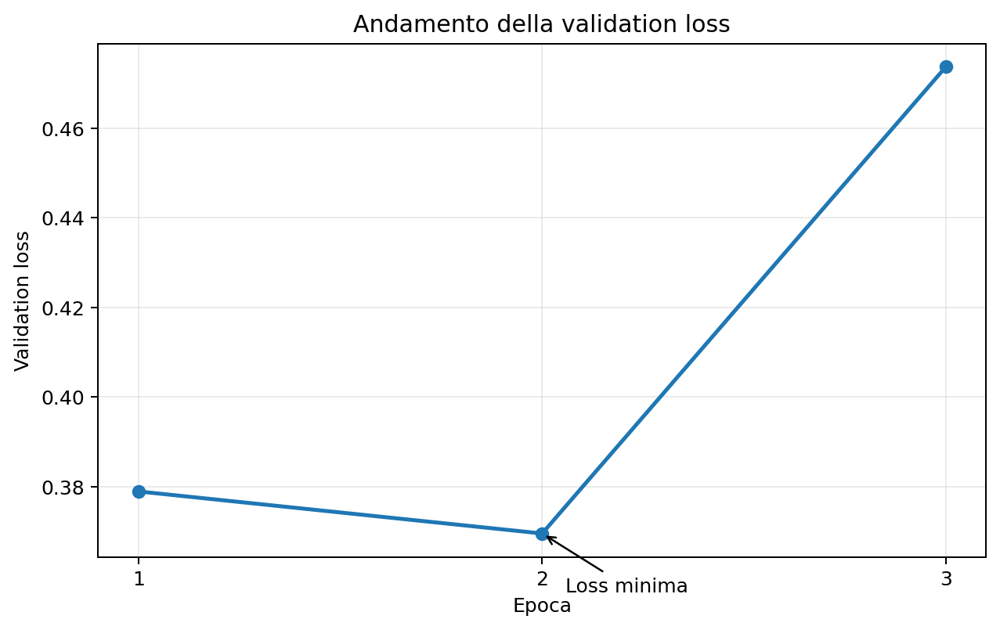
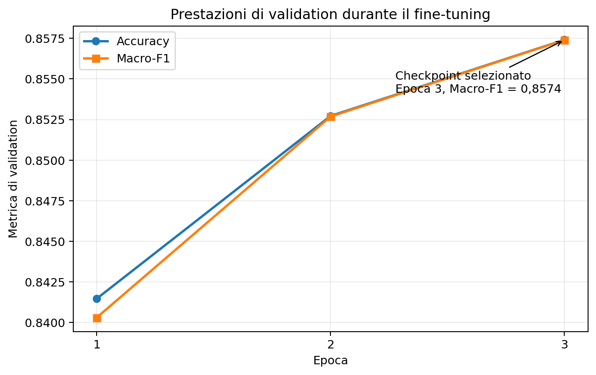
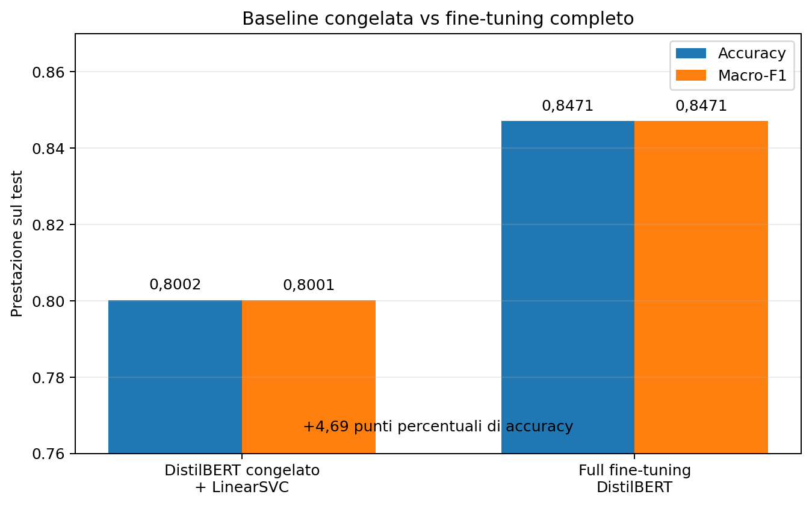

# Exercise 2 — Fine-tuning completo di DistilBERT

L'Exercise 2 prosegue la sentiment analysis su **Cornell Rotten Tomatoes** passando dalla baseline con DistilBERT congelato dell'Exercise 1 al **fine-tuning end-to-end** del Transformer.

Il percorso è articolato in tre fasi:

1. **Exercise 2.1 — Token preprocessing:** tokenizzazione degli split con `Dataset.map()`;
2. **Exercise 2.2 — Sequence classification:** costruzione e ispezione di `DistilBertForSequenceClassification`;
3. **Exercise 2.3 — Full fine-tuning:** training con Hugging Face `Trainer`, selezione del checkpoint sulla validation e valutazione finale sul test.

La domanda principale è:

> **quanto migliora il modello adattando DistilBERT al task rispetto all'uso come feature extractor congelato?**

---

## Dataset e checkpoint

Dataset:

```text
cornell-movie-review-data/rotten_tomatoes
```

| Split | Esempi |
|---|---:|
| Train | 8.530 |
| Validation | 1.066 |
| Test | 1.066 |
| **Totale** | **10.662** |

Etichette:

```text
0 → negative
1 → positive
```

Checkpoint:

```text
distilbert/distilbert-base-uncased
```

Gli split ufficiali rimangono separati durante tutto il protocollo sperimentale.

---

## Exercise 2.1 — Token preprocessing

La tokenizzazione viene applicata a tutti gli split tramite Hugging Face `Dataset.map()`.

```python
tokenizer(
    texts,
    truncation=True,
    return_token_type_ids=False,
)
```

Dopo il preprocessing ogni esempio contiene:

```text
text
label
input_ids
attention_mask
```

Il padding **non viene applicato a lunghezza fissa** durante `Dataset.map()`: ogni sequenza conserva la propria lunghezza reale.

DistilBERT non utilizza `token_type_ids`, quindi il codice ne disabilita la generazione.

Nell'ispezione verificata il primo esempio di training produce 47 token.

Comando:

```bash
python Exercise2/main.py inspect-tokenization
```

È possibile selezionare split e indice:

```bash
python Exercise2/main.py inspect-tokenization --split validation --index 10
```

---

## Exercise 2.2 — Modello per sequence classification

Il classificatore viene costruito con:

```python
AutoModelForSequenceClassification.from_pretrained(
    model_checkpoint,
    num_labels=2,
)
```

La classe concreta è:

```text
DistilBertForSequenceClassification
```

Il flusso è:

```text
testo
  ↓
tokenizer
  ↓
input_ids + attention_mask
  ↓
DistilBERT
  ↓
testa di classificazione
  ↓
2 logits
  ↓
negativo / positivo
```

Per un batch di `B` esempi:

```text
logits → (B, 2)
```

La classe predetta è:

```python
logits.argmax(dim=-1)
```

Prima del fine-tuning la testa di classificazione è appena inizializzata, quindi le predizioni non hanno ancora valore sperimentale.

### Padding dinamico

Durante training ed evaluation viene utilizzato:

```python
DataCollatorWithPadding(tokenizer=tokenizer)
```

Il padding viene quindi applicato soltanto fino alla sequenza più lunga del batch.

Un controllo su due testi ha prodotto:

```text
input_ids shape      = (2, 52)
attention_mask shape = (2, 52)
logits shape         = (2, 2)
```

Comando:

```bash
python Exercise2/main.py inspect-model
```

---

## Exercise 2.3 — Full fine-tuning

Nell'Exercise 1 DistilBERT era congelato; qui tutti i parametri del modello vengono aggiornati.

Il codice verifica esplicitamente che:

```python
total_parameters == trainable_parameters
```

Il training è gestito con Hugging Face `Trainer`.

### Configurazione

| Parametro | Valore |
|---|---:|
| Epoche | 3 |
| Learning rate iniziale | `2e-5` |
| Batch size train | 16 |
| Batch size evaluation | 32 |
| Weight decay | `0.01` |
| Seed | 42 |
| Evaluation | ogni epoca |
| Salvataggio | ogni epoca |
| Metrica di selezione | validation macro-F1 |
| Ripristino best model | sì |
| FP16 | se CUDA disponibile |

La configurazione centrale è:

```python
eval_strategy="epoch"
save_strategy="epoch"
load_best_model_at_end=True
metric_for_best_model="macro_f1"
greater_is_better=True
```

Il test non viene usato durante il training o per la selezione del checkpoint.

### Loss e metriche

Con `AutoModelForSequenceClassification` e label intere, il modello calcola internamente la loss di classificazione single-label sui due logits.

L'ottimizzatore e lo scheduler non vengono ridefiniti nel codice dell'esercizio: la loro gestione è delegata a `Trainer`.

Le metriche esplicitamente calcolate sono:

```text
Accuracy
Macro-F1
```

---

## Risultati di validation

Gli artifact della run finale riportano:

| Epoca | Validation loss | Accuracy | Macro-F1 |
|---:|---:|---:|---:|
| 1 | 0,378904 | 0,841463 | 0,840300 |
| 2 | **0,369516** | 0,852720 | 0,852683 |
| **3** | 0,473725 | **0,857411** | **0,857398** |

La validation loss raggiunge il minimo alla seconda epoca e aumenta alla terza.

<p align="center">
  
</p>

Accuracy e macro-F1 continuano invece a migliorare fino alla terza epoca.

<p align="center">
  
</p>

La run seleziona il checkpoint sulla **macro-F1**, non sulla loss:

```text
best_global_step      = 1602
best_metric           = 0.857398
best_model_checkpoint = checkpoint-1602
best_epoch            = 3
```

La crescita della loss insieme al lieve miglioramento di accuracy e macro-F1 è compatibile con un aumento dell'overconfidence su alcuni errori, ma non implica da sola che la classificazione stia già peggiorando secondo la metrica scelta.

### Prestazioni del training

| Metrica | Valore |
|---|---:|
| Training runtime | 102,51 s |
| Training loss media | 0,267903 |
| Campioni/s | 249,63 |
| Step/s | 15,63 |
| Step totali | 1.602 |

Nel primo log compare `grad_norm = inf` durante FP16; i log successivi riportano valori finiti e non compaiono `NaN`. Loss e metriche evolvono regolarmente fino al termine della run.

---

## Valutazione finale sul test

Dopo la selezione sulla validation, il modello salvato in:

```text
Exercise2/outputs/exercise_2_3/best_model/
```

viene valutato separatamente sul test.

```bash
python Exercise2/main.py evaluate-test
```

Risultati definitivi:

| Metrica | Valore |
|---|---:|
| Test loss | 0,545112 |
| Test accuracy | **0,847092** |
| Test macro-F1 | **0,847085** |
| Esempi | 1.066 |
| Runtime | 1,68 s |

Confronto validation/test:

| Split | Accuracy | Macro-F1 | Loss |
|---|---:|---:|---:|
| Validation — epoca 3 | 0,857411 | 0,857398 | 0,473725 |
| Test | **0,847092** | **0,847085** | 0,545112 |

Il gap validation → test è di circa **1,03 punti percentuali**.

Sul test vengono classificati correttamente 903 esempi su 1.066, con **163 errori**.

---

## Confronto con la stable baseline

La baseline finale dell'Exercise 1 usa:

```text
DistilBERT congelato
        ↓
feature da 768 componenti
        ↓
StandardScaler
        ↓
LinearSVC
```

Il confronto sul test è:

| Metodo | Accuracy | Macro-F1 |
|---|---:|---:|
| DistilBERT congelato + LinearSVC | 0,800188 | 0,800148 |
| **Full fine-tuning DistilBERT** | **0,847092** | **0,847085** |

Il miglioramento è di circa:

```text
Accuracy  → +4,69 punti percentuali
Macro-F1 → +4,69 punti percentuali
```

<p align="center">
  
</p>

Gli errori passano da:

```text
213 → 163
```

quindi il fine-tuning commette **50 errori in meno**, pari a una riduzione relativa di circa **23,5%**.

Il risultato mostra che le rappresentazioni generiche di DistilBERT sono già utili, ma l'adattamento end-to-end al task permette di ottenere una separazione migliore tra sentiment positivo e negativo.

---

## Protocollo sperimentale

```text
TRAIN
  ↓
aggiornamento di DistilBERT

VALIDATION
  ↓
valutazione a ogni epoca
  ↓
selezione del miglior Macro-F1

TEST
  ↓
valutazione finale del modello selezionato
```

Il test non viene passato al `Trainer` durante il fine-tuning.

Il valore `epoch = 0` presente nei risultati del comando `evaluate-test` appartiene al nuovo `Trainer` creato soltanto per l'evaluation e non indica che il modello sia privo di training.

---

## Weights & Biases

Il tracking W&B è opzionale.

```bash
python Exercise2/main.py train --wandb
```

Con nome personalizzato:

```bash
python Exercise2/main.py train \
  --wandb \
  --run-name distilbert-rotten-tomatoes
```

Senza `--wandb` il codice usa:

```text
report_to = "none"
```

Gli artifact principali vengono comunque salvati localmente.

---

## Riproduzione

Dalla root `DLA_LAB2`:

```bash
conda activate DLA2026-transformers
```

Comandi principali:

```bash
python Exercise2/main.py inspect-tokenization
python Exercise2/main.py inspect-model
python Exercise2/main.py train
python Exercise2/main.py evaluate-test
```

Configurazione esplicita equivalente alla run finale in PowerShell:

```powershell
python Exercise2/main.py train `
  --epochs 3 `
  --learning-rate 2e-5 `
  --train-batch-size 16 `
  --eval-batch-size 32 `
  --weight-decay 0.01 `
  --seed 42
```

Sono disponibili anche override dei principali iperparametri e le opzioni `--wandb` e `--run-name`.

---

## Struttura del codice

```text
Exercise2/
├── README.md
├── data.py
├── model.py
├── training.py
├── main.py
├── assets/
│   ├── validation_loss.png
│   ├── validation_metrics.png
│   └── baseline_vs_finetuning.png
└── outputs/
    └── exercise_2_3/
        ├── checkpoints/
        ├── best_model/
        └── test_evaluation/
```

| File | Responsabilità |
|---|---|
| `data.py` | dataset, tokenizer e preprocessing con `Dataset.map()` |
| `model.py` | costruzione e ispezione del classificatore DistilBERT |
| `training.py` | metriche, `Trainer`, fine-tuning e test finale |
| `main.py` | CLI unificata |

---

## Artifact

Gli output principali sono:

```text
outputs/exercise_2_3/
├── checkpoints/
│   ├── checkpoint-.../
│   ├── trainer_state.json
│   ├── train_results.json
│   ├── validation_results.json
│   └── all_results.json
├── best_model/
│   ├── config.json
│   ├── model.safetensors
│   └── file del tokenizer
└── test_evaluation/
    ├── test_results.json
    └── all_results.json
```

Per documentare la run sono sufficienti soprattutto:

```text
trainer_state.json
train_results.json
validation_results.json
test_results.json
config.json
```

Checkpoint completi, pesi del modello, optimizer e scheduler sono artifact pesanti e non devono essere necessariamente versionati nel repository.

---

## Limiti

- La run finale usa un solo seed (`42`), quindi non viene stimata la variabilità tra esecuzioni.
- Non è stata effettuata una ricerca sistematica degli iperparametri.
- Il checkpoint viene selezionato su una sola validation ufficiale.
- La validation loss aumenta alla terza epoca mentre accuracy e macro-F1 crescono leggermente: è un segnale da monitorare, non una prova sufficiente di overfitting.
- Rotten Tomatoes contiene frasi brevi in inglese ed è perfettamente bilanciato; i risultati non si generalizzano automaticamente ad altri domini.
- Non vengono analizzate calibrazione, robustezza, ironia, negazioni o sottogruppi linguistici.
- Il fine-tuning migliora la qualità ma richiede più memoria e calcolo rispetto alle feature congelate.

---

## Conclusioni

Il full fine-tuning di DistilBERT porta il test da circa **80,0%** della baseline congelata a circa **84,7%**, con un guadagno di circa **4,7 punti percentuali** e 50 errori in meno.

Il confronto evidenzia il compromesso:

```text
Feature congelate
→ costo minore
→ feature riutilizzabili
→ prestazioni inferiori

Full fine-tuning
→ costo maggiore
→ rappresentazioni adattate al task
→ prestazioni superiori
```

L'esperimento conferma quindi l'utilità dell'adattamento end-to-end quando il miglioramento predittivo giustifica il maggiore costo computazionale.

---

## Riferimenti e assistenza AI

Riferimenti principali:

- Cornell Movie Review / Rotten Tomatoes tramite Hugging Face Datasets;
- DistilBERT `distilbert-base-uncased`;
- Hugging Face Transformers;
- Hugging Face `Trainer`, `TrainingArguments` e `DataCollatorWithPadding`;
- scikit-learn per accuracy e macro-F1.

Riferimento bibliografico:

> V. Sanh, L. Debut, J. Chaumond, T. Wolf,  
> *DistilBERT, a distilled version of BERT: smaller, faster, cheaper and lighter*, 2019.

ChatGPT è stato utilizzato come supporto per chiarimenti teorici, revisione del codice, controllo degli artifact, analisi dei risultati, costruzione dei grafici e documentazione. Le metriche riportate derivano dagli artifact effettivamente prodotti dalla run finale.
