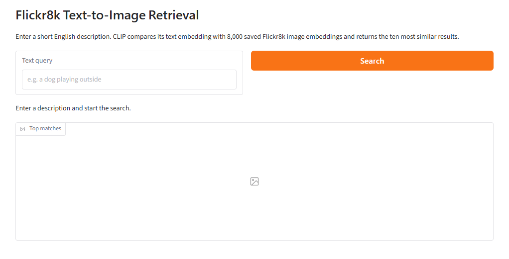
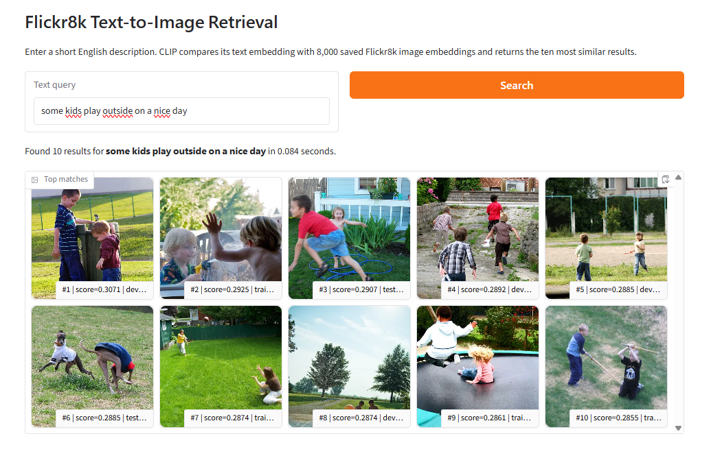
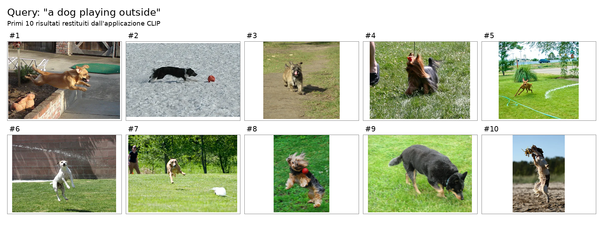
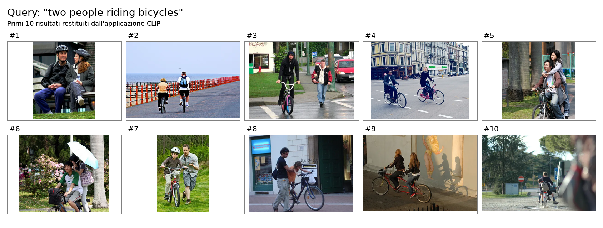
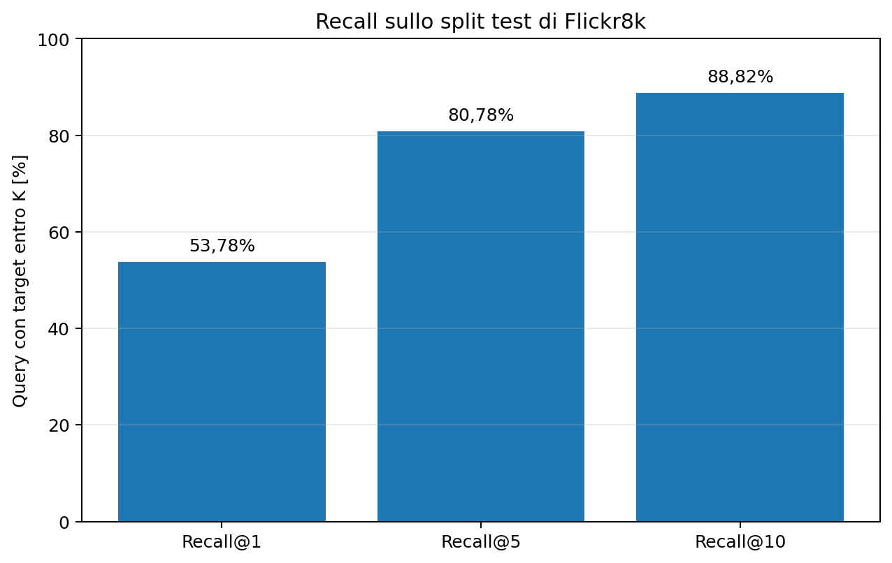
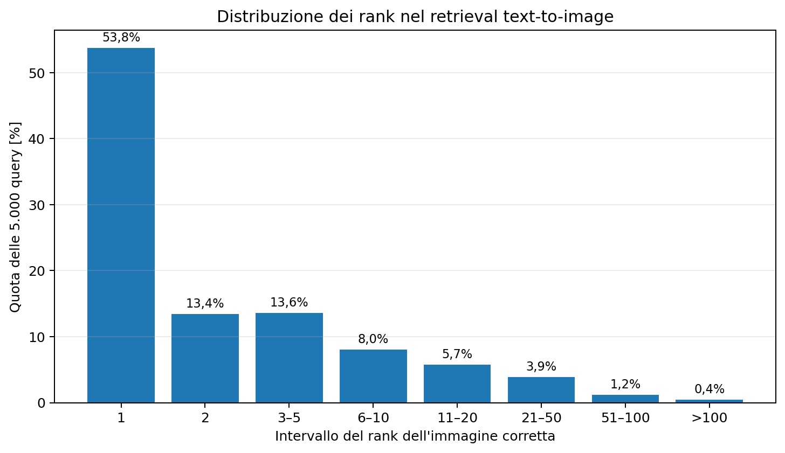

# Exercise 3 — Text-to-Image Retrieval con CLIP

L'Exercise 3 implementa la variante **3.3 — Text-to-Image Retrieval** del Laboratorio 2.

L'obiettivo è costruire un piccolo motore di ricerca semantica in cui l'utente inserisce una descrizione testuale in inglese e il sistema restituisce le immagini di **Flickr8k** più simili secondo lo spazio multimodale appreso da **CLIP**.

<p align="center">
  
  
</p>

La soluzione utilizza:

```text
Dataset:  intro/flickr8k
Modello:  openai/clip-vit-base-patch32
Task:     text-to-image retrieval
Training: nessuno
Ranking:  cosine similarity
UI:       Gradio
```

A differenza degli Exercise 1 e 2, non viene addestrato alcun classificatore e non viene effettuato fine-tuning: CLIP viene utilizzato **zero-shot**.

Il sistema è diviso in due parti:

```text
OFFLINE
8.000 immagini Flickr8k
        ↓
CLIP image encoder
        ↓
embedding 512-D
        ↓
normalizzazione L2
        ↓
indice persistente

ONLINE
query testuale
        ↓
CLIP text encoder
        ↓
embedding 512-D
        ↓
normalizzazione L2
        ↓
prodotto scalare con l'indice
        ↓
ranking
        ↓
top-k immagini
```

---

## Dataset Flickr8k

Il dataset viene caricato tramite Hugging Face Datasets:

```text
intro/flickr8k
```

La configurazione utilizzata è:

```text
default
```

Gli split effettivi sono:

| Split | Immagini |
|---|---:|
| Train | 6.000 |
| Dev | 1.000 |
| Test | 1.000 |
| **Totale** | **8.000** |

Ogni immagine dispone di cinque didascalie:

```text
image
split
caption_0
caption_1
caption_2
caption_3
caption_4
```

### EDA compatta

L'ispezione del dataset non attraversa tutte le immagini per calcolare le statistiche visuali: usa un campione deterministico di **200 immagini per split**.

| Split | Immagini EDA | Caption analizzate | Caption/immagine | Parole medie/caption |
|---|---:|---:|---:|---:|
| Train | 200 | 1.000 | 5 | 11,896 |
| Dev | 200 | 1.000 | 5 | 12,124 |
| Test | 200 | 1.000 | 5 | 11,862 |

Nel campione analizzato:

```text
modalità immagine = RGB
formato           = JPEG
larghezza mediana = 500 px
altezza mediana   = 375 px
```

Le dimensioni non sono però uniformi: CLIP si occupa successivamente del preprocessing necessario all'encoder visivo.

Il comando è:

```powershell
python -m Exercise3.main inspect-dataset
```

Per un controllo rapido in streaming:

```powershell
python -m Exercise3.main inspect-dataset `
  --streaming `
  --eda-limit 10 `
  --num-examples 2
```

L'EDA completa usata nel progetto:

```powershell
python -m Exercise3.main inspect-dataset `
  --eda-limit 200 `
  --num-examples 3
```

Gli artifact vengono salvati in:

```text
Exercise3/outputs/dataset_inspection/
```

---

## CLIP e spazio multimodale

Il checkpoint utilizzato è:

```text
openai/clip-vit-base-patch32
```

CLIP contiene due encoder:

```text
immagine → vision encoder → embedding visivo
testo    → text encoder   → embedding testuale
```

I due embedding sono proiettati nello stesso spazio vettoriale.

Nel checkpoint utilizzato la dimensione è:

```text
512
```

Le shape principali verificate sono:

```text
pixel_values       → (B, 3, 224, 224)
image_embeddings   → (B, 512)
text_embeddings    → (B, 512)
```

Il modello viene caricato in modalità evaluation e l'estrazione avviene con:

```python
torch.inference_mode()
```

Non vengono quindi calcolati gradienti e nessun parametro viene aggiornato su Flickr8k.

### Normalizzazione e similarità

Prima del confronto, gli embedding vengono normalizzati con norma L2:

```python
F.normalize(embeddings, p=2, dim=-1)
```

Se `t` è l'embedding testuale normalizzato e `v_i` quello della i-esima immagine:

```text
score_i = t · v_i
```

Poiché entrambi hanno norma unitaria, il prodotto scalare coincide con la **cosine similarity**.

Il punteggio viene usato esclusivamente per ordinare le immagini: non è una probabilità calibrata di rilevanza.

Per ispezionare preprocessing, embedding e matrice delle similarità:

```powershell
python -m Exercise3.main inspect-clip
```

---

## Indicizzazione offline

La parte più costosa viene eseguita una sola volta.

L'indice completo è costruito sugli split:

```text
train + dev + test
```

per un totale di:

```text
8.000 immagini
```

La configurazione registrata è:

| Parametro | Valore |
|---|---:|
| Modello | `openai/clip-vit-base-patch32` |
| Immagini | 8.000 |
| Dimensione embedding | 512 |
| Dtype | `float32` |
| Normalizzazione | L2 |
| Batch size | 16 |
| Device risolto | CUDA |
| Similarità | dot product / cosine |
| Tempo di costruzione | **139,241 s** |

La matrice finale ha forma:

```text
(8000, 512)
```

### Artifact dell'indice

```text
Exercise3/outputs/index/
├── image_embeddings.npy
├── image_metadata.json
└── index_config.json
```

`image_embeddings.npy` contiene la matrice normalizzata.

Ogni record di `image_metadata.json` collega una riga dell'indice all'immagine originale e alle sue cinque caption:

```json
{
  "index_position": 0,
  "image_id": "train:0",
  "split": "train",
  "dataset_row_index": 0,
  "original_size": [375, 500],
  "captions": ["...", "...", "...", "...", "..."]
}
```

Questa separazione permette di mantenere l'indice vettoriale compatto e recuperare successivamente le informazioni necessarie per mostrare i risultati.

### Costruzione dell'indice

Smoke test:

```powershell
python -m Exercise3.main build-index `
  --splits train `
  --limit 200 `
  --batch-size 16
```

Indice completo:

```powershell
python -m Exercise3.main build-index `
  --batch-size 16 `
  --force
```

`--force` è necessario soltanto quando si vuole sostituire intenzionalmente un indice già esistente.

---

## Ricerca online

Una volta costruito l'indice, per ogni query viene calcolato soltanto l'embedding testuale.

```text
query
  ↓
CLIP text encoder
  ↓
embedding normalizzato (512)
  ↓
image_embeddings @ query_embedding
  ↓
8.000 similarity score
  ↓
ordinamento decrescente
  ↓
top-k
```

Il ranking viene implementato con:

```python
scores = image_embeddings @ query_embedding
positions = np.argsort(-scores, kind="stable")
```

Il valore predefinito è:

```text
top_k = 10
```

Esempio da terminale:

```powershell
python -m Exercise3.main search `
  --query "a dog playing outside"
```

Oppure:

```powershell
python -m Exercise3.main search `
  --query "two people riding bicycles" `
  --top-k 10
```

La ricerca usa l'indice già persistito e non ricalcola gli embedding visivi.

---

## Applicazione Gradio

L'interfaccia permette di utilizzare la pipeline in modo interattivo.

Contiene:

```text
casella di testo
pulsante Search
messaggio con il tempo di ricerca
galleria top-10
score e caption associate ai risultati
```

Avvio:

```powershell
python -m Exercise3.main launch-app --inbrowser
```

oppure:

```powershell
python -m Exercise3.main launch-app
```

L'indirizzo locale predefinito è:

```text
http://127.0.0.1:7860
```

### Nota sull'avvio

I moduli dell'esercizio usano import del tipo:

```python
from Exercise3...
```

Per questo, dalla root `DLA_LAB2`, l'entry point va eseguito come **modulo Python**:

```powershell
python -m Exercise3.main ...
```

e non come:

```text
python Exercise3/main.py ...
```

L'applicazione carica modello, indice e metadati una sola volta e riutilizza le stesse risorse per le query successive.

---

## Esempi qualitativi

### Query: `a dog playing outside`

La query combina un soggetto semplice (`dog`), un contesto generale (`outside`) e un'azione poco vincolante (`playing`).

<p align="center">
  
</p>

I risultati mantengono in larga parte il concetto principale: cani, ambiente esterno e situazioni dinamiche.

CLIP non cerca corrispondenze lessicali tra la query e le caption del dataset: confronta direttamente l'embedding della query con gli embedding delle immagini.

### Query: `two people riding bicycles`

Questa query è più vincolante perché richiede contemporaneamente:

```text
quantità = due
soggetti = persone
oggetto  = biciclette
relazione = persone che le stanno guidando
```

<p align="center">
  
</p>

Molti risultati contengono persone e biciclette, ma non sempre rispettano perfettamente il numero di soggetti o la relazione richiesta.

Questo mette in evidenza un limite tipico di una rappresentazione globale: oggetti salienti e tema generale della scena possono dominare dettagli locali, conteggi e relazioni precise.

---

## Protocollo di valutazione

La demo e la valutazione usano due gallerie concettualmente diverse.

### Demo

L'applicazione cerca nell'indice completo:

```text
8.000 immagini
train + dev + test
```

L'obiettivo è massimizzare la varietà della galleria disponibile all'utente.

### Evaluation

La valutazione quantitativa usa invece soltanto:

```text
1.000 immagini del test
```

come candidate.

Ogni immagine dispone di cinque caption, quindi vengono generate:

```text
1.000 × 5 = 5.000 query testuali
```

Per ogni caption viene misurato il rank della **specifica immagine Flickr8k associata**.

Questa separazione è importante: i Recall@K riportati non sono calcolati sulla galleria completa da 8.000 immagini.

---

## Metriche

Per una query con rank corretto `r`, il Recall@K vale:

```text
1  se r ≤ K
0  altrimenti
```

La media sulle 5.000 query produce il Recall@K finale.

I risultati registrati sono:

| Metrica | Valore | Query soddisfatte |
|---|---:|---:|
| **Recall@1** | **53,78%** | 2.689 / 5.000 |
| **Recall@5** | **80,78%** | 4.039 / 5.000 |
| **Recall@10** | **88,82%** | 4.441 / 5.000 |
| Rango mediano | **1** | — |
| Rango medio | **5,3872** | — |
| Rango minimo | 1 | — |
| Rango massimo | 304 | — |

<p align="center">
  
</p>

Più della metà delle caption recupera l'immagine corretta direttamente al primo posto; oltre quattro query su cinque la recuperano nelle prime cinque e quasi nove su dieci entro le prime dieci.

Il rango mediano pari a `1` mostra che almeno metà delle query viene risolta immediatamente.

Il rango medio è però superiore alla mediana perché esiste una piccola coda di query difficili.

---

## Distribuzione dei rank

Il CSV per-query permette di osservare la distribuzione completa:

| Intervallo | Quota |
|---|---:|
| Rank 1 | 53,78% |
| Rank 2 | 13,42% |
| Rank 3–5 | 13,58% |
| Rank 6–10 | 8,04% |
| Rank 11–20 | 5,72% |
| Rank 21–50 | 3,86% |
| Rank 51–100 | 1,18% |
| Rank >100 | 0,42% |

<p align="center">
  
</p>

Ulteriori cutoff ricavati dagli stessi 5.000 rank:

```text
R@2   = 67,20%
R@3   = 73,58%
R@20  = 94,54%
R@50  = 98,40%
R@100 = 99,58%
```

Gli errori estremi sono quindi rari ma non assenti: il rank massimo osservato è `304`.

Una caption molto generica può risultare difficile perché più immagini della galleria possono essere semanticamente compatibili, mentre il protocollo considera corretta soltanto l'immagine originariamente associata alla caption.

---

## Tempi della valutazione

La valutazione finale registra:

| Operazione | Tempo |
|---|---:|
| Caricamento e validazione indice | 0,082 s |
| Caricamento CLIP | 5,514 s |
| Encoding + ranking di 5.000 query | 4,667 s |
| **Totale** | **11,532 s** |

La configurazione usa:

```text
text batch size = 64
device          = CUDA
```

Il costo principale dell'applicazione rimane la costruzione offline degli embedding delle immagini; una volta persistito l'indice, il ranking consiste essenzialmente in operazioni vettoriali.

---

## Riproduzione della valutazione

Smoke test su 100 immagini test e 500 caption:

```powershell
python -m Exercise3.main evaluate-retrieval `
  --split test `
  --limit 100 `
  --batch-size 64 `
  --output-dir Exercise3/outputs/evaluation_smoke
```

Valutazione completa:

```powershell
python -m Exercise3.main evaluate-retrieval `
  --split test `
  --batch-size 64 `
  --output-dir Exercise3/outputs/evaluation
```

Gli artifact prodotti sono:

```text
Exercise3/outputs/evaluation/
├── text_to_image_metrics.json
└── text_to_image_query_ranks.csv
```

Il JSON contiene protocollo, dataset, modello, metriche, timing e versioni software.

Il CSV conserva invece il risultato di ogni singola caption, compresi:

```text
query
immagine target
rank
score del target
top-1
score top-1
correttezza top-1
```

---

## Ambiente

Le esecuzioni finali registrano:

```text
PyTorch      2.12.0+cu126
Transformers 5.14.1
NumPy        2.4.4
```

L'ambiente Conda utilizzato è:

```powershell
conda activate DLA2026-transformers
```

GPU utilizzata nelle esecuzioni locali:

```text
NVIDIA GeForce RTX 3050 Ti Laptop GPU
```

Il codice usa inoltre Hugging Face Datasets, Pillow e Gradio.

Non è stato necessario utilizzare il server IRIS per completare l'esercizio.

---

## Struttura del codice

```text
Exercise3/
├── README.md
├── app.py
├── data.py
├── evaluation.py
├── indexing.py
├── io_utils.py
├── main.py
├── model.py
├── retrieval.py
├── assets/
│   ├── retrieval_recall.png
│   ├── retrieval_rank_distribution.png
│   ├── retrieval_dog_example.png
│   └── retrieval_bicycle_example.png
└── outputs/
    ├── dataset_inspection/
    ├── index/
    ├── evaluation/
    └── examples/
```

| File | Responsabilità |
|---|---|
| `data.py` | caricamento, ispezione ed EDA compatta di Flickr8k |
| `model.py` | caricamento CLIP, preprocessing, embedding e normalizzazione |
| `io_utils.py` | I/O comune e salvataggi atomici degli artifact |
| `indexing.py` | costruzione, persistenza e validazione dell'indice |
| `retrieval.py` | encoding delle query e ranking top-k |
| `evaluation.py` | Recall@K, rank e artifact della valutazione |
| `app.py` | interfaccia Gradio |
| `main.py` | CLI unificata |

---

## Politica degli artifact

Gli artifact principali dell'esercizio sono:

```text
outputs/index/
├── image_embeddings.npy
├── image_metadata.json
└── index_config.json

outputs/evaluation/
├── text_to_image_metrics.json
└── text_to_image_query_ranks.csv
```

Per mantenere il repository leggero non è necessario versionare:

```text
image_embeddings.npy
dataset completo
cache Hugging Face
output di smoke test
file temporanei
__pycache__
```

`image_embeddings.npy` è un artifact rigenerabile e rappresenta la parte più pesante dell'indice.

Nel repository finale sono invece sufficienti codice, README, asset selezionati e, se desiderato, i piccoli artifact JSON/CSV necessari a documentare le metriche.

---

## Controlli e robustezza

Il codice verifica esplicitamente diversi casi di errore:

- query vuote;
- device non valido;
- indice assente;
- shape incompatibili;
- mismatch tra numero di embedding e metadata;
- valori non finiti;
- embedding non normalizzati;
- modello della query diverso da quello usato per l'indice;
- `top-k` non valido;
- split di evaluation assente;
- caption mancanti o vuote;
- sovrascrittura accidentale degli artifact.

Le scritture JSON, CSV e NumPy sono centralizzate in `io_utils.py` e utilizzano file temporanei sostituiti al termine del salvataggio.

---

## Limiti

- CLIP viene utilizzato **zero-shot**, senza adattamento a Flickr8k.
- Ogni immagine è rappresentata da un singolo embedding globale.
- Conteggi, relazioni tra soggetti e attributi locali possono essere rappresentati in modo imperfetto.
- I cosine score non sono probabilità di rilevanza.
- La valutazione quantitativa riguarda soltanto la direzione **text-to-image**.
- Le metriche dipendono dalla galleria di 1.000 immagini candidate.
- Una caption può descrivere in modo plausibile più immagini, ma il protocollo attribuisce una sola immagine target.
- Non sono stati confrontati checkpoint CLIP alternativi.
- Non vengono riportate statistiche tra seed perché non avviene alcun training.

---

## Possibili sviluppi futuri

Estensioni naturali del progetto sono:

```text
checkpoint CLIP più grandi
image-to-text retrieval
fine-tuning contrastivo su Flickr8k
analisi automatica dei failure case
supporto a immagini caricate dall'utente
indici approssimati per collezioni molto più grandi
deployment della demo
```

Per una collezione di sole 8.000 immagini il prodotto matrice-vettore è sufficientemente semplice; strutture come FAISS diventerebbero più interessanti aumentando significativamente la dimensione della galleria.

---

## Conclusioni

L'Exercise 3 mostra un terzo modo di riutilizzare rappresentazioni pre-addestrate rispetto ai primi due esercizi del laboratorio:

```text
Exercise 1
DistilBERT congelato
→ viene addestrato soltanto un classificatore esterno

Exercise 2
DistilBERT full fine-tuning
→ vengono aggiornati tutti i pesi del modello

Exercise 3
CLIP zero-shot
→ non viene aggiornato alcun peso su Flickr8k
```

CLIP permette di costruire direttamente un'applicazione multimodale perché immagine e testo sono già rappresentati in uno spazio comune.

Sul test di Flickr8k, con 1.000 candidate e 5.000 query, il sistema recupera l'immagine corretta al primo posto nel **53,78%** dei casi e nelle prime dieci nell'**88,82%**.

La persistenza degli embedding visivi separa inoltre il costo offline dall'interazione online, trasformando il modello pre-addestrato in un motore di ricerca semantica utilizzabile tramite una semplice interfaccia Gradio.

---

## Riferimenti e assistenza AI

Riferimenti principali:

- Flickr8k tramite Hugging Face Datasets;
- CLIP `openai/clip-vit-base-patch32`;
- Hugging Face Transformers;
- Hugging Face Datasets;
- NumPy;
- Pillow;
- Gradio.

Riferimento bibliografico principale:

> A. Radford, J. W. Kim, C. Hallacy, A. Ramesh, G. Goh, A. Agarwal, G. Sastry, A. Askell, P. Mishkin, J. Clark et al.,  
> *Learning Transferable Visual Models From Natural Language Supervision*, ICML, 2021.

Riferimento per Flickr8k:

> M. Hodosh, P. Young, J. Hockenmaier,  
> *Framing Image Description as a Ranking Task: Data, Models and Evaluation Metrics*, Journal of Artificial Intelligence Research, 2013.

ChatGPT è stato utilizzato come supporto per chiarimenti teorici, progettazione incrementale, revisione del codice, debugging, controllo degli artifact, analisi quantitativa e qualitativa, costruzione dei grafici e documentazione. Dataset, shape, configurazioni, tempi e metriche riportati derivano dal codice e dagli artifact effettivamente prodotti dall'esercizio.
