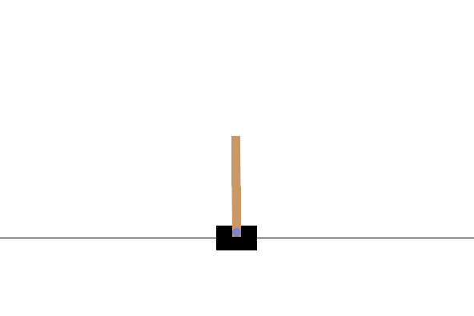
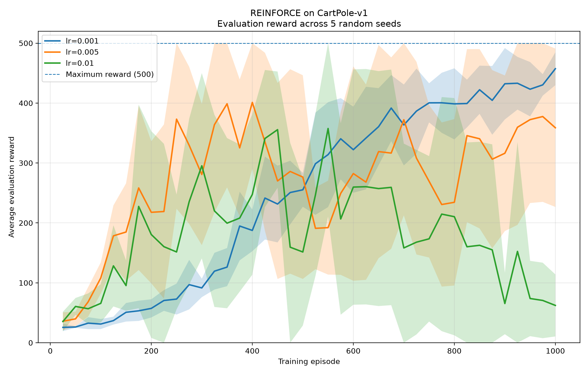
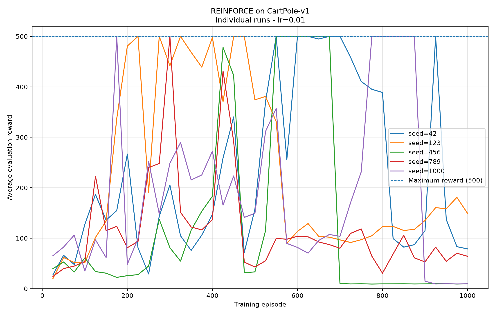
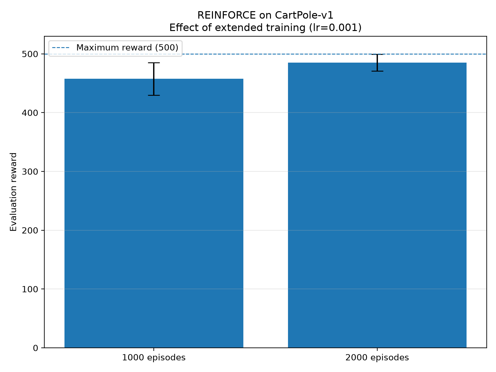
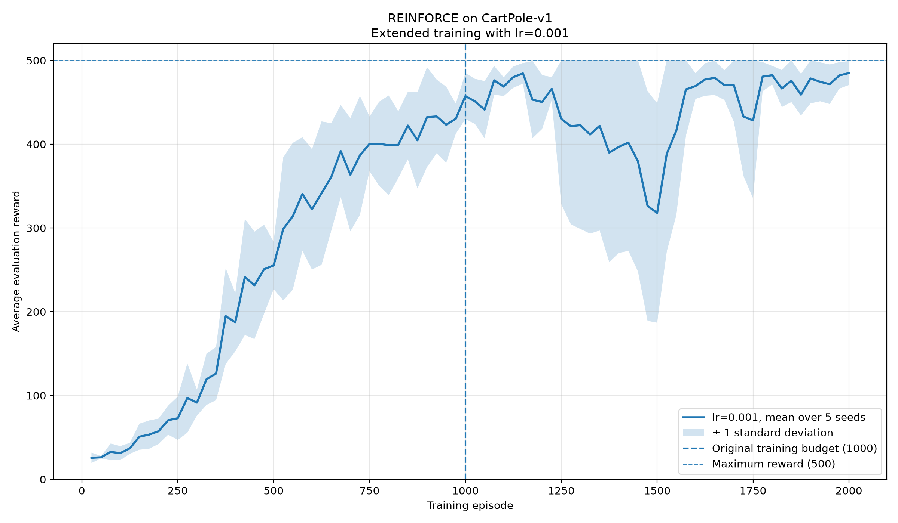
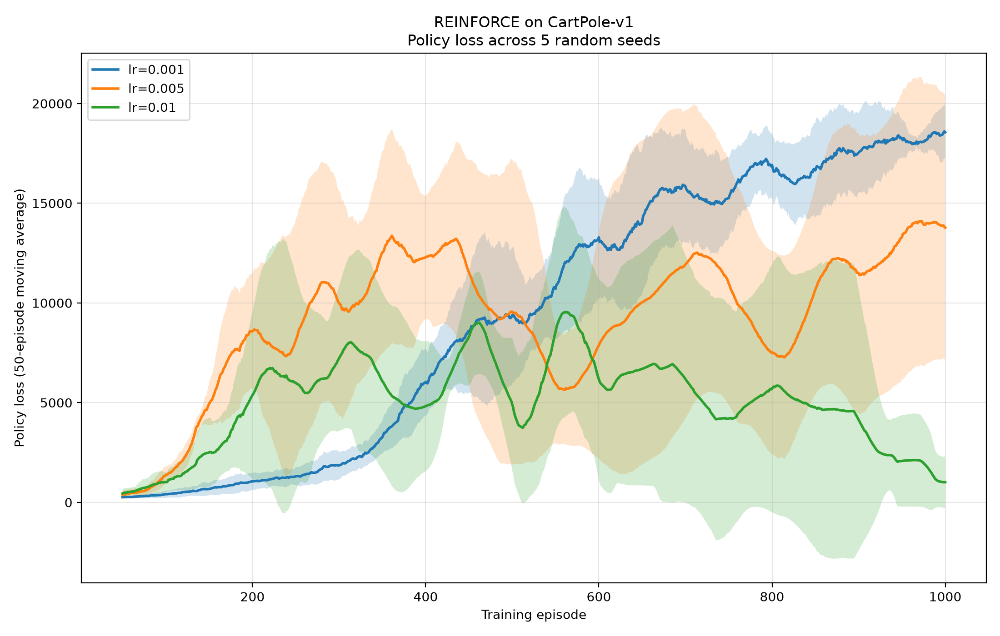

# Exercise 1 — REINFORCE su CartPole-v1

L'Exercise 1 implementa da zero **REINFORCE** sull'ambiente `CartPole-v1` di Gymnasium e costruisce una pipeline sperimentale per analizzarne apprendimento, stabilità e sensibilità agli iperparametri.

La consegna richiede di prendere familiarità con CartPole, far funzionare REINFORCE e sostituire una semplice running average con una **evaluation periodica reale**: ogni `N` episodi di training, la policy viene eseguita per `M` episodi senza aggiornare i pesi, registrando reward medio e lunghezza media.

L'implementazione finale estende questo protocollo con esperimenti multi-seed, confronto tra learning rate, training più lungo e robust evaluation indipendente dei checkpoint.

<p align="center">
  
</p> 

<p align="center">
  <em>CartPole-v1: il carrello deve mantenere il palo in equilibrio scegliendo a ogni step una spinta verso sinistra o verso destra.</em>
</p>

---

## Ambiente — CartPole-v1

`CartPole-v1` rappresenta un palo incernierato su un carrello che può muoversi orizzontalmente. L'agente non controlla direttamente il palo: può soltanto applicare una forza al carrello verso sinistra o verso destra e deve imparare a mantenerlo in equilibrio.

L'osservazione è un vettore di quattro valori:

| Indice | Variabile | Significato |
|---:|---|---|
| 0 | `x` | posizione del carrello |
| 1 | `x_dot` | velocità del carrello |
| 2 | `theta` | angolo del palo |
| 3 | `theta_dot` | velocità angolare del palo |

Lo spazio delle azioni è discreto:

```text
0 → spinta verso sinistra
1 → spinta verso destra
```

Ogni step valido produce reward `+1`. Di conseguenza, in questo ambiente **total reward ed episode length coincidono numericamente**, anche se rappresentano due concetti differenti.

Un episodio può terminare perché il palo o il carrello superano i limiti previsti dal task, oppure essere troncato al limite massimo di `500` step. Un reward pari a `500` indica quindi che il rollout ha raggiunto il time limit senza fallire prima.

---

## Metodo — REINFORCE

REINFORCE è un metodo **Policy Gradient Monte Carlo**. La rete neurale rappresenta direttamente una policy stocastica:

```text
πθ(a | s)
```

che assegna una probabilità alle azioni disponibili nello stato corrente.

### Policy Network

La policy è definita in [`../models.py`](../models.py) come una piccola rete fully connected:

```text
stato CartPole
      │
      ▼
4 input
      │
Linear(4, 64)
      │
    ReLU
      │
Linear(64, 2)
      │
      ▼
2 logits
```

L'architettura utilizzata negli esperimenti è quindi:

```text
4 → 64 → 2
```

I due output non sono probabilità già normalizzate, ma **logits**. Nel rollout vengono passati direttamente a:

```python
Categorical(logits=logits)
```

La distribuzione normalizza internamente i logits e consente di campionare l'azione.

La policy rimane stocastica sia durante il training sia nel protocollo di evaluation utilizzato in questo esercizio.

### Trajectory e discounted return

REINFORCE raccoglie una trajectory completa prima di effettuare l'aggiornamento.

Per ogni timestep vengono conservati:

```text
log πθ(a_t | s_t)
reward_t
```

A fine episodio vengono calcolati i discounted return:

```text
G_t = r_t + γ G_(t+1)
```

equivalenti a:

```text
G_t = r_t + γr_(t+1) + γ²r_(t+2) + ...
```

Negli esperimenti viene utilizzato:

```text
γ = 0.99
```

Il return permette di attribuire a un'azione non soltanto il reward immediato, ma anche le conseguenze future della trajectory.

### Policy loss

L'aggiornamento implementato è:

```text
L = - Σ_t G_t log πθ(a_t | s_t)
```

Il segno negativo è necessario perché PyTorch minimizza la loss, mentre il Policy Gradient nasce come problema di massimizzazione del return atteso.

Per ogni episodio viene eseguito un solo aggiornamento:

```python
optimizer.zero_grad()
loss.backward()
optimizer.step()
```

Il flusso complessivo è:

```text
stato
  │
  ▼
PolicyNetwork
  │
  ▼
logits
  │
  ▼
Categorical
  │
  ▼
azione campionata
  │
  ▼
env.step()
  │
  ▼
reward + nuovo stato
  │
  ▼
trajectory completa
  │
  ▼
discounted returns
  │
  ▼
policy loss
  │
  ▼
backpropagation
  │
  ▼
aggiornamento dei pesi
```

---

## Implementazione

La logica è separata in moduli con responsabilità distinte:

```text
DLA_LAB3/
├── models.py
├── reinforce.py
│
└── Exercise1/
    ├── README.md
    ├── main.py
    ├── evaluate_checkpoints.py
    ├── plot_results.py
    ├── run_extended_2000.sh
    ├── runs/
    ├── robust_evaluation/
    └── plots/
```

| File | Responsabilità |
|---|---|
| `../models.py` | definizione della `PolicyNetwork` |
| `../reinforce.py` | raccolta trajectory, discounted return, policy update, training ed evaluation |
| `main.py` | configurazione della run, environment, optimizer, seed e salvataggio degli artifact |
| `plot_results.py` | aggregazione dei CSV e generazione dei grafici |
| `evaluate_checkpoints.py` | robust evaluation indipendente dei checkpoint |
| `run_extended_2000.sh` | campagna multi-seed da 2000 episodi |

### Separazione training / evaluation

Training ed evaluation utilizzano due istanze differenti di `CartPole-v1`.

Durante il training:

```text
trajectory
→ loss
→ backward
→ optimizer.step()
```

Durante l'evaluation:

```text
policy.eval()
torch.inference_mode()
nessun backward
nessun optimizer.step()
```

L'evaluation continua a campionare dalla `Categorical`, quindi misura la policy stocastica appresa.

La funzione salva inoltre lo stato del generatore casuale PyTorch prima dell'evaluation e lo ripristina alla fine, evitando che il solo processo di valutazione modifichi la sequenza casuale del training successivo.

---

## Protocollo sperimentale

La configurazione di base mantiene fissi:

| Parametro | Valore |
|---|---:|
| Environment | `CartPole-v1` |
| Policy | `4 → 64 → 2` |
| Activation | ReLU |
| Optimizer | Adam |
| Discount factor | `0.99` |
| Hidden dimension | `64` |
| Evaluation interval | `25` episodi |
| Evaluation episodes | `20` |
| Evaluation policy | stocastica |

Ogni evaluation produce:

```text
average evaluation reward
average episode length
```

Poiché CartPole assegna `+1` per step, le due quantità coincidono numericamente in questo task.

La campagna sperimentale è articolata in tre analisi:

```text
1. learning rate × training seed
2. training budget: 1000 → 2000 episodi
3. best checkpoint vs final checkpoint
```

---

## Esperimento 1 — Learning rate e variabilità tra seed

Sono stati confrontati tre learning rate:

```text
0.001
0.005
0.01
```

su cinque training seed:

```text
42
123
456
789
1000
```

per un totale di:

```text
3 learning rate × 5 seed = 15 run
```

Ogni run utilizza `1000` episodi di training.

### Risultati aggregati

| Learning rate | Reward finale medio ± std |
|---:|---:|
| **0.001** | **457.35 ± 27.44** |
| 0.005 | 358.77 ± 132.14 |
| 0.01 | 62.29 ± 51.78 |

<p align="center">
  
</p>

Il learning rate `0.001` apprende più lentamente ma presenta il comportamento finale più consistente tra seed.

`0.005` può raggiungere rapidamente reward molto elevati, ma mostra una maggiore variabilità.

`0.01` rende gli aggiornamenti particolarmente aggressivi e produce frequenti instabilità.

### Policy collapse

Le curve delle singole run mostrano che raggiungere un reward elevato non garantisce che la policy rimanga stabile.

Un caso particolarmente evidente è `lr=0.01`, seed `456`:

```text
episode 550 → 500
episode 575 → 500
episode 600 → 500
episode 625 → 500
episode 650 → 500
episode 675 → 500

episode 700 → 10.50
episode 725 →  9.35
...
episode 1000 → 9.50
```

<p align="center">
  
</p>

La policy aveva quindi imparato una strategia capace di raggiungere il massimo, ma gli aggiornamenti successivi l'hanno distrutta.

Questo comportamento è coerente con l'alta varianza dell'estimatore Monte Carlo: un learning rate elevato amplifica anche oscillazioni e direzioni di gradiente poco affidabili.

Per gli esperimenti successivi viene quindi selezionato:

```text
learning rate = 0.001
```

come configurazione più stabile.

---

## Esperimento 2 — Estensione del training

Le curve con `lr=0.001` mostrano che dopo 1000 episodi l'apprendimento non è ancora completamente esaurito.

Le stesse cinque training seed vengono quindi rieseguite aumentando soltanto il budget:

```text
1000 → 2000 episodi
```

### Risultati

| Training budget | Reward finale medio ± std |
|---:|---:|
| 1000 episodi | 457.35 ± 27.44 |
| **2000 episodi** | **484.79 ± 14.26** |

<p align="center">
  
</p>

Il training più lungo produce contemporaneamente:

```text
reward medio:
457.35 → 484.79

deviazione standard tra seed:
27.44 → 14.26
```

La configurazione conservativa sfrutta quindi efficacemente un budget di training maggiore.

### Evoluzione delle run estese

<p align="center">
  
</p>

Tutte le cinque seed raggiungono almeno una volta un'evaluation media pari a `500`.

| Training seed | Prima evaluation = 500 | Reward finale |
|---:|---:|---:|
| 42 | 1350 | 500.00 |
| 123 | 1300 | 490.30 |
| 456 | 1150 | 476.80 |
| 789 | 1775 | 495.90 |
| 1000 | 1125 | 460.95 |

Il primo raggiungimento del massimo avviene in media intorno all'episodio `1340`.

L'apprendimento rimane però non monotono: alcune policy raggiungono il massimo, peggiorano temporaneamente e successivamente recuperano.

---

## Esperimento 3 — Robust evaluation dei checkpoint

Durante ogni run vengono salvati due checkpoint:

```text
best_policy.pt
policy.pt
```

`best_policy.pt` contiene i pesi corrispondenti alla migliore evaluation periodica osservata durante il training.

`policy.pt` contiene invece i pesi al termine dell'ultimo episodio.

La selezione del checkpoint `best` si basa su evaluation da soli `20` episodi e può quindi essere influenzata dal rumore del campione.

Per questo entrambi i checkpoint delle cinque training seed estese vengono rivalutati su:

```text
100 episodi indipendenti
evaluation seed = 1000 ... 1099
```

Gli stessi seed vengono utilizzati per tutti i checkpoint.

### Risultati aggregati

| Checkpoint | Reward medio tra training seed | Success rate @500 |
|---|---:|---:|
| Best checkpoint | 479.97 ± 9.95 | 89.4% |
| **Final checkpoint** | **486.15 ± 8.01** | **89.6%** |

Il checkpoint denominato `best` non è sistematicamente quello più robusto su nuovi episodi.

| Training seed | Best checkpoint | Final checkpoint |
|---:|---:|---:|
| 42 | 468.45 | **492.44** |
| 123 | 477.84 | **484.69** |
| 456 | 478.84 | **491.30** |
| 789 | **498.47** | 491.24 |
| 1000 | **476.26** | 471.10 |

Il checkpoint finale è migliore in tre seed su cinque.

Il caso più robusto tra i checkpoint valutati è il `best_policy.pt` della training seed `789`:

```text
Mean reward:       498.47
Std reward:         10.83
Median reward:     500.00
Minimum reward:    412.00
Maximum reward:    500.00
Success rate @500: 98%
```

Il risultato evidenzia una distinzione importante:

```text
migliore evaluation osservata durante il training
≠
necessariamente migliore performance su nuovi episodi
```

---

## Policy loss

La policy loss viene registrata durante tutto il training:

<p align="center">
  
</p>

La sua interpretazione è diversa da una classica loss supervisionata.

La funzione è:

```text
L = - Σ_t G_t log πθ(a_t | s_t)
```

Quando la policy migliora, gli episodi diventano più lunghi, aumenta il numero di termini nella somma e aumentano anche i discounted return.

La magnitudine della loss può quindi crescere anche mentre il comportamento dell'agente migliora.

Per confrontare le policy, la metrica principale rimane il **reward durante l'evaluation**; la policy loss viene utilizzata soprattutto come metrica diagnostica.

---

## Output e artifact

Ogni run produce una directory:

```text
Exercise1/runs/<run_name>/
├── config.json
├── training_metrics.csv
├── evaluation_metrics.csv
├── policy.pt
└── best_policy.pt
```

`training_metrics.csv` contiene:

```text
episode
reward
loss
```

`evaluation_metrics.csv` contiene:

```text
episode
average_reward
average_length
```

La robust evaluation salva:

```text
Exercise1/robust_evaluation/
├── checkpoint_summary.csv
├── seed42_best_episodes.csv
├── seed42_final_episodes.csv
├── ...
└── seed1000_final_episodes.csv
```

I grafici finali sono generati esclusivamente dagli artifact persistiti e vengono salvati in:

```text
Exercise1/plots/
```

Tra i principali:

```text
evaluation_mean_std.png
evaluation_individual_lr0.001.png
evaluation_individual_lr0.005.png
evaluation_individual_lr0.01.png
final_reward_summary.png
training_reward_mean_std.png
policy_loss_mean_std.png
extended_evaluation_mean_std.png
extended_evaluation_individual.png
extended_training_reward_mean_std.png
extended_policy_loss_mean_std.png
training_budget_1000_vs_2000.png
```

---

## Riproduzione

I comandi seguenti vanno eseguiti dalla directory `DLA_LAB3` con l'ambiente `DRL` attivo.

### Singola run

```bash
python -m Exercise1.main \
  --lr 0.001 \
  --seed 42 \
  --episodes 1000 \
  --gamma 0.99 \
  --hidden-dim 64 \
  --eval-every 25 \
  --eval-episodes 20 \
  --run-name reinforce_lr0.001_gamma0.99_h64_seed42
```

### Training esteso multi-seed

```bash
bash Exercise1/run_extended_2000.sh
```

Lo script esegue cinque run con:

```text
lr = 0.001
gamma = 0.99
hidden_dim = 64
episodes = 2000
seeds = {42, 123, 456, 789, 1000}
```

### Robust evaluation

```bash
python -m Exercise1.evaluate_checkpoints
```

### Generazione dei grafici

```bash
python -m Exercise1.plot_results
```

---

## Limiti

- REINFORCE utilizza return Monte Carlo e mantiene una variabilità significativa tra training seed.
- L'evaluation periodica usa `20` episodi: è sufficiente per seguire il training ma può essere rumorosa per la selezione del checkpoint.
- La policy viene valutata in modo stocastico, quindi due rollout dello stesso checkpoint possono produrre trajectory differenti.
- Il checkpoint `best` è definito rispetto alle evaluation osservate durante il training e non garantisce la migliore robust evaluation successiva.
- La campagna esplora tre learning rate, ma non rappresenta una ricerca esaustiva degli iperparametri.
- La rete è volutamente piccola (`4 → 64 → 2`) e non vengono confrontate architetture più profonde.
- I checkpoint `.pt` sono esclusi dal repository Git; la riproduzione delle evaluation dei modelli richiede i pesi generati localmente.

---

## Riferimenti e assistenza AI

Riferimenti principali:

- Gymnasium — `CartPole-v1`;
- PyTorch;
- REINFORCE / Monte Carlo Policy Gradient;
- materiale didattico del corso di Deep Learning Applications.

ChatGPT è stato utilizzato come supporto per chiarimenti teorici, organizzazione del lavoro, revisione del codice, debugging, progettazione degli esperimenti, analisi degli artifact e documentazione. Le configurazioni e i risultati riportati derivano dal codice e dagli artifact effettivamente prodotti dal progetto.
