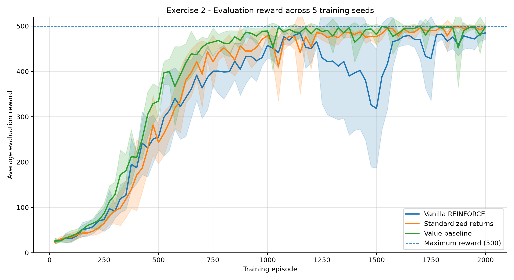
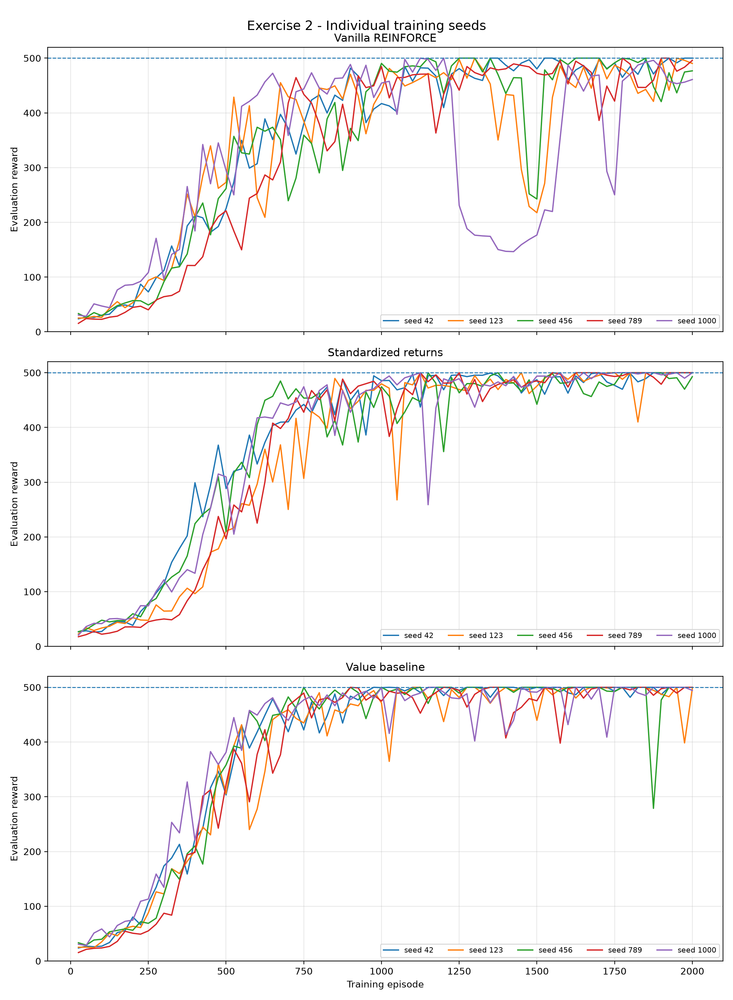
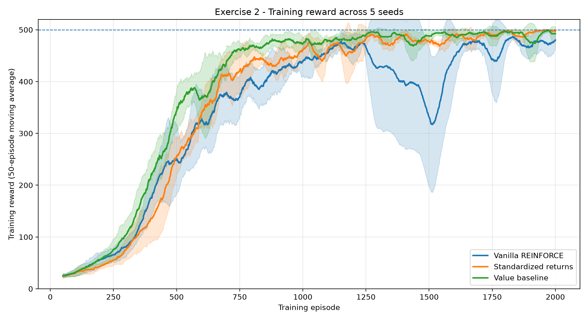
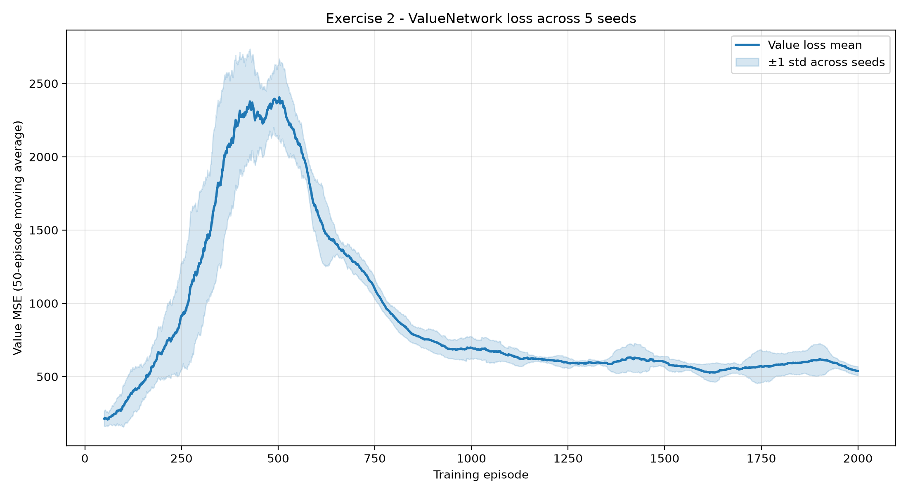
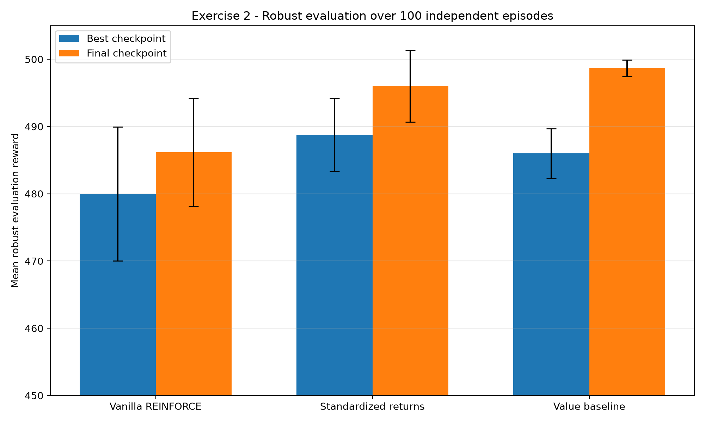
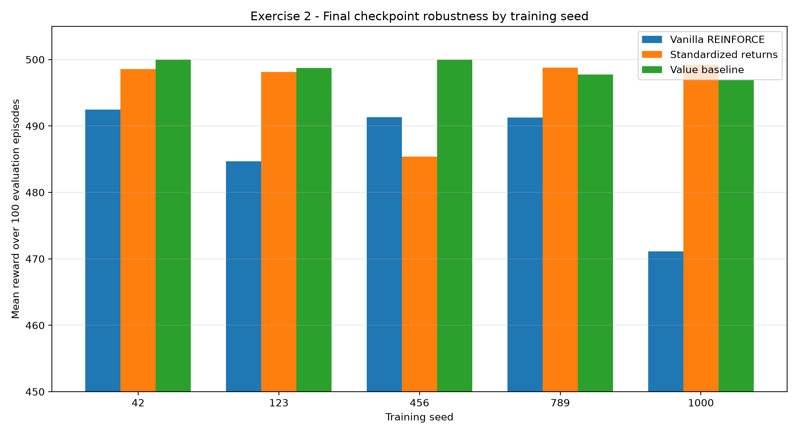
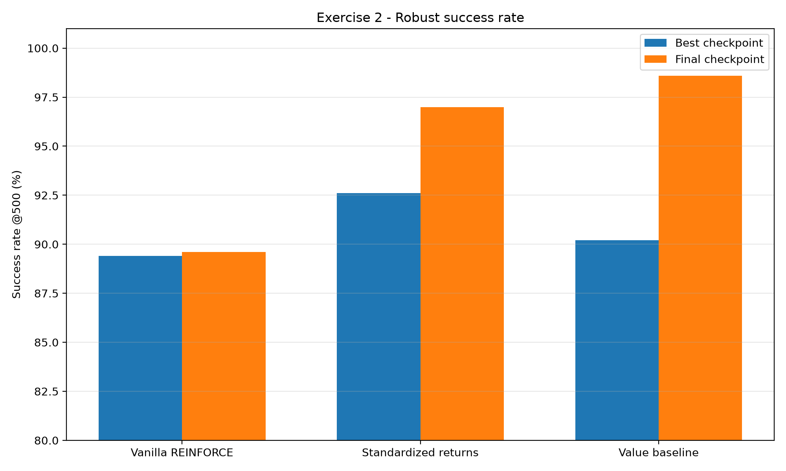

# Exercise 2 — Variance Reduction in REINFORCE su CartPole-v1

## Panoramica

L'Exercise 2 estende l'implementazione di **REINFORCE** sviluppata
nell'Exercise 1 introducendo due tecniche di riduzione della varianza del
policy gradient:

```text
standardizzazione dei return
value baseline appresa
```

L'ambiente, la PolicyNetwork e il protocollo generale rimangono invariati.

L'obiettivo dell'esercizio non è quindi modificare il problema da risolvere,
ma verificare sperimentalmente se un segnale di apprendimento meno rumoroso
permetta di ottenere:

- apprendimento più rapido;
- maggiore stabilità durante il training;
- minore dipendenza dalla random seed;
- minore frequenza di policy collapse;
- policy finali più robuste.

L'Exercise 1 aveva mostrato che vanilla REINFORCE riesce a risolvere
`CartPole-v1`, ma presenta una forte variabilità dovuta alla natura Monte Carlo
del policy gradient.

In particolare, il confronto tra learning rate e training seed aveva portato a
selezionare:

```text
learning rate = 0.001
training episodes = 2000
```

come configurazione di riferimento più stabile.

L'Exercise 2 utilizza quindi proprio questa configurazione come baseline e
confronta, a parità di condizioni:

```text
Vanilla REINFORCE
        vs
Standardized Returns
        vs
Learned Value Baseline
```

---

# 1. Implementazione

## Vanilla REINFORCE

La configurazione di riferimento rimane quella dell'Exercise 1.

La PolicyNetwork è:

```text
stato CartPole
      │
      ▼
4 input
      │
Linear(4, 64)
      │
    ReLU
      │
Linear(64, 2)
      │
      ▼
2 logits
```

I logits vengono utilizzati per costruire una distribuzione categorica:

```python
distribution = Categorical(logits=logits)
```

e l'azione viene campionata dalla policy:

```python
action = distribution.sample()
```

Per ogni step vengono memorizzati:

```text
log π(a_t | s_t)
reward_t
```

e al termine dell'episodio vengono calcolati i discounted return:

```text
G_t = r_t + gamma * G_(t+1)
```

La policy loss vanilla è:

```text
L_policy = - Σ_t G_t log π(a_t | s_t)
```

Il return Monte Carlo viene quindi utilizzato direttamente come peso
dell'aggiornamento della policy.

---

# 2. Standardizzazione dei return

## Motivazione

Nel vanilla REINFORCE la magnitudine del policy gradient dipende direttamente
dalla scala dei return osservati.

Durante il training tale scala può cambiare molto:

```text
episodi corti
    ↓
return piccoli

episodi lunghi
    ↓
return grandi
```

La prima tecnica studiata consiste quindi nel normalizzare i return all'interno
di ogni episodio.

Dato il vettore:

```text
G_0, G_1, ..., G_(T-1)
```

vengono calcolati:

```text
μ_G = mean(G)
σ_G = std(G)
```

e quindi:

```text
G_hat_t =
(G_t - μ_G) / (σ_G + epsilon)
```

con:

```text
epsilon = 1e-8
```

per stabilità numerica.

Nel codice viene utilizzato:

```python
returns.std(correction=0)
```

trattando quindi il vettore dei return dell'episodio come popolazione completa.

---

## Effetto sulla policy loss

Vanilla REINFORCE utilizza:

```text
L_policy =
- Σ_t G_t log π(a_t | s_t)
```

con la standardizzazione viene invece utilizzato:

```text
L_policy =
- Σ_t G_hat_t log π(a_t | s_t)
```

La PolicyNetwork non cambia.

Cambiano solamente i coefficienti che moltiplicano le log-probabilità.

Il flusso rimane quindi:

```text
stato
  │
  ▼
PolicyNetwork
  │
  ▼
logits
  │
  ▼
azione campionata
  │
  ▼
log_prob
  │
  ▼
policy loss
  │
  ▼
backpropagation
```

La standardizzazione non introduce una seconda rete neurale e non utilizza
informazioni specifiche sullo stato.

Utilizza solamente le statistiche dei return dell'episodio corrente.

---

# 3. Learned Value Baseline

La seconda tecnica introduce una nuova rete neurale:

```text
ValueNetwork
```

che cerca di approssimare la state-value function:

```text
V_w(s) ≈ v_π(s)
```

dove:

```text
v_π(s) = E_π[G_t | S_t = s]
```

La rete cerca quindi di stimare:

```text
quanto return futuro ci si può aspettare
partendo da un determinato stato
```

---

## Architettura

La PolicyNetwork continua a essere:

```text
4 → 64 → 2
```

La nuova ValueNetwork è invece:

```text
4 → 64 → 1
```

con:

```text
Linear(4, 64)
ReLU
Linear(64, 1)
```

La differenza concettuale è:

```text
PolicyNetwork
input  → stato
output → 2 logits
ruolo  → scegliere l'azione


ValueNetwork
input  → stato
output → 1 valore
ruolo  → stimare quanto vale lo stato
```

La ValueNetwork non sceglie quindi nessuna azione.

---

# 4. Advantage

La ValueNetwork permette di sostituire il return diretto con un segnale
relativo allo stato corrente.

L'advantage utilizzato è:

```text
A_t = G_t - V_w(S_t)
```

che può essere interpretato come:

```text
return realmente ottenuto
        -
return che ci aspettavamo da quello stato
```

Se:

```text
A_t > 0
```

il risultato ottenuto è stato migliore del previsto.

Se:

```text
A_t < 0
```

il risultato è stato peggiore del previsto.

Se:

```text
A_t ≈ 0
```

il risultato è stato circa quello atteso.

La policy loss diventa quindi:

```text
L_policy =
- Σ_t A_t log π(a_t | s_t)
```

ovvero:

```text
L_policy =
- Σ_t (G_t - V_w(S_t)) log π(a_t | s_t)
```

---

# 5. Training della ValueNetwork

Per addestrare la ValueNetwork viene utilizzato come target il return Monte
Carlo osservato:

```text
target = G_t
```

La loss è una Mean Squared Error:

```text
L_value =
MSE(V_w(S_t), G_t)
```

cioè:

```text
L_value =
mean_t (V_w(S_t) - G_t)^2
```

Sono quindi presenti due optimizer indipendenti:

```text
policy optimizer
        ↓
PolicyNetwork


value optimizer
        ↓
ValueNetwork
```

Entrambi utilizzano Adam.

Nel protocollo finale:

```text
policy learning rate = 0.001
value learning rate  = 0.001
```

---

# 6. Separazione dei gradienti

Una scelta implementativa fondamentale riguarda il gradient flow.

L'advantage viene calcolato tramite:

```python
advantages = returns_tensor - values.detach()
```

Il `detach()` impedisce alla policy loss di aggiornare la ValueNetwork.

Senza `detach()` si avrebbe:

```text
policy loss
    │
    ├── log_prob
    │      ↓
    │   PolicyNetwork
    │
    └── values
           ↓
       ValueNetwork
```

creando un percorso di gradiente indesiderato.

Con `detach()`:

```text
POLICY UPDATE

policy loss
    ↓
log_prob
    ↓
PolicyNetwork


VALUE UPDATE

value loss
    ↓
V(S_t)
    ↓
ValueNetwork
```

Le due reti vengono quindi aggiornate separatamente.

---

# 7. Trajectory estesa

Vanilla REINFORCE necessita principalmente di:

```text
log_probs
rewards
```

Per utilizzare la ValueNetwork è necessario conservare anche gli stati.

Durante ogni episodio vengono quindi memorizzati:

```text
state_t
log_prob_t
reward_t
```

Per una trajectory di lunghezza `T`:

```text
states      → (T, 4)
log_probs   → (T,)
returns     → (T,)
values      → (T,)
advantages  → (T,)
```

Lo stato viene memorizzato prima di eseguire l'azione:

```text
S_t
  │
  ▼
PolicyNetwork
  │
  ▼
A_t
  │
  ▼
env.step(A_t)
```

in modo che:

```text
states[t]
log_probs[t]
returns[t]
values[t]
```

facciano tutti riferimento allo stesso timestep.

---

# 8. Scelte implementative

L'Exercise 2 è stato strutturato mantenendo separato il codice specifico dalle
funzioni vanilla dell'Exercise 1.

La struttura principale è:

```text
models.py
    ├── PolicyNetwork
    └── ValueNetwork

reinforce.py
    └── funzioni comuni dell'Exercise 1

Exercise2/reinforce_ex2.py
    ├── trajectory con stati
    ├── standardizzazione dei return
    ├── policy update
    ├── policy + value update
    ├── training standardizzato
    └── training con value baseline

Exercise2/main.py
    ├── Vanilla REINFORCE
    └── Standardized Returns

Exercise2/value_baseline_main.py
    └── REINFORCE + Value Baseline
```

---

## Parametri configurabili da command line

Anche l'Exercise 2 utilizza parametri configurabili da terminale.

Per vanilla e standardized:

```text
--mode
--seed
--episodes
--gamma
--lr
--hidden-dim
--eval-every
--eval-episodes
--run-name
```

Per la Value Baseline:

```text
--seed
--episodes
--gamma
--policy-lr
--value-lr
--hidden-dim
--eval-every
--eval-episodes
--run-name
```

Questo permette di eseguire facilmente esperimenti multi-seed mantenendo
identico il protocollo.

---

# 9. Controllo della randomizzazione

L'introduzione della ValueNetwork richiede un'ulteriore inizializzazione
casuale dei pesi.

Se non venisse gestita, questa inizializzazione consumerebbe numeri dal
generatore casuale PyTorch e modificherebbe la successiva sequenza di
campionamento delle azioni rispetto agli altri metodi.

Per ridurre questa differenza artificiale viene quindi:

```text
inizializzata PolicyNetwork
        ↓
salvato lo stato RNG
        ↓
inizializzata ValueNetwork
        ↓
ripristinato lo stato RNG
```

In questo modo l'esistenza della seconda rete non altera semplicemente per
effetto collaterale la sequenza RNG utilizzata successivamente dal training
della policy.

---

# 10. Salvataggio degli artifact

Ogni run vanilla o standardized produce:

```text
config.json
training_metrics.csv
evaluation_metrics.csv
policy.pt
best_policy.pt
```

Per la Value Baseline vengono inoltre salvati:

```text
value.pt
best_value.pt
```

La differenza tra i checkpoint della policy è:

```text
best_policy.pt
=
pesi corrispondenti alla migliore
evaluation periodica osservata


policy.pt
=
pesi dopo l'ultimo episodio di training
```

Per la Value Baseline, `best_value.pt` viene salvato nello stesso momento del
`best_policy.pt`.

Il criterio di selezione rimane comunque la performance della policy, non la
value loss.

---

# 11. Protocollo sperimentale

L'Exercise 1 aveva mostrato che:

```text
lr = 0.001
```

era più robusto di `0.005` e `0.01`.

Aveva inoltre mostrato che passando da:

```text
1000 → 2000 episodi
```

vanilla REINFORCE continuava a migliorare.

Per questo motivo l'Exercise 2 utilizza direttamente come riferimento:

| Parametro | Valore |
|---|---:|
| Environment | CartPole-v1 |
| Policy | 4 → 64 → 2 |
| Activation | ReLU |
| Policy optimizer | Adam |
| Policy learning rate | 0.001 |
| Gamma | 0.99 |
| Training episodes | 2000 |
| Evaluation interval | 25 |
| Evaluation episodes | 20 |
| Hidden dimension | 64 |
| Evaluation policy | stochastic |

Training seed:

```text
42
123
456
789
1000
```

Per la Value Baseline:

| Parametro | Valore |
|---|---:|
| ValueNetwork | 4 → 64 → 1 |
| Activation | ReLU |
| Optimizer | Adam |
| Value learning rate | 0.001 |
| Target | Monte Carlo return |
| Loss | MSE |

Sono stati quindi eseguiti:

```text
3 metodi
×
5 training seed
=
15 training completi
```

---

# 12. Configurazioni confrontate

## Vanilla REINFORCE

```text
standardize_returns = False
value_baseline      = False
```

Segnale utilizzato:

```text
G_t
```

---

## Standardized Returns

```text
standardize_returns = True
value_baseline      = False
```

Segnale utilizzato:

```text
(G_t - mean(G)) / (std(G) + epsilon)
```

---

## Value Baseline

```text
standardize_returns = False
value_baseline      = True
```

Segnale utilizzato:

```text
G_t - V_w(S_t)
```

Tutto il resto del protocollo viene mantenuto il più possibile invariato.

---

# 13. Evaluation durante il training

La policy viene valutata:

```text
ogni 25 episodi di training
```

su:

```text
20 episodi indipendenti
```

senza eseguire:

```text
backward()
optimizer.step()
```

Con 2000 episodi vengono quindi prodotte:

```text
2000 / 25 = 80 evaluation
```

per ciascuna training seed.

Per ogni metodo abbiamo:

```text
5 seed × 80 evaluation
=
400 evaluation periodiche
```

---

# 14. Risultati durante il training

## Reward finale

Considerando l'ultima evaluation periodica delle cinque training seed:

| Metodo | Reward finale medio ± std |
|---|---:|
| Vanilla REINFORCE | 484.79 ± 14.26 |
| Standardized Returns | **498.56 ± 2.88** |
| Value Baseline | **498.43 ± 2.20** |

Entrambe le tecniche di variance reduction producono quindi un risultato
finale molto più consistente rispetto al vanilla REINFORCE.

In particolare, la deviazione standard tra training seed passa da:

```text
14.26
```

a:

```text
2.88  → Standardized Returns
2.20  → Value Baseline
```

---

## Velocità di raggiungimento del massimo

È stato inoltre considerato il primo episodio nel quale una evaluation
periodica raggiunge il reward medio massimo di 500.

In media:

| Metodo | Primo reward 500 |
|---|---:|
| Vanilla REINFORCE | 1340 |
| Standardized Returns | 1310 |
| **Value Baseline** | **945** |

La Value Baseline raggiunge quindi il massimo mediamente circa:

```text
395 episodi prima del Vanilla
```

e:

```text
365 episodi prima dello Standardized
```

---

## Frequenza delle evaluation ad alta performance

Sulle 400 evaluation disponibili per metodo:

| Metodo | Evaluation ≥475 | Evaluation =500 |
|---|---:|---:|
| Vanilla REINFORCE | 96 / 400 | 27 / 400 |
| Standardized Returns | 167 / 400 | 51 / 400 |
| **Value Baseline** | **219 / 400** | **103 / 400** |

In percentuale, le evaluation esattamente a 500 sono:

```text
Vanilla REINFORCE:
27 / 400 = 6.75%

Standardized Returns:
51 / 400 = 12.75%

Value Baseline:
103 / 400 = 25.75%
```

La Value Baseline non si limita quindi a raggiungere il massimo prima, ma
rimane molto più frequentemente nella regione di performance massima.

---

# 15. Evoluzione media sulle cinque seed



Il grafico mostra la media dell'evaluation reward sulle cinque training seed
con una banda pari a una deviazione standard.

Il comportamento generale è:

```text
Value Baseline
        ↓
crescita più rapida
        ↓
alta performance raggiunta prima
        ↓
bassa variabilità nella fase finale
```

Lo Standardized Returns migliora anch'esso nettamente il comportamento rispetto
al vanilla.

Vanilla REINFORCE raggiunge comunque reward molto elevati, ma presenta una
maggiore variabilità.

Tra circa 1300 e 1550 episodi la banda del vanilla aumenta sensibilmente.

Questo deriva dal fatto che alcune training seed mantengono una policy vicina
al massimo mentre altre subiscono temporanei policy collapse.

---

# 16. Analisi delle singole training seed



Le curve individuali permettono di osservare comportamenti che la sola media
potrebbe nascondere.

### Vanilla REINFORCE

Il vanilla raggiunge frequentemente reward vicini a 500, ma alcune seed
presentano cali molto significativi anche dopo aver quasi risolto il problema.

Il fenomeno osservato nell'Exercise 1 rimane quindi presente:

```text
policy buona
    ↓
nuovi update Monte Carlo
    ↓
forte oscillazione
    ↓
temporaneo policy collapse
```

---

### Standardized Returns

La standardizzazione riduce nettamente la frequenza e l'intensità dei collapse.

Rimangono comunque alcune oscillazioni isolate.

Questo conferma che controllare la scala dei return aiuta il training, ma non
fornisce informazioni specifiche sul valore dello stato corrente.

---

### Value Baseline

La Value Baseline porta le cinque seed nella regione di reward elevato più
rapidamente.

Sono ancora presenti occasionali cali temporanei, quindi la tecnica non elimina
completamente la natura stocastica del training.

Tuttavia le curve risultano mediamente più concentrate vicino a 500.

---

# 17. Training reward



Il training reward mostra la stessa tendenza osservata durante l'evaluation.

Per rendere leggibile la curva viene utilizzata una moving average su 50
episodi.

La Value Baseline entra più rapidamente nella regione di reward elevato.

Il Vanilla REINFORCE mostra invece una forte crescita della variabilità nella
parte centrale/finale del training, coerente con i collapse osservati nelle
singole seed.

La conclusione non è quindi semplicemente:

```text
variance reduction
→ reward più alto
```

ma soprattutto:

```text
variance reduction
→ apprendimento più consistente
```

---

# 18. Value loss



La value loss non deve essere interpretata come una classica validation loss
supervisionata.

Durante il training la PolicyNetwork cambia continuamente.

Di conseguenza cambiano anche:

```text
stati visitati
lunghezza degli episodi
return osservati
target della ValueNetwork
```

All'inizio gli episodi sono relativamente corti e i return hanno una scala
ridotta.

Quando la policy migliora:

```text
episodi più lunghi
        ↓
return Monte Carlo più grandi
        ↓
problema di regressione più difficile
        ↓
value loss può aumentare
```

Il grafico mostra infatti una crescita iniziale della MSE, seguita da una
progressiva diminuzione e stabilizzazione quando la policy entra nella regione
di performance elevata.

Il comportamento non indica quindi automaticamente divergenza.

La value loss è utilizzata principalmente come metrica diagnostica.

La metrica fondamentale rimane la performance della policy.

---

# 19. Robust evaluation

Le evaluation periodiche durante il training utilizzano solamente 20 episodi.

Come osservato già nell'Exercise 1, questo può produrre una stima rumorosa della
performance.

È stata quindi eseguita una seconda valutazione indipendente utilizzando:

```text
100 episodi per checkpoint
evaluation seed = 1000 ... 1099
```

Per ogni episodio vengono inizializzati in modo controllato:

```text
environment RNG
PyTorch RNG
```

Gli stessi seed vengono utilizzati per ogni checkpoint.

Sono stati valutati:

```text
3 metodi
×
5 training seed
×
2 checkpoint
=
30 checkpoint
```

dove per ogni training viene confrontato:

```text
best_policy.pt
policy.pt
```

In totale:

```text
30 × 100
=
3000 episodi di robust evaluation
```

La ValueNetwork non viene utilizzata durante questa fase.

Durante l'evaluation serve solamente:

```text
PolicyNetwork
```

perché è la policy a scegliere le azioni.

---

# 20. Robust evaluation — risultati aggregati

| Metodo | Checkpoint | Reward medio ± std tra training seed | Success rate @500 |
|---|---|---:|---:|
| Vanilla REINFORCE | Best | 479.97 ± 9.95 | 89.4% |
| Vanilla REINFORCE | **Final** | **486.15 ± 8.01** | **89.6%** |
| Standardized Returns | Best | 488.76 ± 5.41 | 92.6% |
| Standardized Returns | **Final** | **496.00 ± 5.33** | **97.0%** |
| Value Baseline | Best | 485.99 ± 3.71 | 90.2% |
| **Value Baseline** | **Final** | **498.68 ± 1.22** | **98.6%** |



Il valore `±` rappresenta la deviazione standard tra i mean reward ottenuti
dalle cinque diverse training seed.

Il risultato più forte viene ottenuto dal checkpoint finale della Value
Baseline:

```text
498.68 ± 1.22
```

con:

```text
98.6% success rate @500
```

---

# 21. Miglioramento rispetto al Vanilla REINFORCE

Confrontando i checkpoint finali:

```text
Vanilla:
486.15 ± 8.01
```

```text
Standardized:
496.00 ± 5.33
```

```text
Value Baseline:
498.68 ± 1.22
```

Lo Standardized Returns migliora il reward robusto medio di:

```text
496.00 - 486.15
=
+9.85
```

e il success rate passa da:

```text
89.6% → 97.0%
```

ovvero:

```text
+7.4 punti percentuali
```

La Value Baseline migliora il reward rispetto al vanilla di:

```text
498.68 - 486.15
=
+12.53
```

mentre il success rate passa da:

```text
89.6% → 98.6%
```

ovvero:

```text
+9.0 punti percentuali
```

La variabilità tra training seed diminuisce inoltre da:

```text
8.01
```

a:

```text
1.22
```

per la Value Baseline.

---

# 22. Robustezza rispetto alla training seed



I checkpoint finali producono:

| Training seed | Vanilla | Standardized | Value Baseline |
|---:|---:|---:|---:|
| 42 | 492.44 | 498.58 | **500.00** |
| 123 | 484.69 | 498.11 | **498.71** |
| 456 | 491.30 | 485.36 | **500.00** |
| 789 | 491.24 | **498.76** | 497.75 |
| 1000 | 471.10 | **499.19** | 496.92 |

La Value Baseline ottiene:

```text
496.92 ≤ mean reward ≤ 500
```

per tutte le cinque training seed.

Inoltre:

```text
seed 42  → 500.00
seed 456 → 500.00
```

significa che entrambe le policy hanno raggiunto:

```text
500 / 500 / ... / 500
```

in tutti i 100 episodi della robust evaluation.

---

# 23. Robust success rate



Per i checkpoint finali:

```text
Vanilla REINFORCE:
89.6%

Standardized Returns:
97.0%

Value Baseline:
98.6%
```

Questo risultato mostra che il vantaggio delle tecniche di variance reduction
non consiste solamente in alcuni reward medi leggermente più elevati.

La probabilità empirica di raggiungere il limite massimo di CartPole aumenta
in modo significativo.

---

# 24. Best checkpoint vs checkpoint finale

Un risultato interessante è che, in media, il checkpoint finale risulta
migliore del checkpoint denominato `best` per tutti e tre i metodi.

```text
Vanilla:
479.97 → 486.15

Standardized:
488.76 → 496.00

Value Baseline:
485.99 → 498.68
```

Questo non è una contraddizione.

`best_policy.pt` significa:

```text
checkpoint con la migliore
evaluation periodica su 20 episodi
```

e non:

```text
checkpoint realmente migliore
su qualunque insieme di episodi
```

Le evaluation periodiche sono stime rumorose.

Una policy può quindi ottenere una valutazione particolarmente favorevole nei
20 episodi utilizzati per il checkpointing.

La robust evaluation da 100 episodi fornisce invece una misura più affidabile.

Il risultato conferma quindi quanto già osservato nell'Exercise 1:

```text
best evaluation osservata
≠
necessariamente miglior checkpoint reale
```

---

# 25. Esempio — Value Baseline seed 42

Un esempio particolarmente chiaro riguarda la training seed `42`.

Il best checkpoint ottiene:

```text
Mean reward:       490.82
Success rate @500: 93%
```

Il checkpoint finale ottiene invece:

```text
Mean reward:       500.00
Std reward:          0.00
Median reward:     500.00
Min reward:        500.00
Max reward:        500.00
Success rate @500: 100%
```

Quindi:

```text
100 / 100
```

episodi raggiungono il massimo reward.

Un risultato analogo viene ottenuto dal checkpoint finale della training seed
`456`.

---

# 26. Interpretazione complessiva

I tre metodi possono essere interpretati come tre segnali progressivamente più
informativi.

## Vanilla REINFORCE

Utilizza:

```text
G_t
```

direttamente.

Il metodo riesce a risolvere CartPole ma mantiene una forte variabilità.

---

## Standardized Returns

Utilizza:

```text
(G_t - mean(G)) / (std(G) + epsilon)
```

La trasformazione:

- centra il segnale;
- ne controlla la scala;
- riduce parte della variabilità degli update.

Il metodo migliora nettamente la robustezza rispetto al vanilla.

Tuttavia la trasformazione dipende solamente dalle statistiche dell'episodio.

---

## Value Baseline

Utilizza:

```text
G_t - V_w(S_t)
```

Il segnale è quindi state-dependent.

La policy non viene semplicemente informata del return ottenuto, ma di quanto
quel return sia stato migliore o peggiore rispetto a ciò che era atteso dallo
stato corrente.

Nel protocollo utilizzato questo produce:

```text
apprendimento più rapido
+
maggiore permanenza nella regione ad alto reward
+
minore variabilità tra seed
+
migliore robust evaluation finale
```

---

# 27. Collegamento con Exercise 1

L'Exercise 1 aveva evidenziato:

```text
Monte Carlo policy gradient
        │
        ▼
elevata varianza
        │
        ▼
sensibilità alla seed
        │
        ▼
oscillazioni
        │
        ▼
policy collapse
```

L'Exercise 2 interviene direttamente sul segnale moltiplicato per:

```text
log π(a_t | s_t)
```

Il confronto finale è:

```text
Vanilla
G_t
        │
        ▼
486.15 ± 8.01


Standardized
G_hat_t
        │
        ▼
496.00 ± 5.33


Value Baseline
G_t - V(S_t)
        │
        ▼
498.68 ± 1.22
```

I risultati sono quindi coerenti con la motivazione iniziale dell'esercizio:

```text
ridurre la varianza del learning signal
        ↓
rendere il policy gradient più affidabile
        ↓
ottenere training più stabile
```

---

# 28. Nota sulla Value Baseline e Actor-Critic

La ValueNetwork utilizza come target:

```text
G_t
```

cioè il return Monte Carlo completo dell'episodio.

Non viene utilizzato un target bootstrapped del tipo:

```text
r_t + gamma V(S_(t+1))
```

L'implementazione rimane quindi **REINFORCE with learned baseline**.

La rete di valore svolge il ruolo di baseline per il policy gradient, ma il
target utilizzato per il suo training rimane Monte Carlo.

---

# 29. Risultati principali

Gli esperimenti permettono di riassumere il comportamento osservato in questo
modo.

### 1. Vanilla REINFORCE rimane un baseline forte

Con:

```text
lr = 0.001
2000 episodi
```

raggiunge:

```text
486.15 ± 8.01
```

nella robust evaluation finale.

Le tecniche dell'Exercise 2 vengono quindi confrontate contro una baseline già
ben configurata, non contro un training vanilla debole.

---

### 2. La standardizzazione migliora significativamente la robustezza

Il checkpoint finale passa da:

```text
486.15 ± 8.01
```

a:

```text
496.00 ± 5.33
```

con un success rate:

```text
89.6% → 97.0%
```

---

### 3. La Value Baseline accelera maggiormente l'apprendimento

Il primo reward medio di 500 viene raggiunto mediamente a:

```text
Vanilla       → episodio 1340
Standardized  → episodio 1310
Value baseline→ episodio 945
```

---

### 4. La Value Baseline rimane più frequentemente nella regione di massimo reward

Evaluation esattamente a 500:

```text
Vanilla:
27 / 400

Standardized:
51 / 400

Value Baseline:
103 / 400
```

---

### 5. La Value Baseline produce i checkpoint finali più consistenti

La robust evaluation finale è:

```text
498.68 ± 1.22
```

con:

```text
98.6% success rate @500
```

e tutte le training seed ottengono almeno:

```text
496.92
```

di reward medio sui 100 episodi.

---

### 6. La ValueNetwork non deve essere giudicata solamente dalla sua MSE

La target distribution cambia insieme alla policy.

La value loss è quindi non stazionaria e può aumentare anche mentre la policy
sta migliorando.

---

### 7. Il checkpoint chiamato `best` non è necessariamente quello più robusto

Per tutti i tre metodi il checkpoint finale ottiene una performance aggregata
migliore nella robust evaluation.

Questo conferma la necessità di distinguere tra:

```text
migliore evaluation periodica osservata
```

e:

```text
migliore performance stimata su nuovi episodi
```

---

# 30. Riproducibilità

## Ambiente

Dalla directory:

```text
DLA_LAB3/
```

attivare:

```bash
conda activate DRL
```

---

## Vanilla REINFORCE

Esempio:

```bash
python -m Exercise2.main \
    --mode vanilla \
    --seed 42 \
    --episodes 2000 \
    --gamma 0.99 \
    --lr 0.001 \
    --hidden-dim 64 \
    --eval-every 25 \
    --eval-episodes 20 \
    --run-name ex2_vanilla_ep2000_lr0.001_seed42
```

---

## Standardized Returns

```bash
python -m Exercise2.main \
    --mode standardized \
    --seed 42 \
    --episodes 2000 \
    --gamma 0.99 \
    --lr 0.001 \
    --hidden-dim 64 \
    --eval-every 25 \
    --eval-episodes 20 \
    --run-name ex2_standardized_ep2000_lr0.001_seed42
```

---

## Value Baseline

```bash
python -m Exercise2.value_baseline_main \
    --seed 42 \
    --episodes 2000 \
    --gamma 0.99 \
    --policy-lr 0.001 \
    --value-lr 0.001 \
    --hidden-dim 64 \
    --eval-every 25 \
    --eval-episodes 20 \
    --run-name ex2_value_baseline_ep2000_plr0.001_vlr0.001_seed42
```

Il protocollo completo utilizza:

```text
seed:
42
123
456
789
1000
```

per tutti e tre i metodi.

---

## Robust evaluation

Dopo aver completato le 15 run:

```bash
python -m Exercise2.evaluate_checkpoints
```

Vengono valutati:

```text
best_policy.pt
policy.pt
```

per tutte le configurazioni.

I risultati vengono salvati in:

```text
Exercise2/robust_evaluation/
```

tra cui:

```text
checkpoint_summary.csv
aggregated_summary.csv
*_episodes.csv
```

---

## Generazione dei grafici

```bash
python -m Exercise2.plot_results
```

I grafici principali prodotti sono:

```text
plots/evaluation_mean_std.png
plots/evaluation_individual.png
plots/training_reward_mean_std.png
plots/value_loss_mean_std.png
plots/robust_reward_comparison.png
plots/robust_success_rate_comparison.png
plots/final_robust_reward_by_seed.png
```

---

# 31. Struttura principale

```text
DLA_LAB3/
├── models.py
├── reinforce.py
│
└── Exercise2/
    ├── main.py
    ├── reinforce_ex2.py
    ├── value_baseline_main.py
    ├── evaluate_checkpoints.py
    ├── plot_results.py
    ├── README.md
    │
    ├── runs/
    │   └── <run_name>/
    │       ├── config.json
    │       ├── training_metrics.csv
    │       ├── evaluation_metrics.csv
    │       ├── policy.pt
    │       ├── best_policy.pt
    │       ├── value.pt          # solo Value Baseline
    │       └── best_value.pt     # solo Value Baseline
    │
    ├── robust_evaluation/
    │   ├── checkpoint_summary.csv
    │   ├── aggregated_summary.csv
    │   └── *_episodes.csv
    │
    └── plots/
        ├── evaluation_mean_std.png
        ├── evaluation_individual.png
        ├── training_reward_mean_std.png
        ├── value_loss_mean_std.png
        ├── robust_reward_comparison.png
        ├── robust_success_rate_comparison.png
        └── final_robust_reward_by_seed.png
```

---

# Conclusione

L'Exercise 2 mostra sperimentalmente come il segnale utilizzato da REINFORCE
influenzi in modo significativo la stabilità dell'apprendimento.

Vanilla REINFORCE, utilizzando direttamente i return Monte Carlo:

```text
G_t
```

è in grado di risolvere `CartPole-v1`, ma continua a presentare oscillazioni e
una significativa dipendenza dalla training seed.

La standardizzazione:

```text
G_hat_t =
(G_t - mean(G)) / (std(G) + epsilon)
```

riduce la variabilità degli update e produce policy finali nettamente più
robuste.

La learned Value Baseline introduce invece un segnale state-dependent:

```text
A_t =
G_t - V_w(S_t)
```

che confronta il risultato realmente ottenuto con quello atteso dallo stato
corrente.

Nel protocollo sperimentale utilizzato questa configurazione produce il miglior
risultato complessivo.

Durante il training raggiunge il reward massimo più rapidamente e rimane più
frequentemente nella regione ad alta performance.

Nella robust evaluation dei checkpoint finali ottiene:

```text
Mean reward:
498.68 ± 1.22

Success rate @500:
98.6%
```

rispetto a:

```text
Vanilla:
486.15 ± 8.01
89.6%

Standardized Returns:
496.00 ± 5.33
97.0%
```

Il risultato principale dell'esercizio può quindi essere sintetizzato come:

```text
Monte Carlo return diretto
        ↓
alta variabilità


normalizzazione del return
        ↓
maggiore stabilità


baseline state-dependent
        ↓
advantage più informativo
        ↓
training più rapido e robusto
```

La conclusione non è che la Value Baseline elimini completamente la
stocasticità di REINFORCE, né che sia necessariamente superiore in qualunque
problema di reinforcement learning.

Il risultato supportato dagli esperimenti è più preciso:

```text
nel protocollo CartPole-v1 utilizzato,
con le cinque training seed considerate,
REINFORCE con learned value baseline
ha prodotto il miglior compromesso osservato
tra velocità di apprendimento,
stabilità e robustezza finale.
```