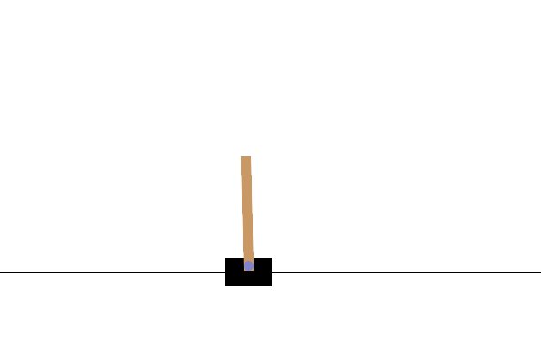
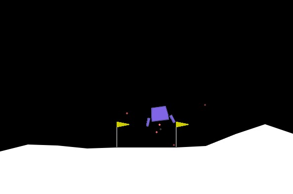
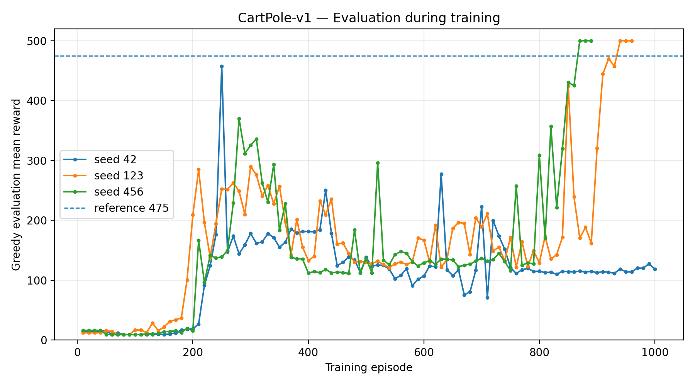
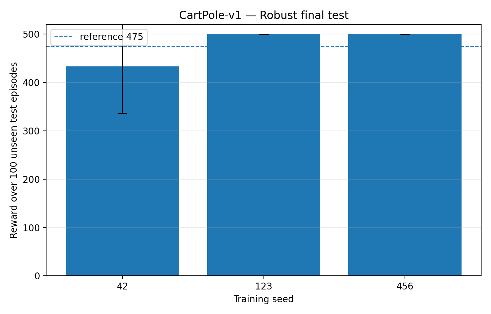
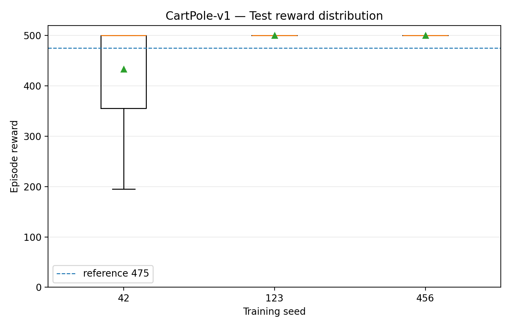
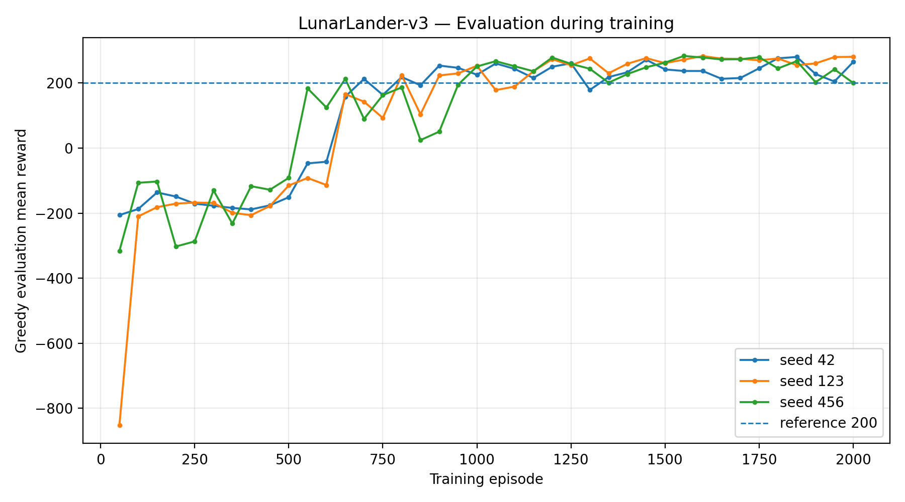
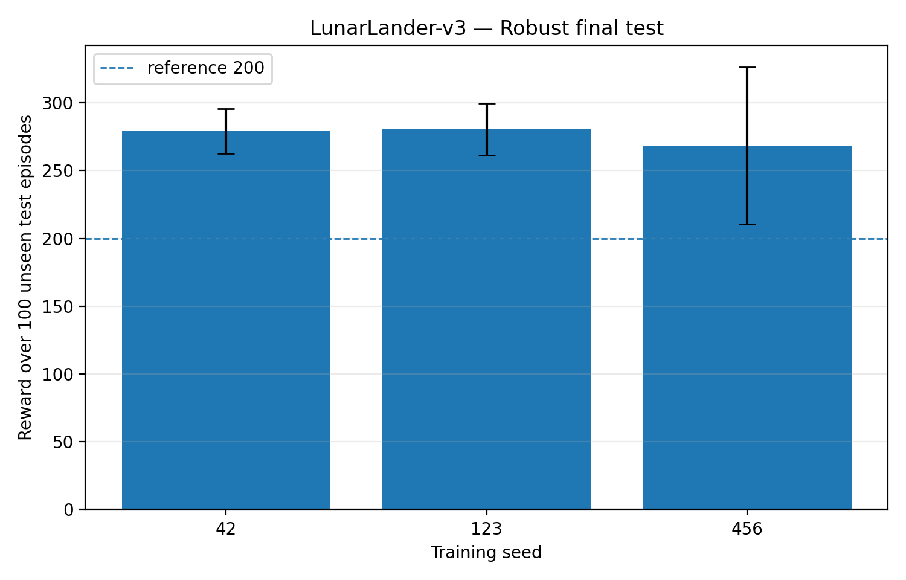
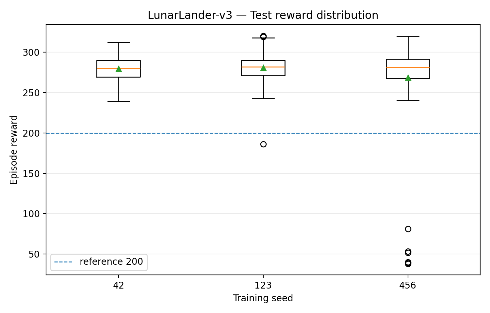

# Exercise 3 — Deep Q-Learning su CartPole-v1 e LunarLander-v3

L'Exercise 3 implementa la variante **3.2 — Deep Q-Learning** del Laboratorio 3 e applica un **Deep Q-Network (DQN)** a due ambienti Gymnasium con spazio delle azioni discreto:

```text
CartPole-v1
LunarLander-v3
```
<p align="center">
  
  
</p>

<p align="center">
  <em>Ambienti utilizzati nell'Exercise 3: CartPole-v1 e LunarLander-v3.</em>
</p>


La stessa implementazione generica viene utilizzata per entrambi gli ambienti e comprende i due meccanismi fondamentali richiesti dalla consegna:

```text
Experience Replay
Target Q-Network
```

La versione finale conserva soltanto le configurazioni selezionate e valuta la robustezza su più training seed e su un test finale indipendente.

---

## Ambienti

| Ambiente | Dimensione stato | Azioni | Obiettivo |
|---|---:|---:|---|
| `CartPole-v1` | 4 | 2 | mantenere il palo in equilibrio fino al limite di 500 step |
| `LunarLander-v3` | 8 | 4 | controllare il lander e completare un atterraggio con reward elevato |

Per CartPole viene adottata come soglia operativa di successo:

```text
reward >= 475
```

mentre `500` indica un episodio completato fino al time limit.

Per LunarLander viene utilizzata la soglia:

```text
reward >= 200
```

---

## Metodo — Deep Q-Learning

DQN approssima con una rete neurale la funzione:

\[
Q(s,a)
\]

che stima il valore atteso di ogni azione nello stato corrente.

Durante il training viene usata una strategia **epsilon-greedy**:

```text
con probabilità epsilon -> azione casuale
altrimenti              -> argmax_a Q(s,a)
```

Durante l'evaluation la policy è invece greedy.

### Q-Network

Le configurazioni finali utilizzano una MLP con due hidden layer:

```text
CartPole-v1:     4 -> 128 -> 128 -> 2
LunarLander-v3:  8 -> 128 -> 128 -> 4
```

Gli output sono Q-value reali, non probabilità.

### Experience Replay

Ogni interazione viene salvata nel Replay Buffer come:

```text
(state, action, reward, next_state, terminated, truncated)
```

Gli aggiornamenti utilizzano minibatch casuali campionati dal buffer, riducendo la correlazione temporale tra transizioni consecutive e permettendo di riutilizzare l'esperienza raccolta.

### TD target

Per il vanilla DQN implementato nel progetto il target è:

\[
y_t =
r_t +
\gamma (1-\text{terminated}_t)
\max_a Q_{\text{target}}(s_{t+1},a)
\]

`terminated` e `truncated` sono mantenuti separati: entrambi interrompono il rollout, ma soltanto `terminated` annulla il bootstrap.

### Target Q-Network

Il progetto mantiene due reti:

```text
online_network
target_network
```

La rete online viene aggiornata tramite gradient descent; la target network viene utilizzata per costruire target TD più stabili.

Le configurazioni finali adottano due strategie differenti:

```text
CartPole    -> soft target update
LunarLander -> hard target update periodico
```

Su CartPole vengono inoltre ridotte la frequenza degli update e la sensibilità agli errori TD tramite Huber loss. Queste scelte migliorano la stabilità del training senza modificare il principio del vanilla DQN.

---

## Implementazione

```text
Exercise3/
├── README.md
├── dqn.py
├── main.py
├── lunarlander_main.py
├── evaluate_results.py
├── plot_results.py
├── run_final.sh
├── runs/
├── results/
└── plots/
```

| File | Responsabilità |
|---|---|
| `dqn.py` | Q-Network, Replay Buffer, epsilon-greedy, TD loss, target update, training ed evaluation |
| `main.py` | training finale CartPole |
| `lunarlander_main.py` | training finale LunarLander |
| `evaluate_results.py` | selezione best/final e test robusto dei checkpoint |
| `plot_results.py` | generazione dei grafici dagli artifact persistiti |
| `run_final.sh` | campagna finale multi-seed completa |

Training ed evaluation sono separati: durante la valutazione non vengono effettuati update, scritture nel Replay Buffer o campionamenti epsilon-greedy.

---

## Protocollo sperimentale

Le configurazioni finali vengono addestrate con tre training seed:

```text
42
123
456
```

### CartPole-v1

Il monitoraggio dei checkpoint durante il training utilizza 20 seed fissi:

```text
2100 ... 2119
```

La scelta finale tra checkpoint best e final utilizza 50 seed di validation separati:

```text
2000 ... 2049
```

Il test viene aperto soltanto dopo il congelamento della selezione:

```text
1000 ... 1099
```

### LunarLander-v3

Il monitoraggio durante il training utilizza:

```text
2000 ... 2019
```

La selezione finale best/final viene effettuata sul pannello più ampio:

```text
2000 ... 2049
```

quindi include i 20 seed di monitoraggio e ne aggiunge altri 30.

Il test finale resta completamente separato:

```text
1000 ... 1099
```

Per ciascun ambiente vengono quindi valutati **3 checkpoint selezionati × 100 episodi di test**, per un totale di 300 episodi finali.

---

## Configurazioni finali

| Parametro | CartPole-v1 | LunarLander-v3 |
|---|---:|---:|
| Training episodes | max `1000` | `2000` |
| Learning rate | `3e-4` | `5e-4` |
| Gamma | `0.99` | `0.99` |
| Hidden layers | `128, 128` | `128, 128` |
| Loss | Huber | MSE |
| Batch size | `128` | `64` |
| Replay capacity | `50,000` | `100,000` |
| Replay warm-up | `1,000` | `5,000` |
| Epsilon | `1.0 -> 0.05` | `1.0 -> 0.05` |
| Epsilon decay | `15,000` step | `100,000` step |
| Train frequency | 1 update ogni `4` step | 1 update per step |
| Target update | soft | hard |
| Target parameter | `tau = 0.005` | ogni `1,000` update |
| Gradient clipping | `10` | `10` |
| Evaluation interval | `10` episodi | `50` episodi |
| Evaluation episodes | `20` | `20` |
| Early stopping | `>=475` per 3 eval consecutive | — |

Per CartPole l'early stopping viene attivato soltanto quando la soglia viene mantenuta per tre evaluation consecutive.

---

## Risultati — CartPole-v1

Il test finale utilizza 100 seed mai usati per la selezione del checkpoint.

| Training seed | Mean reward | Std | Median | Reward >=475 | Reward =500 |
|---:|---:|---:|---:|---:|---:|
| 42 | 433.16 | 96.64 | 500 | 64% | 59% |
| 123 | 500.00 | 0.00 | 500 | 100% | 100% |
| 456 | 500.00 | 0.00 | 500 | 100% | 100% |
| **Aggregato** | **477.72 ± 31.51** | — | — | **88.0%** | **86.3%** |

La riga aggregata riporta la media e la deviazione standard delle **medie dei tre training seed**.

Due training seed producono una policy perfetta su tutti i 100 episodi di test. Il seed 42 presenta maggiore variabilità, ma mantiene mediana pari a `500`.

<p align="center">
  
</p>

<p align="center">
  
</p>

<p align="center">
  
</p>

---

## Risultati — LunarLander-v3

| Training seed | Checkpoint selezionato | Mean reward | Std | Median | Reward >=200 |
|---:|---|---:|---:|---:|---:|
| 42 | Best | 279.11 | 16.59 | 280.09 | 100% |
| 123 | Final | 280.38 | 19.17 | 281.71 | 99% |
| 456 | Best | 268.38 | 57.86 | 280.75 | 94% |
| **Aggregato** | — | **275.96 ± 5.38** | — | — | **97.7%** |

Anche in questo caso la riga aggregata riporta media e deviazione standard delle medie dei tre training seed.

La performance rimane consistente tra le tre inizializzazioni e il `97.7%` dei 300 episodi finali raggiunge almeno `200` punti.

<p align="center">
  
</p>

<p align="center">
  
</p>

<p align="center">
  
</p>

### Diagnostica aggiuntiva

Sono inoltre mantenuti:

```text
cartpole_training_reward.png
lunarlander_training_reward.png
lunarlander_td_loss.png
```

La TD loss viene utilizzata come metrica diagnostica e non come misura diretta della qualità della policy, perché i target cambiano durante il training insieme alla rete online, alla target network, alla policy epsilon-greedy e alla distribuzione del Replay Buffer.

---

## Output e artifact

Ogni run finale conserva:

```text
runs/<run_name>/
├── config.json
├── training_metrics.csv
├── evaluation_metrics.csv
└── selected_q_network.pt
```

Le sei run archiviate sono:

```text
cartpole_seed42
cartpole_seed123
cartpole_seed456
lunarlander_seed42
lunarlander_seed123
lunarlander_seed456
```

I risultati finali sono raccolti in:

```text
results/
├── validation_selection.csv
├── final_test_episodes.csv
├── final_test_summary.csv
└── final_test_aggregate.csv
```

I grafici vengono generati direttamente dagli artifact persistiti, senza ripetere il training.

---

## Riproduzione

I comandi vanno eseguiti dalla directory `DLA_LAB3` con l'ambiente `DRL` attivo.

Campagna finale completa:

```bash
bash Exercise3/run_final.sh
```

Training di una singola seed CartPole:

```bash
python -m Exercise3.main --seed 42
```

Training di una singola seed LunarLander:

```bash
python -m Exercise3.lunarlander_main --seed 42
```

Rivalutazione dei checkpoint:

```bash
python -m Exercise3.evaluate_results
```

Rigenerazione dei grafici:

```bash
python -m Exercise3.plot_results
```

Gli output vengono salvati in `Exercise3/runs/`, `Exercise3/results/` e `Exercise3/plots/`.

---

## Considerazioni finali

La stessa implementazione DQN viene utilizzata su entrambi gli ambienti, adattando il protocollo di stabilizzazione alla diversa dinamica dei due task.

Su CartPole la riduzione della frequenza di update, Huber loss e soft target update limitano la degradazione osservata con update più aggressivi. Su LunarLander un training più lungo con Replay Buffer più ampio e target update hard produce invece risultati consistenti sui tre training seed.

Il test finale rimane separato dalla selezione del modello e costituisce la misura conclusiva riportata nella documentazione.
