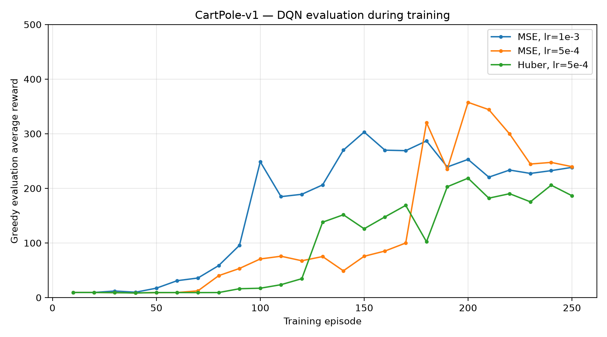
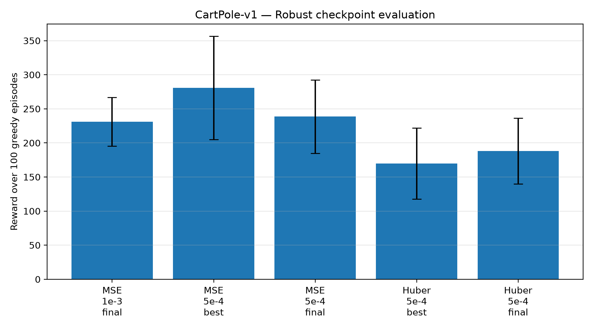
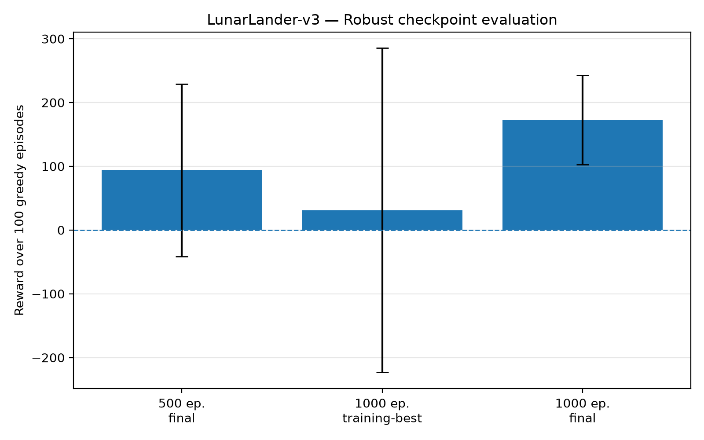
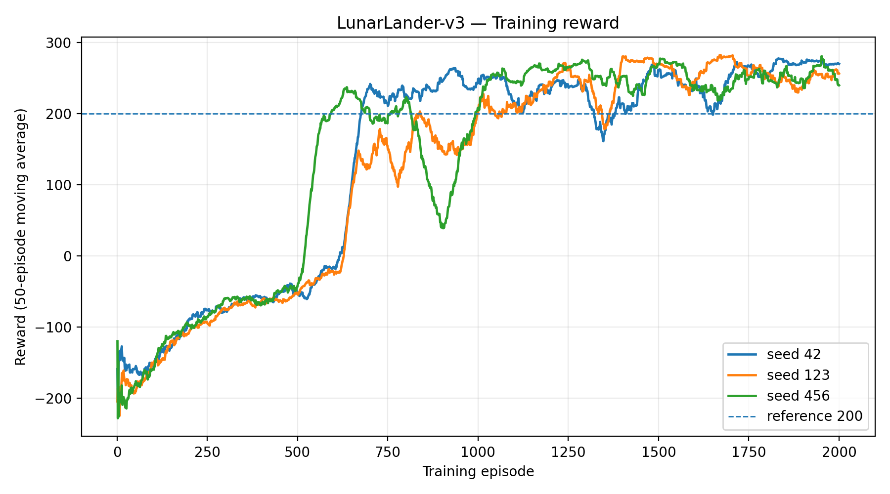
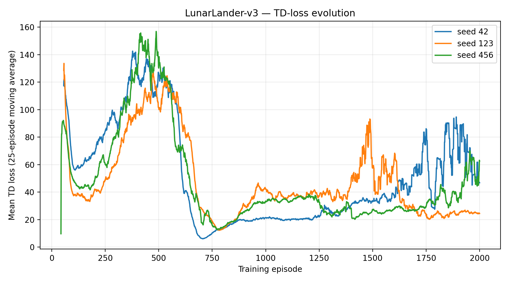

# Exercise 3 — Deep Q-Learning su CartPole-v1 e LunarLander-v3

L'Exercise 3 implementa un **Deep Q-Network (DQN)** e lo applica a due ambienti Gymnasium con spazio delle azioni discreto:

```text
CartPole-v1
LunarLander-v3
```

La consegna richiede un'implementazione di Deep Q-Learning che includa i due componenti fondamentali usati per stabilizzare il training:

```text
Experience Replay
Target Q-Network
```

La stessa implementazione generica viene utilizzata per entrambi gli ambienti, adattando automaticamente dimensione dello stato e numero di azioni.

<p align="center">
  
  
</p>

<p align="center">
  <em>Ambienti utilizzati nell'Exercise 3: CartPole-v1 e LunarLander-v3.</em>
</p>
 

## Metodo — Deep Q-Learning

DQN approssima con una rete neurale la funzione:

```text
Q(s, a)
```

che assegna a ogni azione un valore atteso nello stato corrente.

La rete produce un Q-value per ciascuna azione:

```text
CartPole-v1:    4 → 64 → 2
LunarLander-v3: 8 → 64 → 4
```

Gli output sono valori reali, non probabilità. L'azione greedy è quindi:

```text
argmax_a Q(s, a)
```

Durante il training viene utilizzata una strategia **epsilon-greedy**:

```text
con probabilità ε → azione casuale
altrimenti        → argmax Q(s, a)
```

con decadimento lineare di `ε`.

### Replay Buffer

Ogni interazione con l'ambiente viene memorizzata come:

```text
(state, action, reward, next_state, terminated, truncated)
```

Il training non utilizza immediatamente soltanto l'ultima transizione: estrae minibatch casuali dal Replay Buffer.

Questo permette di riutilizzare l'esperienza e riduce la correlazione temporale tra gli esempi utilizzati negli update.

### Target Q-Network e TD target

DQN mantiene due reti con la stessa architettura:

```text
online_network
target_network
```

La rete online viene aggiornata tramite gradient descent.

La target network viene invece utilizzata per costruire il target Temporal-Difference:

```text
y_t =
r_t + γ (1 - terminated_t) max_a Q_target(s_(t+1), a)
```

e viene sincronizzata periodicamente con la rete online:

```text
target ← online
```

Il progetto utilizza un **hard target update**.

La loss confronta il Q-value dell'azione realmente eseguita con il TD target. Sono state sperimentate:

```text
MSE
Huber / Smooth L1
```

---

## Implementazione

La struttura dell'esercizio è:

```text
DLA_LAB3/
└── Exercise3/
    ├── README.md
    ├── dqn.py
    ├── main.py
    ├── lunarlander_main.py
    ├── evaluate_results.py
    ├── plot_results.py
    ├── runs/
    ├── results/
    └── plots/
```

| File | Responsabilità |
|---|---|
| `dqn.py` | `QNetwork`, Replay Buffer, epsilon-greedy, TD loss, target sync, training ed evaluation |
| `main.py` | entry point CartPole |
| `lunarlander_main.py` | entry point LunarLander |
| `evaluate_results.py` | robust evaluation indipendente dei checkpoint |
| `plot_results.py` | generazione dei grafici dagli artifact persistiti |

### Separazione training / evaluation

Durante il training:

```text
epsilon-greedy
Replay Buffer write
minibatch sampling
TD loss
backward
optimizer.step()
target sync periodico
```

Durante l'evaluation:

```text
azione greedy
ε = 0
nessuna scrittura nel Replay Buffer
nessun backward
nessun optimizer.step()
```

`terminated` e `truncated` vengono conservati separatamente. Entrambi interrompono il rollout, ma soltanto `terminated` annulla il bootstrap nel TD target.

---

## Protocollo sperimentale

Tutte le run archiviate utilizzano:

```text
training seed = 42
gamma         = 0.99
optimizer     = Adam
hidden dim    = 64
batch size    = 64
```

La valutazione finale dei checkpoint utilizza invece:

```text
100 episodi greedy
seed = 1000 ... 1099
```

Gli stessi seed sono utilizzati per tutti i checkpoint dello stesso ambiente.

### CartPole-v1

| Parametro | Valore |
|---|---:|
| Training episodes | `250` |
| Replay capacity | `10,000` |
| Replay warm-up | `500` |
| Epsilon start | `1.0` |
| Epsilon end | `0.05` |
| Epsilon decay | `10,000` step |
| Target sync | ogni `250` update |
| Evaluation interval | `10` episodi |
| Evaluation episodes | `10` |

Sono state confrontate tre configurazioni:

```text
A — MSE,   lr = 1e-3
B — MSE,   lr = 5e-4
C — Huber, lr = 5e-4
```

### LunarLander-v3

| Parametro | Valore |
|---|---:|
| Learning rate | `5e-4` |
| Loss | MSE |
| Replay capacity | `50,000` |
| Replay warm-up | `1,000` |
| Epsilon start | `1.0` |
| Epsilon end | `0.05` |
| Epsilon decay | `50,000` step |
| Target sync | ogni `500` update |
| Evaluation interval | `25` episodi |
| Evaluation episodes | `10` |

Sono stati eseguiti:

```text
pilot      → 500 episodi
run finale → 1000 episodi
```

---

## Risultati — CartPole-v1

Il confronto tra le configurazioni mostra che il learning rate più basso con MSE produce il checkpoint più efficace tra quelli sperimentati.

### Robust evaluation

| Configurazione | Checkpoint | Mean reward | Std | Median | Reward ≥ 200 |
|---|---|---:|---:|---:|---:|
| MSE, `lr=1e-3` | Final | 230.94 | 35.69 | 219.0 | 87% |
| **MSE, `lr=5e-4`** | **Best** | **280.84** | 75.88 | **258.5** | **95%** |
| MSE, `lr=5e-4` | Final | 238.68 | 53.85 | 216.5 | 78% |
| Huber, `lr=5e-4` | Best | 169.60 | 52.17 | 152.0 | 21% |
| Huber, `lr=5e-4` | Final | 187.99 | 48.16 | 172.5 | 28% |

<p align="center">
  
</p>

Nel protocollo utilizzato:

```text
MSE + lr=5e-4
```

produce il miglior checkpoint CartPole osservato.

La robust evaluation del modello selezionato è:

```text
Mean reward:      280.84
Std reward:        75.88
Median reward:    258.50
Minimum reward:   185
Maximum reward:   500

Reward >= 100:    100%
Reward >= 200:     95%
```

<p align="center">
  
</p>

<p align="center">
  
</p>

Il checkpoint selezionato è:

```text
runs/cartpole_dqn_lr0.0005_seed42/best_q_network.pt
```

Huber loss non ha migliorato il comportamento dell'agente nelle configurazioni testate.

---

## Risultati — LunarLander-v3

LunarLander presenta un task più complesso e una dinamica di training molto più instabile.

Il pilot da 500 episodi mostra un miglioramento progressivo del reward di evaluation:

```text
episode 25      -288.61
episode 100     -220.97
episode 250     -103.76
episode 300       -0.87
episode 400       70.16
episode 500      157.63
```

Questo andamento ha motivato l'estensione del training a `1000` episodi.

<p align="center">
  
</p>

Nella run estesa, il massimo delle evaluation periodiche viene osservato all'episodio `575`:

```text
average reward = 198.33
```

su `10` episodi di evaluation.

La curva non è però monotona: dopo questo punto compaiono nuove oscillazioni e cali significativi.

### Robust evaluation

I checkpoint principali sono stati quindi rivalutati su 100 episodi greedy indipendenti:

| Checkpoint | Mean reward | Std | Median | Positive | Reward ≥100 | Reward ≥200 |
|---|---:|---:|---:|---:|---:|---:|
| 500 ep — Final | 93.91 | 135.19 | 137.55 | 79% | 74% | 14% |
| 1000 ep — Best periodico | 31.03 | 254.19 | 132.00 | 61% | 55% | 33% |
| **1000 ep — Final** | **172.68** | **70.02** | **184.82** | **96%** | **84%** | 32% |

<p align="center">
  
</p>

Il checkpoint finale da 1000 episodi ottiene il miglior equilibrio tra reward medio, mediana e dispersione:

```text
Mean reward:       172.68
Std reward:         70.02
Median reward:     184.82
Minimum reward:   -101.21
Maximum reward:    282.87

Positive episodes:  96%
Reward >= 100:      84%
Reward >= 200:      32%
```

<p align="center">
  
</p>

Il modello selezionato è:

```text
runs/lunarlander_dqn_final_1000ep_seed42/final_q_network.pt
```

### Selezione del checkpoint

Il risultato più interessante riguarda il confronto tra evaluation periodica e robust evaluation.

Il checkpoint dell'episodio `575` era stato selezionato durante il training perché aveva ottenuto:

```text
198.33
```

di reward medio su 10 episodi.

Sugli stessi 100 seed usati per il confronto finale ottiene però:

```text
31.03 ± 254.19
```

mentre il checkpoint finale raggiunge:

```text
172.68 ± 70.02
```

Una evaluation periodica su pochi episodi può quindi produrre una stima molto rumorosa della qualità reale del checkpoint.

---

## Training reward e TD loss

<p align="center">
  
</p>

<p align="center">
  
</p>

La TD loss diminuisce fortemente nella prima parte del training, ma non segue un andamento monotono.

Questo è coerente con la natura del problema:

```text
online network cambia
target network viene aggiornata
policy epsilon-greedy cambia
Replay Buffer cambia distribuzione
TD target cambia
```

La TD loss viene quindi utilizzata soprattutto come metrica diagnostica.

La misura principale della qualità dell'agente rimane il **reward di evaluation**.

---

## Output e artifact

Ogni run moderna produce:

```text
Exercise3/runs/<run_name>/
├── config.json
├── training_metrics.csv
├── evaluation_metrics.csv
├── best_q_network.pt
└── final_q_network.pt
```

Alcune run pilota storiche utilizzano una nomenclatura leggermente diversa per il checkpoint finale.

`training_metrics.csv` contiene:

```text
episode
total_steps
reward
length
mean_loss
epsilon
```

`evaluation_metrics.csv` contiene:

```text
episode
total_steps
average_reward
average_length
```

La robust evaluation salva:

```text
Exercise3/results/
├── robust_evaluation_episodes.csv
└── robust_evaluation_summary.csv
```

I grafici finali sono salvati in:

```text
Exercise3/plots/
```

e comprendono:

```text
cartpole_evaluation_comparison.png
cartpole_robust_comparison.png
cartpole_selected_reward_distribution.png

lunarlander_evaluation_curve.png
lunarlander_training_reward.png
lunarlander_td_loss.png
lunarlander_robust_comparison.png
lunarlander_selected_reward_distribution.png
```

I grafici vengono prodotti dagli artifact persistiti senza ripetere il training o la robust evaluation.

---

## Riproduzione

I comandi vanno eseguiti dalla directory `DLA_LAB3` con l'ambiente `DRL` attivo.

### CartPole

```bash
python -m Exercise3.main
```

La configurazione corrente utilizza:

```text
episodes = 250
learning rate = 5e-4
loss = MSE
seed = 42
```

e salva gli artifact in una run dedicata:

```text
cartpole_dqn_final_mse_lr0.0005_seed42
```

Le run sperimentali già archiviate rimangono separate nella directory `Exercise3/runs/`.

### LunarLander

```bash
python -m Exercise3.lunarlander_main
```

La configurazione corrente esegue il training finale da `1000` episodi con:

```text
learning rate = 5e-4
loss = MSE
seed = 42
```

### Robust evaluation

```bash
python -m Exercise3.evaluate_results
```

Lo script valuta i checkpoint configurati su:

```text
100 episodi
seed 1000–1099
policy greedy
```

e aggiorna i CSV in:

```text
Exercise3/results/
```

### Grafici

```bash
python -m Exercise3.plot_results
```

---

## Limiti

- Le run di training archiviate utilizzano una sola training seed (`42`).
- La robust evaluation su 100 seed misura la variabilità della policy su nuovi episodi, ma non la variabilità tra agenti addestrati indipendentemente.
- Il confronto CartPole esplora soltanto due learning rate e due loss.
- La selezione periodica dei checkpoint usa 10 episodi ed è quindi sensibile al rumore.
- L'implementazione utilizza il target DQN classico con `max Q_target`, senza Double DQN.
- Non vengono studiati Dueling DQN, Prioritized Replay, soft target update o multi-step returns.
- La QNetwork è volutamente compatta, con un solo hidden layer da 64 unità.
- I checkpoint sono artifact locali e non devono essere considerati parte necessaria del codice sorgente versionato.

---

## Conclusioni

L'Exercise 3 implementa un DQN completo con:

```text
QNetwork
epsilon-greedy exploration
Replay Buffer
Temporal-Difference target
Target Q-Network
hard target synchronization
greedy evaluation
robust checkpoint evaluation
```

La stessa implementazione viene utilizzata su `CartPole-v1` e `LunarLander-v3`.

Su CartPole la configurazione più efficace tra quelle sperimentate è:

```text
MSE
learning rate = 5e-4
```

con robust evaluation:

```text
280.84 ± 75.88
```

Su LunarLander l'estensione del training a 1000 episodi produce un checkpoint finale molto più robusto del pilot da 500 episodi e del checkpoint selezionato dalla migliore evaluation periodica:

```text
172.68 ± 70.02
96% episodi con reward positivo
```

Il risultato sperimentale più importante non riguarda soltanto il valore massimo raggiunto: le curve e la robust evaluation mostrano che **DQN può apprendere policy efficaci mantenendo una forte instabilità durante il training**, rendendo essenziale una valutazione indipendente dei checkpoint.

---

## Riferimenti e assistenza AI

Riferimenti principali:

- notebook ufficiale della consegna `DLA-Lab2-DRL.ipynb`;
- materiale del corso su Deep Q-Learning;
- Gymnasium — `CartPole-v1` e `LunarLander-v3`;
- PyTorch;
- Mnih et al., *Human-level control through deep reinforcement learning*, Nature, 2015.

ChatGPT è stato utilizzato come supporto per chiarimenti teorici, organizzazione del lavoro, revisione del codice, debugging, progettazione degli esperimenti, analisi degli artifact e documentazione. Le configurazioni, le metriche e i risultati quantitativi riportati derivano dal codice e dagli artifact effettivamente prodotti dal progetto.
